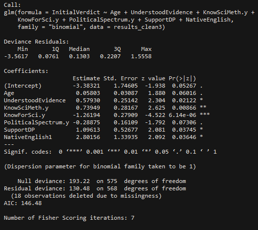
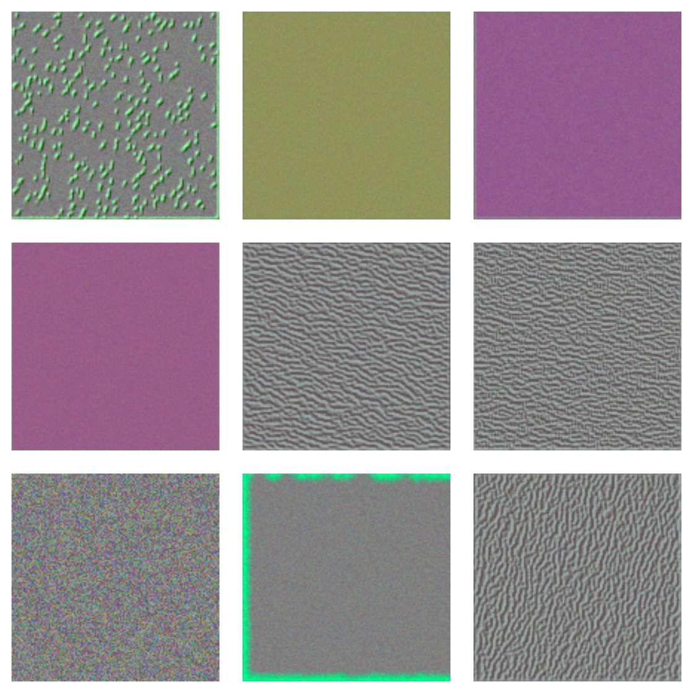
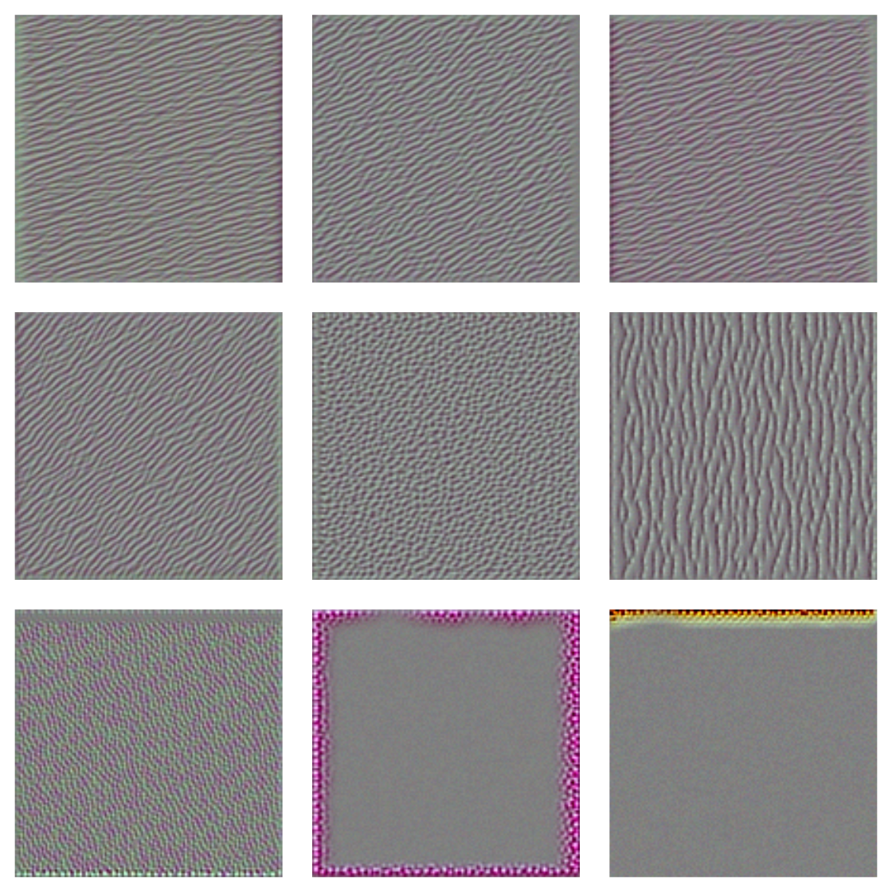
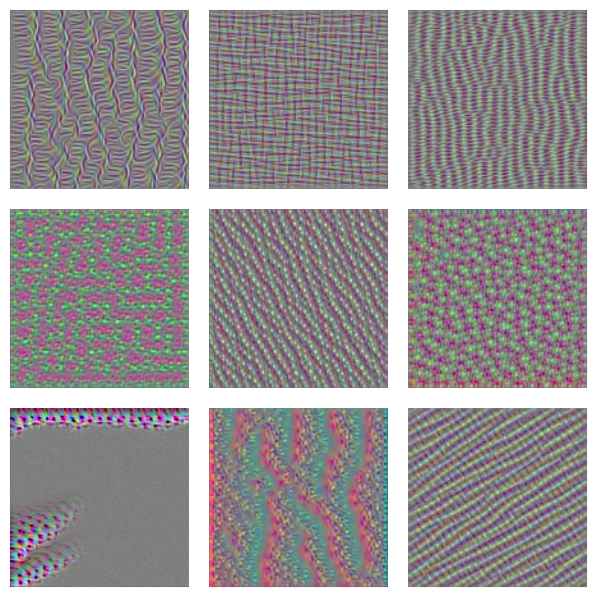
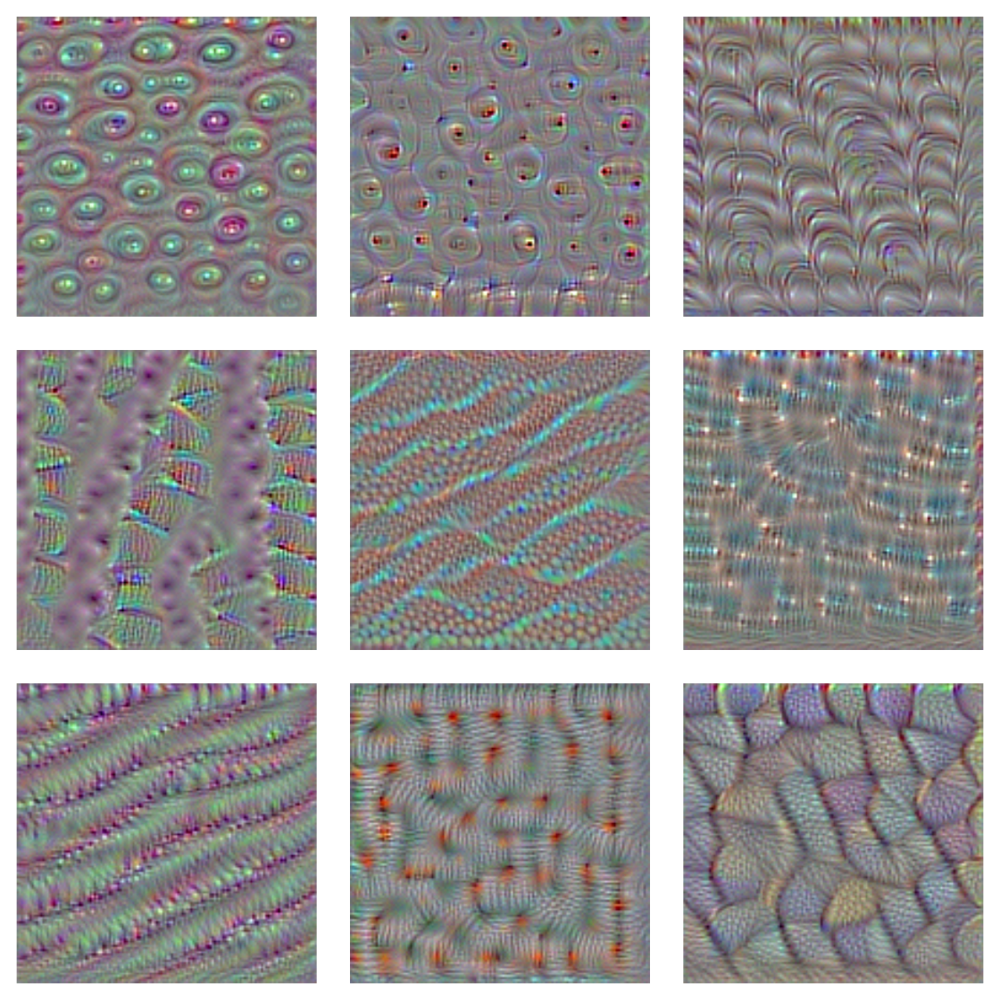
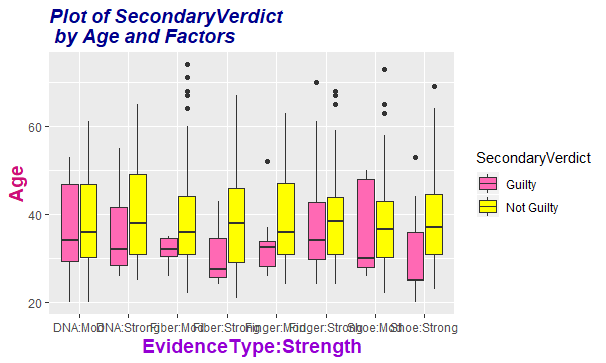

class: inverse
# About Slides

---
class: primary 
# New CSAFE slide template

We're now using [`xaringan`](https://github.com/yihui/xaringan)

What's changed: 

- New person slide: 

````
---
class: inverse
# Your Name
````

---
class: secondary

- New content slide with title: 

````
---
class: primary
# Title of slide 

Slide content
````

- New content slide without title: 

````
---
class: secondary

Slide content with no title on slide
````

---
class: inverse
# Sample User

---
class: primary
# Sample Slide

- Sample Table (top press freedom index):

| Country      | 2018 Press Freedom Index |
| :----------- | :----------------------- |
| Norway       | 7.63   |
| Sweden       | 8.31   |
| Netherlands  | 10.01  |
| Finland      | 10.26  |
| Switzerland  | 11.27  |
| Jamaica      | 11.33  |                 


---
class: secondary

- If you are going to add an image, **create a directory** with your name within "images" folder. For example, "images/**guillermo**/sample_image.JPG"

 

---
class: inverse
#Guillermo

---
class: primary
# Three GIFs from MatScan

 
 
 

---
class: primary
# Notes on MatScan Files

| Matter | Current Decision   |
| :-- | :-- |
| Format of the animation | GIF |
| Color Palette | Spectral | 
| Blank frames | Keep |

---
class: primary
# Badiah 
 This is what I did

```{r, eval=FALSE, echo=TRUE} 
  modelbest <- glm(InitialVerdict ~ Age + UnderstoodEvidence + KnowSciMeth.y + KnowForSci.y +
  PoliticalSpectrum.y + SupportDP + NativeEnglish, family = "binomial", data = results_clean3)
```

 

---
class: inverse
# Miranda

---
class: primary
# Neural Networks

- Singularity image and access to GPU server to train networks!
- Working on scripts for multi-class and multi-label models

---
class: primary
# VGG16

- a deep convolutional network (16 layers) for object recognition developed and trained by Oxford's Visual Geometry Group
- Trained on ImageNet database and can classify over 1,000 types of images
- Using VGG16's visual ability and retraining the classifier is a lot like asking an adult to only classify "cat" or "dog", when we're trained to identify a lot more than that
- gradient ascent in input shows each filter's optimal pattern

---
class: secondary




  
---
class: secondary





---
class: primary
# Malisha Jones

Creating Models

```{r, eval=FALSE, echo=TRUE}
sig <- glm(data = res, SecondaryVerdict~ 
             EvidenceType*Strength+ Age+ 
             RMPEstimate +ErrorEstimate+ KnowForSci+ 
             maxmath+ stats, family = binomial)
```

And If You Like Bright Colors Check Out Theme Malisha



---
class: primary
# Yolonda

* PCA analysis on training data completed

* Working on classification models

  + KNN
```{r, eval=FALSE, echo=TRUE}
knn_errors <- NULL
for (i in 1:30){
  digits_KNN <- knn3(as.factor(label) ~ ., data = train, k = i)
  pred_KNN <- predict(digits_KNN, newdata = test, type = "class")
  error_rate <- mean(as.factor(test$label) != pred_KNN)
  score <- c(k = i, error = error_rate)
  knn_errors <- rbind(knn_errors, score)
}
```
* Problems with test$label

---
class: Primary
# Da'Monie

Handwriting Project

-Separated testing data and training data
-Using PCA analysis to reduce the data set
-Trying different methods such as random forests

---
class: inverse
# Nate 

---
class: primary
# Groove ID

- Mistake in changepoint model
  - Current fix requires reducing the data by averaging points in small intervals
- Assuming this fix is roughly satisfactory, next step is testing the full algorithm on the Hamby data set.

---
class: primary
# SLR
- Task for this week is to sketch out the math for the new conservative error approximation approach and to examine the basics of its behavior.

---
class: primary
# Alese
- Mock Jury GLM's
- Smallest p value & AIC model
```{r}
glm_KML <- glm(ChangeVerdict ~ KellyMoreLikely, 
               family = binomial(link = "logit"), data = resultmodel1)

summary(glm_KML)


```


