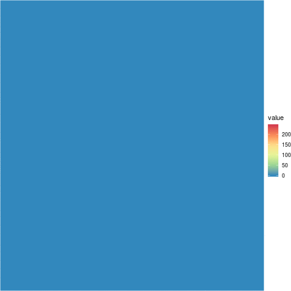

class: inverse
# About Slides

---
class: primary 
# New CSAFE slide template

We're now using [`xaringan`](https://github.com/yihui/xaringan)

What's changed: 

- New person slide: 

````
---
class: inverse
# Your Name
````

---
class: secondary

- New content slide with title: 

````
---
class: primary
# Title of slide 

Slide content
````

- New content slide without title: 

````
---
class: secondary

Slide content with no title on slide
````

---
class: inverse
# Sample User

---
class: primary
# Sample Slide

- Sample Table (top press freedom index):

| Country      | 2018 Press Freedom Index |
| :----------- | :----------------------- |
| Norway       | 7.63   |
| Sweden       | 8.31   |
| Netherlands  | 10.01  |
| Finland      | 10.26  |
| Switzerland  | 11.27  |
| Jamaica      | 11.33  |                 


---
class: secondary

- If you are going to add an image, **create a directory** with your name within "images" folder. For example, "images/**guillermo**/sample_image.JPG"

 

---
class: inverse
#Guillermo

---
class: primary
# Three GIFs from MatScan

 
 
 

---
class: primary
# Notes on MatScan Files

| Matter | Current Decision   |
| :-- | :-- |
| Format of the animation | GIF |
| Color Palette | Spectral | 
| Blank frames | Keep |


---
class: inverse
# Nate 

---
class: primary
# Groove ID

- Mistake in changepoint model
  - Current fix requires reducing the data by averaging points in small intervals
- Assuming this fix is roughly satisfactory, next step is testing the full algorithm on the Hamby data set.

---
class: primary
# SLR
- Task for this week is to sketch out the math for the new conservative error approximation approach and to examine the basics of its behavior.