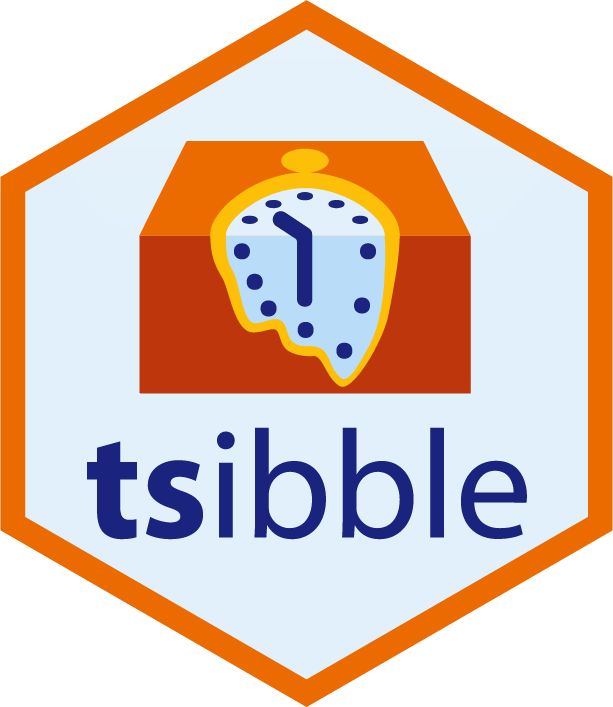
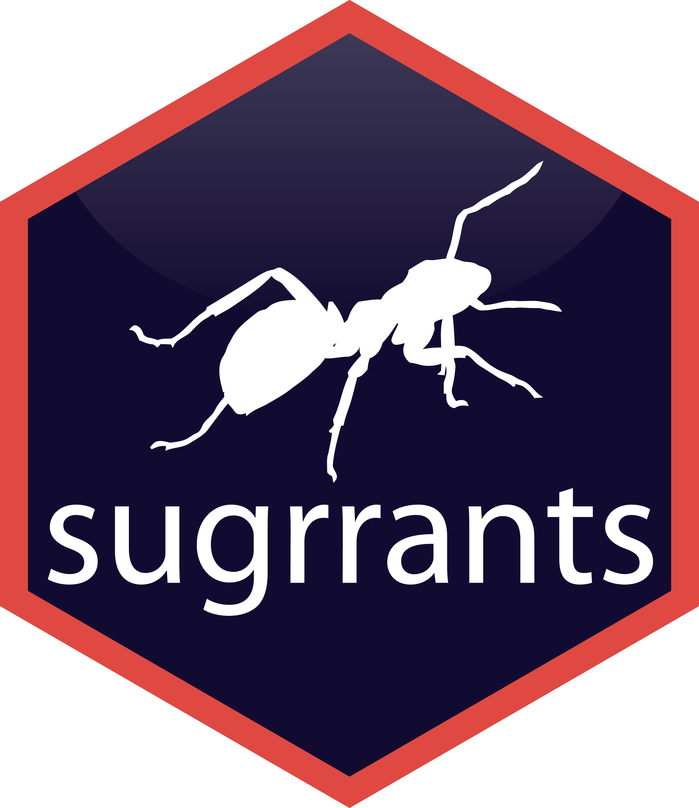
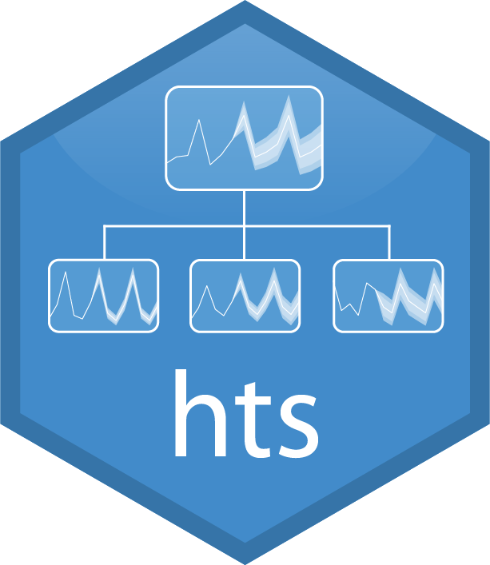
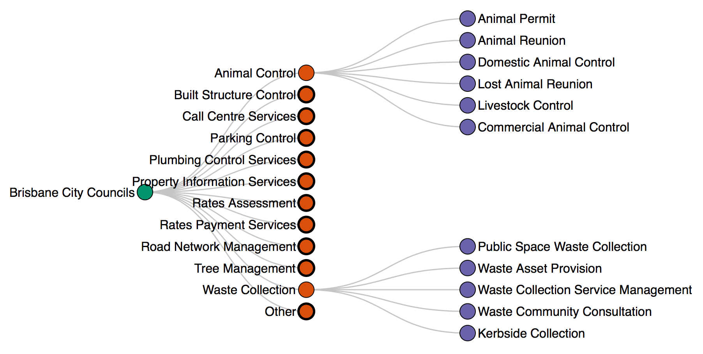
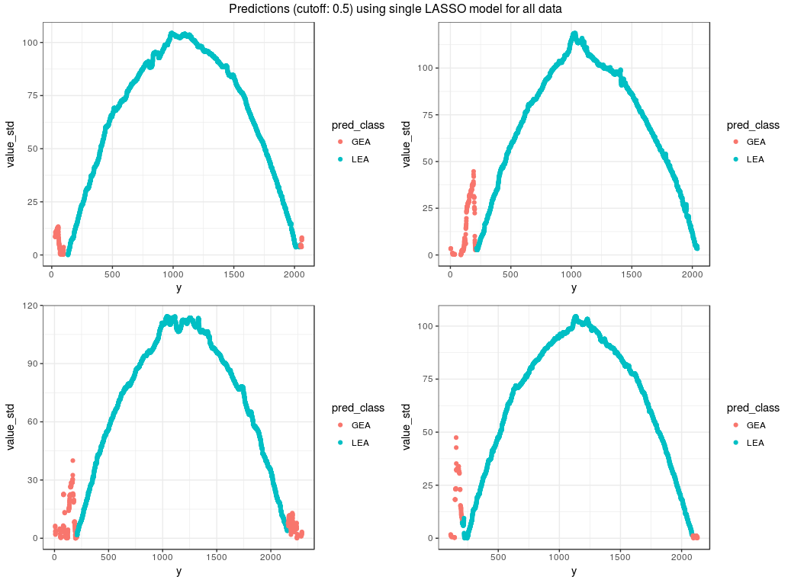
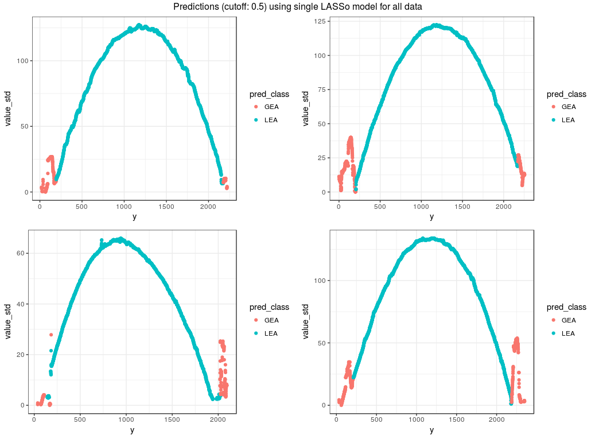

class: inverse
# About Slides

---
class: primary 
# New CSAFE slide template

We're now using [`xaringan`](https://github.com/yihui/xaringan)

What's changed: 

- New person slide: 

````
---
class: inverse
# Your Name
````

---
class: secondary

- New content slide with title: 

````
---
class: primary
# Title of slide 

Slide content
````

- New content slide without title: 

````
---
class: secondary

Slide content with no title on slide
````

---
class: inverse
# Sample User

---
class: primary
# Sample Slide

- Sample Table (top press freedom index):

| Country      | 2018 Press Freedom Index |
| :----------- | :----------------------- |
| Norway       | 7.63   |
| Sweden       | 8.31   |
| Netherlands  | 10.01  |
| Finland      | 10.26  |
| Switzerland  | 11.27  |
| Jamaica      | 11.33  |                 


---
class: secondary

- If you are going to add an image, **create a directory** with your name within "images" folder. For example, "images/**guillermo**/sample_image.JPG"


 
 
---
class: inverse
# James

---
class: primary
# Files and Metadata

* Successful meeting with Eric: < 5 errors

* Currently working on cleaning metadata
         + Most participants responded with values out of 100
         + Some did not: values out of 60, most/least, Yes/No, Etc. 

* Most participant responses can be turned into:
         + value out of 100
         + Yes/No

* Guillermo is working on a script

---
class: primary
# Meanwhile 

* I am working on R Software/R Studio skills. 

* Doing research into papers and webinars that I have been refered too. 


---
class: inverse
#Guillermo

---
class: secondary
- Extracted all MatScan files (including those already extracted, for consistency) and renamed them

- Almost done processing survey data

- Database paper looking at Journal of Forensic Sciences... It requires some data analysis

---
class: inverse
# Earo

---
class: primary
# $whoami

* third-year Ph.D. @ Monash Uni


* R developer, authoring `tsibble`, `sugrrants`, `hts`, and etc.







* more? <https://earo.me>

---
class: secondary

 


---
class: inverse
# Heike


---
class: primary
# bulletxtrctr and x3ptools

* `x3ptools` can now read from URL

* `bulletxtrctr` is getting a set of feature extraction functions (plus documentation for each)

---
class: primary
# news from the lab

* Sensofar representative was here ... 
  * pro: and installed the new software
  * con: without asking
  
* new version needs some testing (impact on scans?)

* supports native x3p (also needs testing)


* DFSC cartridge cases are scanned ... need to be processed next


---
class: inverse
# Kiegan


---
class: primary
# Groove ID 

* AFTE Journal draft complete! 
* Submission in next week (or two depending on feedback) 
* Moving on to more modeling

---
class: primary
# Groove ID 

* Two-class classification using LASSO

 
 
 ---
class: primary
# Groove ID 

* Two-class classification using LASSO

 

 ---
class: primary
# Groove ID 

* Two-class classification using LASSO
* Things to consider: 
    * Very unbalanced response
    * May consider adding additional features
    * Training/test sets: keep bullets grouped together? 
    * May add a random component for bullet

---
class: primary
# Groove ID  

* Going to work on metadata sheet for notes on bullets Nate and I work with 
* Update `grooves` GitHub so it actually has some information about our project 
* Clean up!  

* Could we do a "summer update"/"fall goals" overview Show & Tell at the beginning of the semester? 


---
class: inverse
# Susan


---
class: primary
# bullets

## bulletxtrctr

* rewriting tests to work with `covr` test coverage package
* Use setup.R and teardown.R files to set up data for tests and clean up the environment afterwards
* Only compare results from current algorithm to results from previous versions of the algorithm on Bigfoot (not on CRAN or Travis)
* This week: tests for the separate features functions

---
class: primary
# bullets

## x3ptools

* starting to write tests for x3ptools
* goal: > 90% coverage

---
class:primary
# Truthiness

* Separate image files (outside of the Rmd files) for each of 11 image types x 12 claims
    * consistent size, style (as much as map aspect ratio issues allow)
    * minimize the number of packages required
* This week: shiny app to present the survey - too complicated to do with Qualtrics


