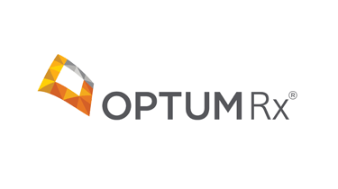
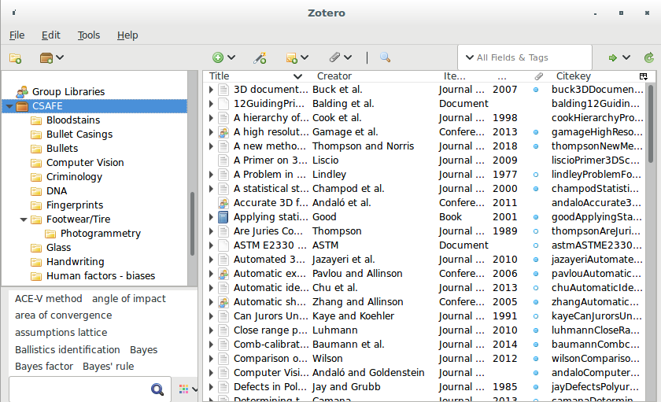

class: inverse
# About Slides

---
class: primary 
# New CSAFE slide template

We're now using [`xaringan`](https://github.com/yihui/xaringan)

What's changed: 

- New person slide: 

````
---
class: inverse
# Your Name
````

---
class: secondary

- New content slide with title: 

````
---
class: primary
# Title of slide 

Slide content
````

- New content slide without title: 

````
---
class: secondary

Slide content with no title on slide
````

---
class: inverse
# Sample User

---
class: primary
# Sample Slide

- Sample Table (top press freedom index):

| Country      | 2018 Press Freedom Index |
| :----------- | :----------------------- |
| Norway       | 7.63   |
| Sweden       | 8.31   |
| Netherlands  | 10.01  |
| Finland      | 10.26  |
| Switzerland  | 11.27  |
| Jamaica      | 11.33  |                 


---
class: secondary

- If you are going to add an image, **create a directory** with your name within "images" folder. For example, "images/**guillermo**/sample_image.JPG"


 
 
---
class: inverse
# Ben  

---
class: primary
# Summer

- Internship at OptumRx in Schaumburg IL
- Pharmaceutical company part of UHG
- Fullstack / Database development in team of 5
- ~2,000,000$ saved
- Linux Club challenges / content  


---
class: primary
# Semester Intentions

- Collaborate w/Nic & Amy to improve handwriting project
- Develop improvements / features part of algorithm
- Eventually port algorithm through an application portal
- Improve file structure of project   

---
 class: inverse
# Ganesh  

---
class: primary  
# Summer Work  

- Presented Adapting the Chumbley Score poster at AFTE  
- Finished writing the Chumbley paper  (along with Dr. Hofmann)
- Submitted to the Journal of Forensic Sciences  (JFS)
- Got reviewer comments, addressed them and submitting back the responses today 
- Started reviewing basic building blocks for developing an interactive User Interface and Front end for reviewing bullet and land-to-land comparisons.
---
class: primary   
# Fall Semester Goals  

- Taking 2 or 3 classes (Time Series (Stat 551), Optimization in Machine Learning (Com Sc 578X), Cognitive Psychology for Human Computer Interaction (HCI 521))
- Continue with the development of the User Interface
- Explore possibilities of Optimizing the Random Forest wherever possible in the bullet project and implement it.
- Conceptualize the bullet-to-bullet comparison problem for the Chumbley score method.

---
class: inverse
# Kiegan  

---
class: primary  
# Summer Work  

- Presented grooves poster at AFTE  
- Helped Amy run STEMversity in GA  
- Took the PhD written prelim   
    - Took a nap after  
- Presented grooves work (talk) at JSM  
- Wrote draft of grooves ID paper for AFTE journal  
- Started using more sophisticated techniques on grooves  
    - Results coming soon to a show-and-tell near you! ;)  

---
class: primary   
# Fall Semester Goals  

- Submit to AFTE journal  
- Complete writing of Chapman & Hall book  
    - Working on this from home T/Th  
- Write a joint paper with Nate on grooves project  
    - Probably aim for Journal of Forensic Sciences  
    - Compare/contrast of methodologies
    - Downstream impact on the algorithm!  
- Taking one class (Stat 643) and research credits  


---
class: inverse
# Danica  

---
class: primary  
# Summer Work  

- Published a paper in LPR on the difference between common source and specific source  
- Completed a draft paper on the difference between the BF and LR
- Presented my dissertation work at ISBA in Scotland  
- Presented my work on Fiducial Factors at JSM in Vancouver  
- Started experimental design for NIJ Handwriting grant with UCSD & SDSU  
    - Explored algorithms in OpenCV (C++) for feature detection of handwritten images
    - Refined the OpenCV algorithms, including SIFT, to get a score to compare two documents

---
class: primary   
# Fall Semester Goals  

- Submit draft BF vs. LR paper to AOS  
    - Write a follow-up paper to LPR  
- Continue NIJ grant to validate FDE conclusions  
- Work with Amy on the CSAFE Handwriting project  
- Work with Dan Spitzner from UVA on the CSAFE Statistical Foundations project
- Write a paper for LPR on approximations to BFs
- Write a paper on Fiducial Factors with UNC


---
class: inverse
# Susan

---
class: primary
# Summer Work

- `x3ptools` and `bulletxtrctr` unit tests
- Truthiness study - do people inherently believe claims with pictures/graphs?
    - Just about ready to collect data
- Shoeprint Feature Recognition
    - Supervised HS Interns Jenny and Ben - labeling shoe soles w/ geometric elements
    - Labeled images -> Miranda's neural networks
- Longitudinal Shoeprint Database
    - Designed in collaboration with CSSM IT
    
---
class: primary
# Fall Semester Goals

- `x3ptools` and `bulletxtrctr`
    - \> 95% test coverage (if possible)
    - Results database - data provenance
    - Docker or packrat to ensure environment reproducibility
- Truthiness study data collection
- Paper with Miranda (Creative Component):    
one-hot Convolutional NN for shoeprint feature recognition
- Longitudinal Shoeprint Database
    - Functioning well enough to present at AAFS in Feb

---
class: primary
# Other Stuff


- CSAFE has a [zotero](https://www.zotero.org/) library with useful references
- Interested? Email me (srvander@iastate.edu) and I will invite you.


    
---
class: inverse
# Miranda

---
class: primary
# Summer Work

- Helped Jimmy with data collection for longitudinal shoe study
- Attended AFTE to help with booth and learn about pattern evidence analysis from the examiner's perspective
- Learned about convolutional neural networks and trained them on shoe images
    - So far, single-label
- Helped Susan design Truthiness study

---
class: primary
# Fall Semester Goals

- Develop methods to train "one-hot" neural networks for multi-label classification
- Write paper on network training and results (ideally also a Creative Component)
- Continue to help with truthiness data collection
    
---
class: inverse
# Nate
---

class: primary
# Summer Work
- Defended MS/prepared CC for journal submission
- Ran preliminary analyses for dissertation/predictive policing
- Pivoted goals on SLR project and began research/work related to said goals
- Wrote code for groove changepoint detection algorithm
---
class: primary
# Fall Semester Goals
- Verify theoretical basis for current SLR goals and begin experiments on simulated data 
- Finish groove changepoint detection algorithm version 2 and test on all available data
- Write paper with Kiegan on groove results

---
class: inverse
# Sam

---
class: primary
# Summer work

- Led the REU: 6 students, 2 groups: one on handwriting, one on human factors
- Co-wrote presentation for Alicia, Hal & others for a presentation to the ABA 
- Chaired a SAFE session at JSM 
- Presented thesis work @ JSM 
- Started writing book funded by ROpenSci Fellowship


---
class: primary
# Fall semester plans: 

- publish papers from thesis 
- writing R packages with SP
    + glass 
    + shoes
    + "uncertainty pyramid" stuff with SL & HI
- working on book funded by ROpenSci Fellowship 
- narrowing down topics & formats for new CSAFE training materials 
- writing "Ten Simple Rules for..." articles with DO
    + statisticians doing forensic science
    + forensic scientists doing statistics
    + [legal professionals encountering statistics](https://github.com/CSAFE-ISU/slides/issues/2)

---
class: inverse
# Guillermo

---
class: primary
# This Summer

- Processing and cleaning Shoeprints Database
  + Vinyl pictures: Modified Python program to rename them and created R program to check that name is correct.
  + MatScan files: wrote AutoIt script to automatically extract files and made R program to name them accordingly (plus I wrote some programs to generate our own images and GIFs that will not be included in the database).
  
- Make changes to IRB (and there are still some pending changes)

- Registration of 3D scans of shoeprints

---
class: primary
# Plans for this Fall

- Complete adaptation of registration of 3D scans in R and perform analysis

- Complete shiny app for 2D outsole scans registration

- Write paper of the database which must include some data analysis

- Write paper on speaker recognition (w/Vianey Leos)
=======
    
---
class: inverse
# James
---

class: primary
# Summer work

* Completed the final round of data collection on the 160 shoes
   + Poster at the All Hands Meeting
* Reviewed all files (20,000) for naming and type errors
   + over 5,300 errors
   + 5 left (have been passed to Guillermo)
* Reviewed and cleaned the survey data from the Longitudinal Study
* Developed drafts of new data collection procedures
   + HS Inters Ben and Jenny wrote initial procedures
   + Discussion, testing, and further research  
* IAI with Harlie - Booth


   
---

class: primary
# This Fall

* Phase 2 of Data Collection for the shoe database 
   + Currently waiting on feedback from the DCI
   + Further tuning of our new procedures
   + Develop a strict outline for how data collection will be done
* Beginning my masters work
   + GDCB 510 (Transmission Genetics)
   + Soc. 590 (Independent Study Research)
   + Gen. 409 (Molecular Genetics)
   + Possible independent paper into Stationary Serial Homicide
   

