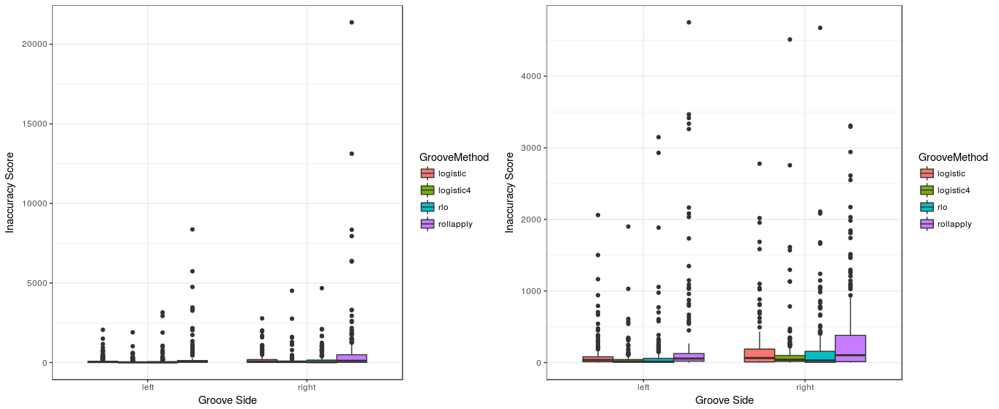
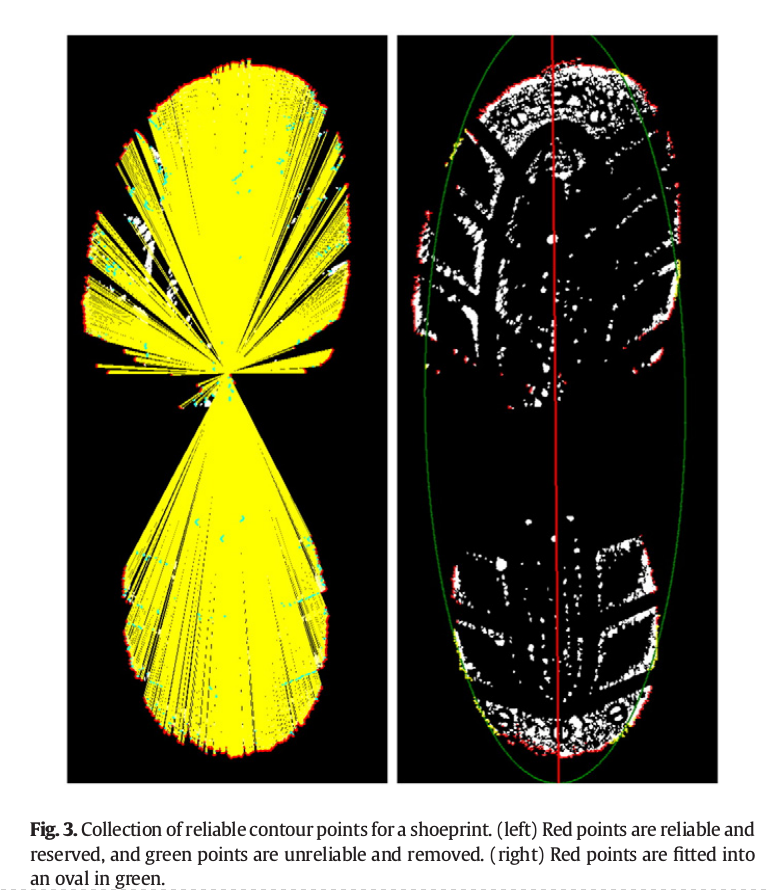
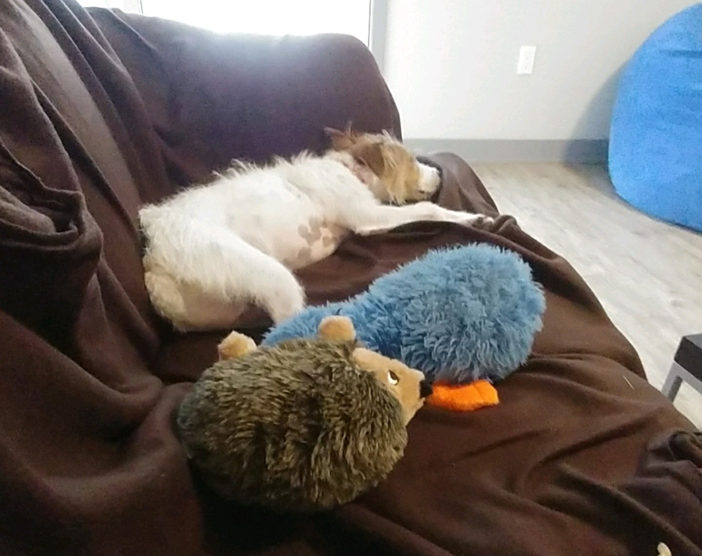
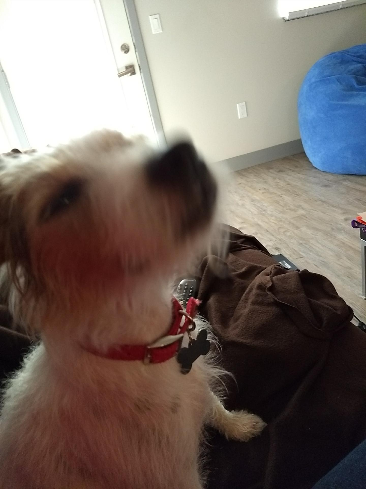
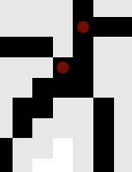

class: inverse
# About Slides

---
class: primary 
# New CSAFE slide template

We're now using [`xaringan`](https://github.com/yihui/xaringan)

What's changed: 

- New person slide: 

````
---
class: inverse
# Your Name
````

---
class: secondary

- New content slide with title: 

````
---
class: primary
# Title of slide 

Slide content
````

- New content slide without title: 

````
---
class: secondary

Slide content with no title on slide
````

---
class: inverse
# Sample User

---
class: primary
# Sample Slide

- Sample Table. Sam Tyner talked about the three must-haves of your summary:


| Must-have | It means |
| :------   | :------- |
| Context | Why are you doing what you're doing? "I'm working on X project in order to Y" |
| Content | What are you doing? "I wrote X function that does Y" or "I ran a simulation of Z" |
| Conclusion | What did you learn? "This will help me because it..." or "This important because it gets us to..." |


---
class: secondary

- If you are going to add an image, **create a directory** with your name within "images" folder. For example, "images/**guillermo**/sample_image.JPG"


 
 
    
---
class: inverse
# Nate
---

class: primary
# Summer Work
- Defended MS/prepared CC for journal submission
- Ran preliminary analyses for dissertation/predictive policing
- Pivoted goals on SLR project and began research/work related to said goals
- Wrote code for groove changepoint detection algorithm
---
class: primary
# Fall Semester Goals
- Verify theoretical basis for current SLR goals and begin experiments on simulated data 
- Finish groove changepoint detection algorithm version 2 and test on all available data
- Write paper with Kiegan on groove results

---
class: inverse
# Sam

---
class: primary
# Summer work

- Led the REU: 6 students, 2 groups: one on handwriting, one on human factors
- Co-wrote presentation for Alicia, Hal & others for a presentation to the ABA 
- Chaired a SAFE session at JSM 
- Presented thesis work @ JSM 
- Started writing book funded by ROpenSci Fellowship


---
class: primary
# Fall semester plans: 

- submit papers from thesis for publication
- writing R packages with SP
    + glass 
    + shoes
    + "uncertainty pyramid" stuff with SL & HI
- working on book funded by ROpenSci Fellowship 
- narrowing down topics & formats for new CSAFE training materials 
- writing "Ten Simple Rules for..." articles with DO
    + statisticians doing forensic science
    + forensic scientists doing statistics
    + [legal professionals encountering statistics](https://github.com/CSAFE-ISU/slides/issues/2)

---
class: primary
# Since last meeting:

- Training:
    * Creating new training materials for website
    * What do practitioners want? ⬅️ constructing a survey
    * With that knowledge, can start material development
- Contacted potential coauthors of book chapters
    * ROpenSci [Fellowship](https://ropensci.org/blog/2018/02/14/announcing-2018-ropensci-fellows/): follow progress on [my blog](https://sctyner.github.io/blog.html)
    * Need several co-authors on chapters ⬅️ sent lots of emails
    * Once all collaborators are found, will find "case studies" 
    * Now organized in SmartSheet! (Thanks Stacy, Harlie & Rachael!)
- Spent all day Friday at the "Emerging Leaders Academy" (once a month for whole school year)
    * Applied in April 2018 (Thanks Alicia!)
    * Professional development: fostering communication & leadership skills

---
class: inverse
# Guillermo

---
class: primary
# This Summer

- Processing and cleaning Shoeprints Database
  + Vinyl pictures: Modified Python program to rename them and created R program to check that name is correct.
  + MatScan files: wrote AutoIt script to automatically extract files and made R program to name them accordingly (plus I wrote some programs to generate our own images and GIFs that will not be included in the database).
  + Surveys: wrote R code to 'clean' code, e.g., `"20% to 40%"` to `"30"`.
  
- Make changes to IRB (and there are still some pending changes)

- Registration of 3D scans of shoeprints

---
class: primary
# Plans for this Fall

- Complete adaptation of registration of 3D scans in R and perform analysis

- Complete shiny app for 2D outsole scans registration

- Write paper of the database which must include some data analysis

- Write paper on speaker recognition (w/Vianey Leos)

---
class: inverse
# James
---

class: primary
# Summer work

* Completed the final round of data collection on the 160 shoes
   + Poster at the All Hands Meeting
* Reviewed all files (20,000) for naming and type errors
   + over 5,300 errors
   + 5 left (have been passed to Guillermo)
* Reviewed and cleaned the survey data from the Longitudinal Study
* Developed drafts of new data collection procedures
   + HS Inters Ben and Jenny wrote initial procedures
   + Discussion, testing, and further research  
* IAI with Harlie - Booth


   
---

class: primary
# This Fall

* Possible Phase 2 of Data Collection for the shoe database 
   + Just received feedback from the DCI
   + Further tuning of our new procedures
   + Develop a strict outline for how data collection will be done
* New 3D Scanner Techniques
* Beginning my masters work
   + GDCB 510 (Transmission Genetics)
   + Soc. 590 (Independent Study Research)
   + Gen. 409 (Molecular Genetics)
   + Possible independent paper into Stationary Serial Homicide
   
---
class: inverse
# Kiegan  

---
class: primary   
# New Modeling Progress   


- Predicting location of grooves  


---  
class: primary
# New Modeling Progress  

- Logistic regression (data-point-centric)  
- Predicting "part of LEA" vs. "part of GEA"  
    - robust LOESS residual value  
    - robust LOESS residual value squared  
    - side  
    - depth from center  
    - number of NA's in 50  
    - range of residual values in 50   
    - number of positive residuals in 50  
    - indicator: >= 2*median abs. deviation  
    - predicted x-intercept on left side  
    - predicted x-intercept on right side  

---
class: primary  
# New Modeling Results  
  


---
class: inverse
# Danica  


---
class: primary   
# Fall Semester Goals  

- Submit draft BF vs. LR paper to AOS  
    - Write a follow-up paper to LPR  
- Continue NIJ grant to validate FDE conclusions  
- Work with Amy on the CSAFE Handwriting project  
- Work with Dan Spitzner from UVA on the CSAFE Statistical Foundations project
- Write a paper for LPR on approximations to BFs
- Write a paper on Fiducial Factors with UNC


---
class: inverse
# Susan

---
class: primary
# Useful Things

- `bulletxtrctr` is at 98% test coverage and also has more descriptive variable names

- Tried and failed to get Shiny to record audio for the truthiness study talk-aloud pilot
    - Audio drivers + Javascript = sadness.
    - We'll just collect audio data the old fashioned way.


---
class: primary
# Useful Things

Read a paper: 
> Gwo, C.-Y., & Wei, C.-H. (2016). Shoeprint retrieval: Core point alignment for pattern comparison. Science & Justice, 56(5), 341-350. https://doi.org/10.1016/j.scijus.2016.06.004    

- Partially implemented in R - goal is to align + impose coordinate system on a shoeprint
- Combine with identified features to get a spatial feature "map" that can identify a type of shoe




---
class: inverse
# Miranda

---
class: primary
# Neural Networks

- Preliminary multi-label model "trained"
    - Still need to figure out how to view predictions...
- Next steps: add classes, implement augmentation (to prevent over-fitting)

---
class:primary
# Dog-Sitting

Eddie has two personalities: precious angel and kangaroo

 
 


---
class: inverse
# Amy

---
class: primary
# Fall Semester Goals

- Data Collection
- Expand Bayesian hierarchical model
    - Formal Model Selection
    - Tests and Intervals
    - Validation
- Write and submit a paper on that modeling.
- Exploritory analysis of 'next level' features (AAFS)
    - Work with Ben and Nick
    

---
class: inverse
# Nate
---
class: primary
# Groove ID

- Writing version 2 of changepoint algorithm
    - Things seem to be working for the two changepoint case.
    - working on 1 changepoint case.

---
class: primary
# SLR

- Reading through a few papers on ABC
    - Currently reading a paper on how to select summary statistics based on minimizing the entropy in the distribution of the data given the summary statistics.
    - Also have a paper on necessary and sufficient condition on the summary statistics for convergence of Bayes factor to the true model. 

---
class: inverse
# Ben

---
class: primary
# Semester Intentions

- Collaborate w/Nic & Amy to improve handwriting project
- Develop improvements / features part of algorithm
- Eventually port algorithm through an application portal
- Improve file structure of project


---
class: secondary

- Working on preprocessing binary image
  - Prototyping w/ Numba & Python
  - Testing performance relative to Cpp
  - Hope to expedite development

---
class: inverse
# Nick
---
class: primary
# Adding Missed nodes

- Added catch to verify that if a 2x2 block is left in skeleton that it gets a node - it's always a connection of some sort.




---
class: inverse
# Ganesh  

---
class: primary   
# Reinforcement Learning Trees
Paper: https://www.tandfonline.com/doi/abs/10.1080/01621459.2015.1036994
R package : https://cran.r-project.org/web/packages/RLT/index.html
- This method implements reinforcement learning at each selection of a splitting variable during the tree construction processes

Issues in RF being addressed by RLT (The following excerpts are directly from the paper)
- Consistency and Convergence rates for random forests rely heavily on the particular implemented splitting rule.
- The "large p small n" problem (few data points and many features) is caused by random feature selection, which is the most important “random” component of random forests.

---
class: primary 
- Using only a small number of randomly sampled features means less opportunity to consider a strong variable as the splitting rule and leads to possible bias in variable importance measures.
- Using large number of predictors causes overfitting toward terminal nodes where the sample size is small and prevents the effect of strong variables from being fully explored.
- Proposed method: Improves the performance of random forests in high-dimensional sparse settings which boil down to the fact that in a high-dimensional setup, a tree-based model with good performance should split only on the X number of strong variables.

---
class: primary 
What does the method do?
An important characteristic of reinforcement learning is the “lookahead” notion, which benefits the long-term performance rather than short-term performance. 
The main features of the proposed method are: 
- first, to choose variable(s) for each split that will bring the largest return from future branching splits rather than only focusing on the immediate consequences of the split via marginal effects. Splitting mechanism can break any hidden structure and avoid inconsistency by forcing splits on strong variables even if they do not show any marginal effect.

---
class: primary 
- Meaning by splitting on the variable that brings the greatest future improvement in later splits, rather than choosing the one with largest marginal effect from the immediate split, the constructed tree uses the available samples in a more efficient way. 
- a variable muting procedure that progressively eliminates noise variables during the construction of each individual tree. The muting procedure also takes advantage of reinforcement learning and prevents noise variables from being considered in the search for splitting rules, so that toward terminal nodes, where the sample size is small, the splitting rules are still constructed from only strong variables.

Questions on applicability of RLT: benefit vs disadvantage for CSAFE projects

---
