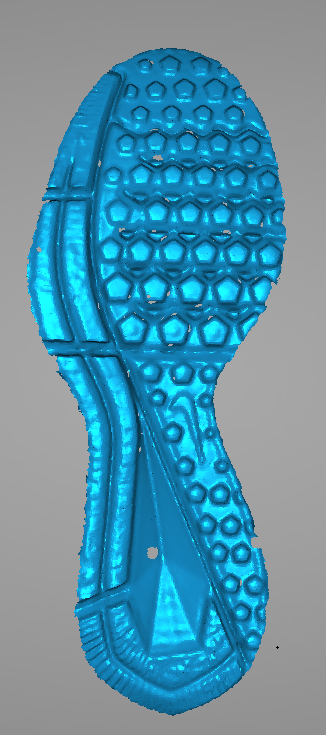
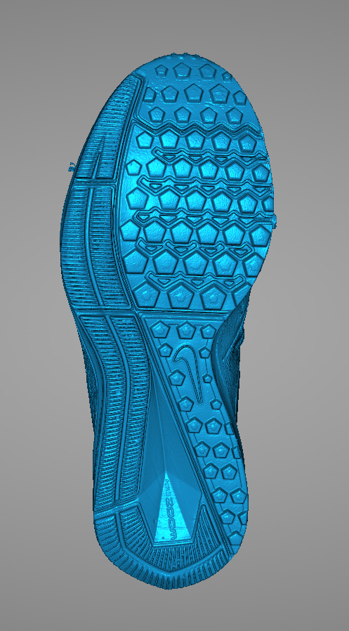
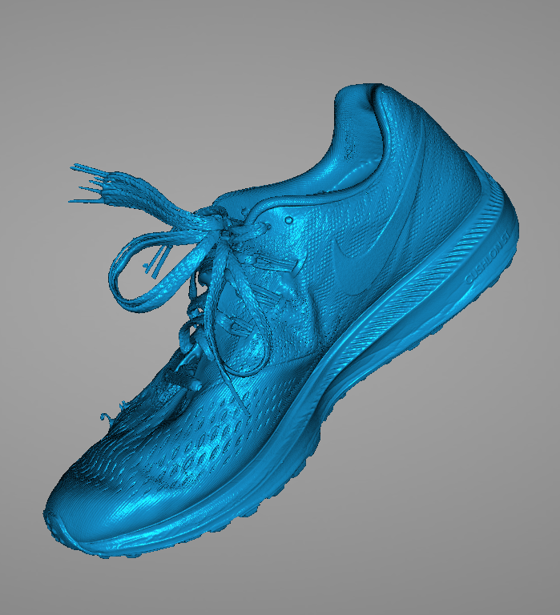
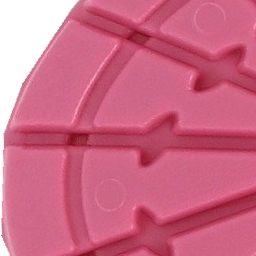

class: inverse
# About Slides

---
class: primary 
# New CSAFE slide template

We're now using [`xaringan`](https://github.com/yihui/xaringan)

What's changed: 

- New person slide: 

````
---
class: inverse
# Your Name
````

---
class: secondary

- New content slide with title: 

````
---
class: primary
# Title of slide 

Slide content
````

- New content slide without title: 

````
---
class: secondary

Slide content with no title on slide
````

---
class: inverse
# Sample User

---
class: primary
# Sample Slide

- Sample Table. Sam Tyner talked about the three must-haves of your summary:


| Must-have | It means |
| :------   | :------- |
| Context | Why are you doing what you're doing? "I'm working on X project in order to Y" |
| Content | What are you doing? "I wrote X function that does Y" or "I ran a simulation of Z" |
| Conclusion | What did you learn? "This will help me because it..." or "This important because it gets us to..." |


---
class: secondary

- If you are going to add an image, **create a directory** with your name within "images" folder. For example, "images/**guillermo**/sample_image.JPG"


 
 


---
class: inverse
# Amy

---
class: primary
# Fall Semester Goals

- **Data Collection** <span style="color:red">IRB Routing!</span>
- Expand Bayesian hierarchical model
    - **Formal Model Selection** <span style="color:red">Deviance Information Criterion (DIC)!</span>
    - Tests and Intervals
    - Validation
- Write and submit a paper on that modeling.
- Exploratory analysis of 'next level' features (AAFS)
    - Work with Ben and Nick
    
---
class: inverse
# Ben

---
class: primary
# Progress!

- Checks binary image for predefined patterns.
- Outputs coordinates for corrections, marked by dots.
---
class: secondary


- F. W. M. Stentiford and R. G. Mortimer, "Some new heuristics for thinning binary handprinted characters for OCR," in IEEE Transactions on Systems, Man, and Cybernetics, vol. SMC-13, no. 1, pp. 81-84, Jan.-Feb. 1983.
doi: 10.1109/TSMC.1983.6313034
- Checks for a variety of masks
- Documentation on my branch (ben)
---
class: inverse
# Nick

---
class: secondary

- Working on getting node counts.
- Paying penalty for oversights made first time around.


---
class: inverse
# Ganesh  

---
class: primary   
# UI Development

- Fixed click events for Layered Graphics display in Shiny using some sample datasets.
- Discovered after lots of pain that some shiny render events, by default, delete all the files in use!!

- Implementing the framework for a small sample bullet dataset
- Overview of the app layout
  - First Layer: bullet-to-bullet comparisons, Second Layer: land-to-land comparisons, then Visual comparisons of images, signatures, and so on.


    
---
class: inverse
# Nate


---
class: primary
# Fall Semester Goals
- Verify theoretical basis for current SLR goals and begin experiments on simulated data 
- Finish groove changepoint detection algorithm version 2 and test on all available data
- Write paper with Kiegan on groove results

---
class: inverse
# Sam

---
class: primary
# Fall semester plans: 

- submit papers from thesis for publication
- writing R packages with SP
    + glass 
    + shoes
    + "uncertainty pyramid" stuff with SL & HI
- working on book funded by ROpenSci Fellowship 
- narrowing down topics & formats for new CSAFE training materials 
- writing "Ten Simple Rules for..." articles with DO
    + statisticians doing forensic science
    + forensic scientists doing statistics
    + [legal professionals encountering statistics](https://github.com/CSAFE-ISU/slides/issues/2)

---
class: inverse
# Guillermo

---
class: secondary

- Getting familiar with forensic genetics
    + Some papers with Thore Egeland
    + Development of theory and software (R packages)
    
- Some time spent on reviewing names of shoeprints database and changes to IRB


---
class: inverse
# James

---
class: primary
# This Fall

* New Data Collection Procedures on Select Shoe Pairs 
   + 107 Full Sets of Data - No Problems
   + Casting, Flour Impressions, High Resolution 3D Scanning
   + Develop a strict outline for data collection



   
---
class: inverse
# Kiegan  


---
class: primary   
# Fall Semester Goals  

- *Submit to AFTE journal* - 1 advisor down, 1 to go!    
- *Complete writing of Chapman & Hall book*    
    - Finishing Chapter 3 draft this week  
- `get_grooves_logistic` in `bulletxtrctr`  
- Ran into an issue with robust LOESS on Houston set  
    - Reworking functions to iterate how we want.  


---
class: inverse
# Danica  

---
class: primary   
# Update  

- Submit draft BF vs. LR paper to AOS ->  should be done this week!  
    - Write a follow-up paper to LPR  ->  have a nice draft
- Continue NIJ grant to validate FDE conclusions
    - Started work on the second phase
    - Trying to determine a good way to combine kinematic measures
- Working on my Top 10 lists
    - Things statisticians should know before working in forensics -> have a nice draft
    - Things forensic practioners should know before working with statistics -> have a rough draft


---
class: inverse
# Susan

---
class: primary
# Bullets

- Hamby 36 analysis
    - Use `bulletxtrctr` with legacy featurees
    - Intelligent re-calculation of results - only recalculate if the inputs have changed
    - smarter parallel processing - memory issues
- Hamby 44 analysis
    - Goal is to compare Hamby 36 to Hamby 44

---
class: primary
# Shoes

- Image alignment/shoe coordinate system algorithm
    - [`ShoeAlignR` package](https://github.com/srvanderplas/ShoeAlignR)
    - Still to do: See how consistent the coordinates are from image to image (same shoe)
    - May also apply to chemistry/fingerprint image alignment
    

---
class: primary
# Shoes

- Shoe NN Images:
    - Better labeling - quality control
    - Add "context" - for non-rectangular polygons, use minimum bounding rectangle
        - less distortion
        - ensures NN isn't recognizing cutout shape instead of actual image features
    - Fill in white pixels with median non-white pixel value - lower background contrast

Before | After
------ | -----
  |   

---
class: inverse
# Miranda

---
class: primary
# Multi-class Neural Networks

- Trained multi-label neural networks
- Created shiny app for viewing prediction probabilities
- https://bigfoot.csafe.iastate.edu/shiny/tiltonm/NNPreview/

---
class: inverse
# Heike

---
class: primary
# Scans


- Hamby set 36 scans done, <span style="color:orange">analysis done, results are a bit strange</span>

- Hamby clone set 224 <span style="color:orange">scans done </span>

- Hamby set 224 <span style="color:orange">scans done </span>

- <span style="color:orange">Hamby set 10 arrived from St Louis, in scanning process. </span>

- several other sets of bullets and cartridge cases

---
class: primary
# Hamby 224 - Clone

- Hamby 224 Clone

    - organized as test set: two known bullets from the same barrel are paired with an unknown
    
    - total of fifteen test sets (one for each unknown): some clones have replicates


     

---
class: primary
# Hamby 224 - Clone and Original

Which barrel in the original is Test Set barrel X?

Test set 1 (Clone 224) versus Barrel 1 (Set 224)


Still todo: Matching individual clones and their respective bullets

---
class: primary
# Scans

Original


Clone


---
class: primary
# Hamby 224 - Clone and Original
Test set 11 (Clone 224) versus Barrel 1 (Set 224)


Set 224: Bullet 1 - Bullet 2: 0.98

Set/Clone 224: Bullet 1: 0.97

---
class: primary
# Strange scan

Scan of original and corresponding clone - middle part of clone does not show any striae


---
class: primary
# Programming

- bulletxtrctr re-factoring ~~close to~~ done

- starting on comparisons of before/after feature values

- [x3ptools](https://heike.github.io/x3ptools/) and 
[bulletxtrctr](https://heike.github.io/bulletxtrctr/)


---
class: secondary

[Issues!!](https://github.com/CSAFE-ISU/slides/issues)
