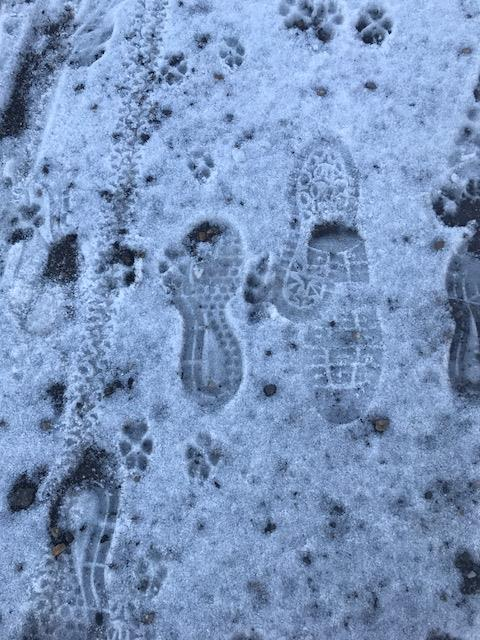
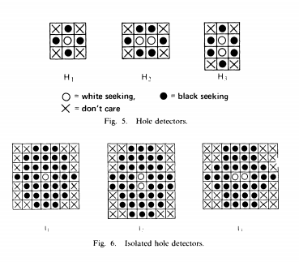
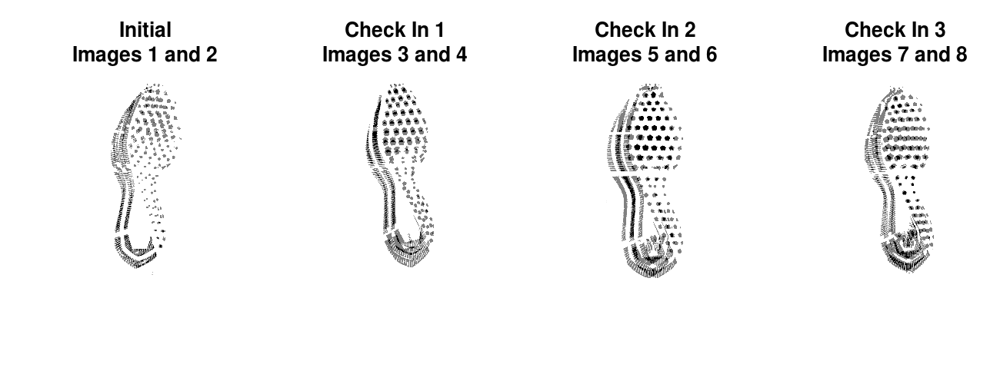
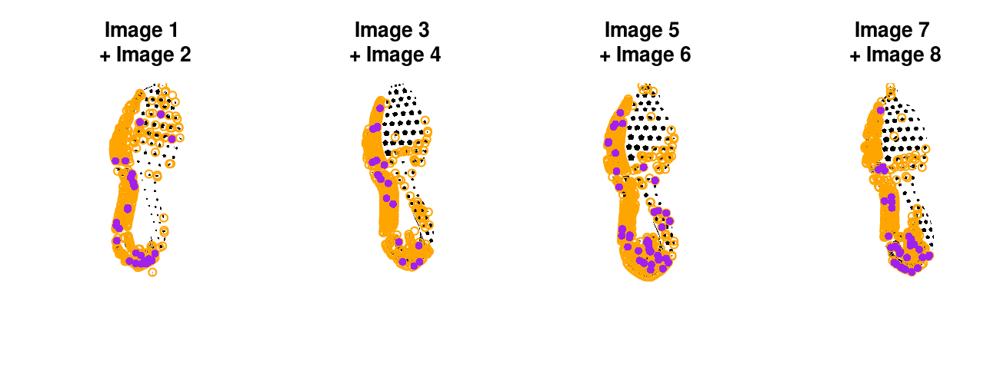

class: inverse
# About Slides

---
class: primary 
# New CSAFE slide template

We're now using [`xaringan`](https://github.com/yihui/xaringan)

What's changed: 

- New person slide: 

````
---
class: inverse
# Your Name
````

---
class: secondary

- New content slide with title: 

````
---
class: primary
# Title of slide 

Slide content
````

- New content slide without title: 

````
---
class: secondary

Slide content with no title on slide
````

---
class: inverse
# Sample User

---
class: primary
# Sample Slide

- Sample Table. Sam Tyner talked about the three must-haves of your summary:


| Must-have | It means |
| :------   | :------- |
| Context | Why are you doing what you're doing? "I'm working on X project in order to Y" |
| Content | What are you doing? "I wrote X function that does Y" or "I ran a simulation of Z" |
| Conclusion | What did you learn? "This will help me because it..." or "This important because it gets us to..." |


---
class: secondary

- If you are going to add an image, **create a directory** with your name within "images" folder. For example, "images/**guillermo**/sample_image.JPG"


 
 


---
class: inverse
# Amy

---
class: primary
# Fall Semester Goals

- **Data Collection** <span style="color:red">Application is in 'IRB Staff Review' phase.</span>
- Expand Bayesian hierarchical model
    - **Formal Model Selection** <span style="color:red">Deviance Information Criterion (DIC)</span>
    - Tests and Intervals
    - Validation
- Write and submit a paper on that modeling.
- Exploratory analysis of 'next level' features (AAFS in February)
    - Work with Ben and Nick
    
---
class: secondary
## IRB Manager - <br>*"One form to rule them all"*


---
class: secondary
## DIC
**Context:** Formal model selection with DIC. How many grapheme types to use in modeling? <br>
**Content:**  

|No. Graphemes| DIC Server (JAGS 4.2.0) | DIC Local (JAGS 4.3.0) |  
| :------   | :------- | :------- |  
| 2 | 1 | 1 |  
| 2 | 1 | 1 |  
| 2 | 1 | 1 |  
| 2 | 1 | 1 |  
| <span>&#8942;</span> | 1 | 1 |  


    
---
class: secondary
### IRB Manager - <br>*"One form to rule them all"*


---
class: secondary
### IRB Manager - <br>*"One form to rule them all"*


---
class: inverse
# Ben

---
class: primary
# Progress!

- Checks binary image for predefined patterns.
- Outputs coordinates for corrections, marked by dots.
---
class: secondary



- F. W. M. Stentiford and R. G. Mortimer, "Some new heuristics for thinning binary handprinted characters for OCR," in IEEE Transactions on Systems, Man, and Cybernetics, vol. SMC-13, no. 1, pp. 81-84, Jan.-Feb. 1983.
doi: 10.1109/TSMC.1983.6313034
- Checks for a variety of masks
- Documentation on my branch (ben)


---
class: inverse
# Nick

---
class: secondary

- Working on preprocessing binary image
  - Prototyping w/ Numba & Python
  - Testing performance relative to Cpp
  - Hope to expedite development


---
class: inverse
# Nate


---
class: primary
# Fall Semester Goals
- Verify theoretical basis for current SLR goals and begin experiments on simulated data 
- Finish groove changepoint detection algorithm version 2 and test on all available data
- Write paper with Kiegan on groove results

---
class: inverse
# Sam

---
class: primary
# Book progress

- Confirmed book contributors: 
  - Amanda Luby (human factors)
  - Chris Galbraith (digital)
  - Karen Pan (fingerprint, glass (?))
  - Eric Hare (bullets)
  - Xiao Hui (casings, digital)
  - Nick Berry (handwriting)
  - Soyoung Park (glass, shoes)
  - Peter Vallone, Sarah Riman (DNA)
  
- Chapter Outline: 
  - Intro. to problem
  - Data collection and cleaning
  - R Packages available & key functions
  - Drawing conclusions (LR?, SLR?, etc.)
  - Case Study 
  
Other: glossary, hierarchy of propositions, LR chapter? 

---
class: primary
# Practitioner survey

  

---
class: primary
# Practitioner survey


---
class: primary
# EDA glass paper


---
class: inverse
# Soyoung

---
class: primary
# Fall semester plans: 

- Shoes
    + Wrap up shoe analysis using edges and SURF 
    + Compare the performance with other methods such as phase only correlations, Fourier-Mellin transformation correlation
    + Do analysis with CSAFE shoe data
    + Submit papers regarding shoe analysis soon!
   
- Research on "uncertainty pyramid" with Steve and Hari at NIST   

- Glass analysis with Sam
    + Exploratory analysis 
    + Various covariance estimations
    + Submit papers!
   
- Working on book chapters of glass and shoes funded by ROpenSci Fellowship 

---
class: primary
# Analysis result with CSAFE shoe data 

- All nike shoes with size of 8.5 and 10.5 at time 4 (6 months)
- KM (716) : Between replicates
- KNM (599) : Between shoe IDs
- Edge matching with three circles


---
class: inverse
# Guillermo

---
class: secondary

- Getting familiar with forensic genetics
    + Some papers with Thore Egeland
    + Development of theory and software (R packages)
    
- Some time spent on reviewing names of shoeprints database and changes to IRB


---
class: inverse
# James

---
class: primary
# This Fall

* Steady Progress 
  + 27 Pairs left to 3D Scan
  
* Will be Using the Gilman Lab for all "four" Prints

* Mud prints may be taken in Durham due to the 3D Scanner


---
class: inverse
# Kiegan  


---
class: primary   
# Fall Semester Goals  

- **Submit to AFTE journal** - Finishing up edits this week.    
- **Complete writing of Chapman & Hall book**    
    - Finishing Chapter 3 draft *this week*   
- "Bake-off" of get_grooves methods coming soon.  
- Ran into an issue with robust LOESS on Houston set  
    - Reworking functions to iterate how we want.  


---
class: inverse
# Danica  

---
class: primary   
# Update  

- Submit draft BF vs. LR paper to AOS ->  should be done this week!  
    - Write a follow-up paper to LPR  ->  have a nice draft
- Continue NIJ grant to validate FDE conclusions
    - Started work on the second phase
    - Trying to determine a good way to combine kinematic measures
- Working on my Top 10 lists
    - Things statisticians should know before working in forensics -> have a nice draft
    - Things forensic practioners should know before working with statistics -> have a rough draft


---
class: inverse
# Susan

---
class: primary
# Bullets

- Hamby 44 analysis
    - Goal is to compare Hamby 36 to Hamby 44
    - Hopefully will be finished later today

---
class: primary
# Image Alignment

- `ShoeAlignR` package renamed to `ImageAlignR` 
    - useful for fingerprints as well
    - algorithms aren't working with color images yet... not sure why
- Implemented an alignment algorithm from a [Kaggle post](https://www.kaggle.com/vicensgaitan/image-registration-the-r-way/notebook)
    - Harris Corner detection + KNN features + RANSAC to find a matching transformation for alignment

---
class: primary
# Image Alignment



---
class: primary
# Image Alignment



- Orange points - interesting feature for the first image
- Purple points - similar feature in 2nd image

---
class: primary
# Image Alignment


- Red = appears in warped image only
- Blue = appears in unwarped image only
- Black = appears in both images (overlapped points)

---
class: primary
# Image Alignment

- Still to do:
    - Need to add a better feature detector - corner detection misses some shoe features
    - Figure out whether the algorithm isn't working on certain shoes:
        - Image cleaning?
        - Poor feature detection?
        - Different people wearing the shoes?

---
class: inverse
# Miranda

---
class: primary
# Fall Semester Goals

- Develop methods to train "one-hot" neural networks for multi-label classification
- Write paper on network training and results (ideally also a Creative Component)
- Continue to help with truthiness data collection

---
class: inverse
# Heike

---
class: primary
# Scans


- Hamby set 36 scans done, <span style="color:orange">analysis done, results are a bit strange</span>

- Hamby clone set 224 <span style="color:orange">scans done </span>

- Hamby set 224 <span style="color:orange">scans done </span>

- <span style="color:orange">Hamby set 10 arrived from St Louis, in scanning process. </span>

- several other sets of bullets and cartridge cases

---
class: primary
# Hamby 224 - Clone

- Hamby 224 Clone

    - organized as test set: two known bullets from the same barrel are paired with an unknown
    
    - total of fifteen test sets (one for each unknown): some clones have replicates


     

---
class: primary
# Hamby 224 - Clone and Original

Which barrel in the original is Test Set barrel X?

Test set 1 (Clone 224) versus Barrel 1 (Set 224)


Still todo: Matching individual clones and their respective bullets

---
class: primary
# Scans

Original


Clone


---
class: primary
# Hamby 224 - Clone and Original
Test set 11 (Clone 224) versus Barrel 1 (Set 224)


Set 224: Bullet 1 - Bullet 2: 0.98

Set/Clone 224: Bullet 1: 0.97

---
class: primary
# Strange scan

Scan of original and corresponding clone - middle part of clone does not show any striae


---
class: primary
# Programming

- bulletxtrctr re-factoring ~~close to~~ done

- starting on comparisons of before/after feature values

- [x3ptools](https://heike.github.io/x3ptools/) and 
[bulletxtrctr](https://heike.github.io/bulletxtrctr/)


---
class: secondary

[Issues!!](https://github.com/CSAFE-ISU/slides/issues)


---

class: inverse 
# Nate 

---

class: primary
# Groove ID
- Version 2 of changepoint algorithm running 
- Still undergoing some testing and seeing some bizarre behavior, which may be due to some very small technical issues.
- After these issues are resolved, I'll run the algorithm on all of Hamby and Houston.

---

class: primary
# SLR
- Using "mutual information" between the distribution of the data given a score vs the unconditional distribution of the data to measure information loss 
    - Can estimate this numerically
- I think that this can be maximized wrt the empirical distribution for the original data with a linear program
- Then the distribution of log(LR) - log(SLR) could be computed numerically
- Lots of (small?) issues
    

