class: inverse
# About Slides

---
class: primary 
# New CSAFE slide template

We're now using [`xaringan`](https://github.com/yihui/xaringan)

What's changed: 

- New person slide: 

````
---
class: inverse
# Your Name
````

---
class: secondary

- New content slide with title: 

````
---
class: primary
# Title of slide 

Slide content
````

- New content slide without title: 

````
---
class: secondary

Slide content with no title on slide
````

---
class: inverse
# Sample User

---
class: primary
# Sample Slide

- Sample Table. Sam Tyner talked about the three must-haves of your summary:


| Must-have | It means |
| :------   | :------- |
| Context | Why are you doing what you're doing? "I'm working on X project in order to Y" |
| Content | What are you doing? "I wrote X function that does Y" or "I ran a simulation of Z" |
| Conclusion | What did you learn? "This will help me because it..." or "This important because it gets us to..." |


---
class: secondary

- If you are going to add an image, **create a directory** with your name within "images" folder. For example, "images/**guillermo**/sample_image.JPG"


 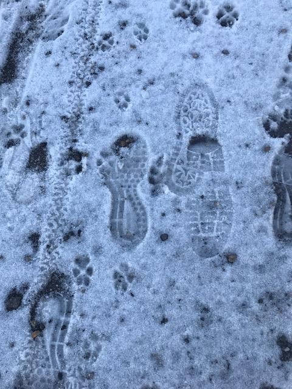
 

---
class: inverse
# Soyoung

---
class: primary
# Fall semester plans: 
 - Shoes
    + Wrap up shoe analysis using edges and SURF 
    + Compare the performance with other methods such as phase only correlations, Fourier-Mellin transformation correlation
    + Do analysis with CSAFE shoe data
    + Submit papers regarding shoe analysis soon!
   
- Research on "uncertainty pyramid" with Steve and Hari at NIST   
 - Glass analysis with Sam
    + Exploratory analysis 
    + Various covariance estimations
    + Submit papers!
   
- Working on book chapters of glass and shoes funded by ROpenSci Fellowship 

---
class: primary
# Analysis result with CSAFE shoe data 
 - All nike shoes with size of 8.5 and 10.5 at time 4 (6 months)
- KM (716) : Between replicates
- KNM (599) : Between shoe IDs
- KNM example between ID 1 and ID2 of size 10.5 at time 4
 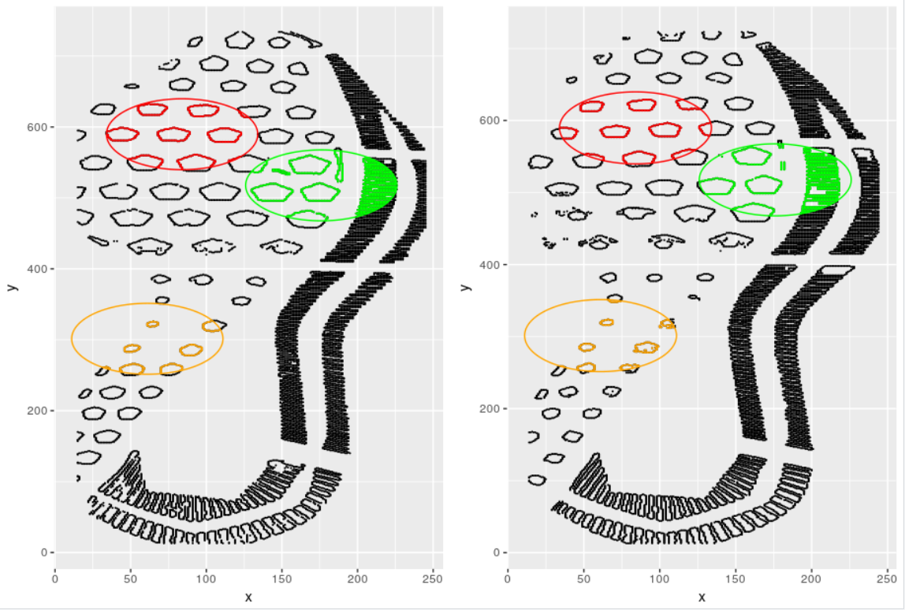


---
class: primary
# Analysis result with CSAFE shoe data 
 - All nike shoes with size of 8.5 and 10.5 at time 4 (6 months)
- KM (716) : Between replicates
- KNM (599) : Between shoe IDs
- Edge matching with three circles
 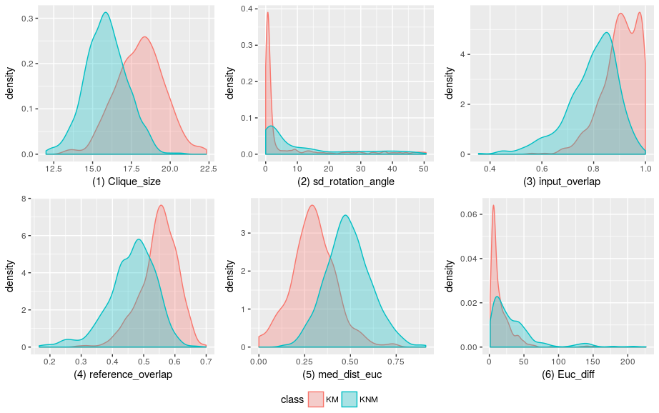

    
---
class: inverse
# Nate


---
class: primary
# Groove ID
- Version 2 of changepoint algorithm running (hopefully bug free)
    - Preliminary results seem a little too variable
- Running algorithm on entire Hamby44 set today
- Next step is to gather all of the code in an R package and thoroughly document everything.

---
class: primary

# SLR
- Looking into "mutual information" between the distribution of the data given a score vs the unconditional distribution of the data to measure information loss 
    - Can potentially estimate this numerically
    
- Putting a prior on $H_0$ vs $H_A$ results in an interesting(?) equality
    - $\log(LR) - \log(SLR) = \frac{1}{p(H_A | X,S)} \left[KL(p(M|X,S) || p(M|S)) - \log(\frac{p(H_0|X,S)}{p(H_0|S)}) \right]$
    - Is it possible to compute a reasonable upper bound for this, specific to the score distribution of interest? 
    - What does it mean that the left side is independent of prior, but right side is not?


---
class: inverse
# Susan

---
class: primary
# Bullets

- Hamby 44 analysis - compare Hamby 36 to Hamby 44
    - ~~Hopefully will be finished later today~~     
    Finished last Monday. Results are a little weird, but not too bad.
- Resampling with `bulletsamplr` package:     
Use time-series bootstrap methods that ensure continuity (threshold bootstrap) to build a bullet signature using pieces of previously generated signatures
    - Did this week: Got a database of cycles populated with Hamby 36 and Hamby 44 signatures
    - Short term goal: Get the methods working
    - Long term goal: Calculate truly "random" match score statistics to get null distributions


---
class: primary
# Image Alignment

- `ShoeAlignR` package renamed to `ImageAlignR` 
    - useful for fingerprints as well
    <!-- - algorithms aren't working with color images yet... not sure why -->
- Implemented an alignment algorithm from a [Kaggle post](https://www.kaggle.com/vicensgaitan/image-registration-the-r-way/notebook)
    - Harris Corner detection + KNN features + RANSAC to find a matching transformation for alignment
    - Added SURF feature detector from `image.dlib` package

---
class: primary
# Image Alignment

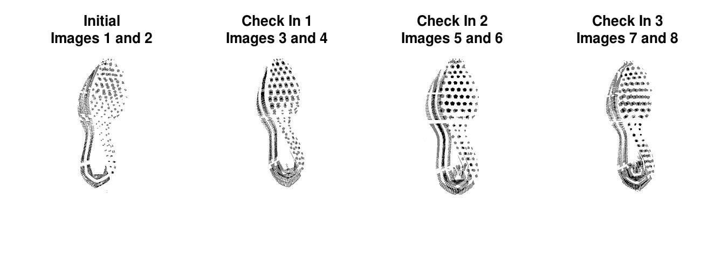

---
class: primary
# Image Alignment

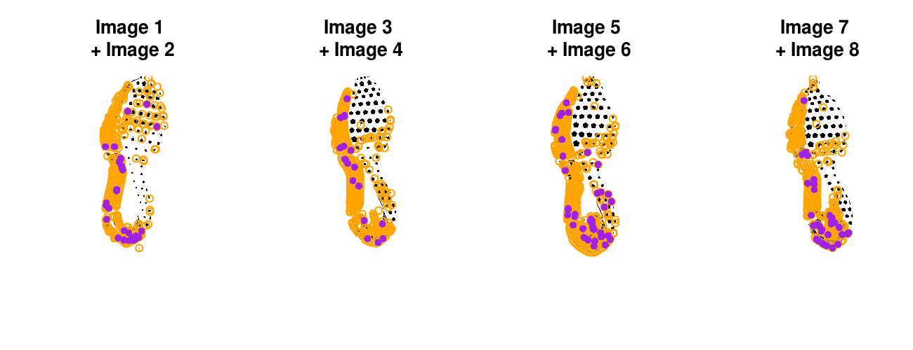

- Orange points - interesting feature for the first image
- Purple points - similar feature in 2nd image

---
class: primary
# Image Alignment

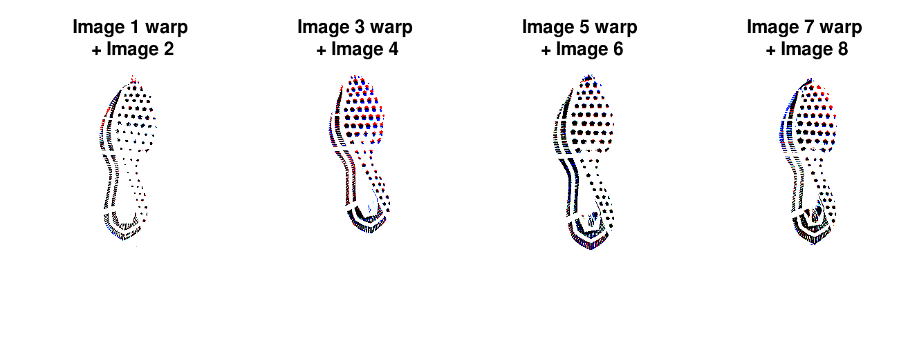
- Red = appears in warped image only
- Blue = appears in unwarped image only
- Black = appears in both images (overlapped points)

---
class: primary
# Image Alignment

- Still to do:
    - ~~Need to add a better feature detector - corner detection misses some shoe features~~
    - Figure out whether the algorithm isn't working on certain shoes:
        - Image cleaning?
        - Poor feature detection?
        - Different people wearing the shoes?
            - The algorithm does much better when aligning shoes at the same timepoint (but still isn't perfect)
    - Get the algorithm working on color images
    - Use on fingerprint data

---
class: primary
# Neural Networks

- Add features to shiny app that facilitate debugging/fixing labels
    - Chunk image linked directly to LabelMe page for the shoe
- Automate generation of labeled images (at 5pm daily) and integrate with model script
    - Shrink large regions down instead of slicing them up
    - No more filling in white pixels with the mean pixel value
- New model is fit every night after image generation is done


---
class: inverse
# Amy

---
class: primary
# Fall Semester Goals

- Data Collection
- Expand Bayesian hierarchical model
    - **Formal Model Selection**
        - <span style="color:red">Further investigation of DIC</span>
        - <span style="color:red">Still waiting on IT to get access to JAGS 4.3.0 (bug fix)...</span>
    - Tests and Intervals
    - Validation
- Write and submit a paper on that modeling.
- Exploritory analysis of 'next level' features (AAFS)
    - **Work with Ben and Nick**
        - <span style="color:red">Node/Grapheme counts & FlashID Data...</span>
    
---
class: inverse
# Ben

---
class: primary
# Improvements!
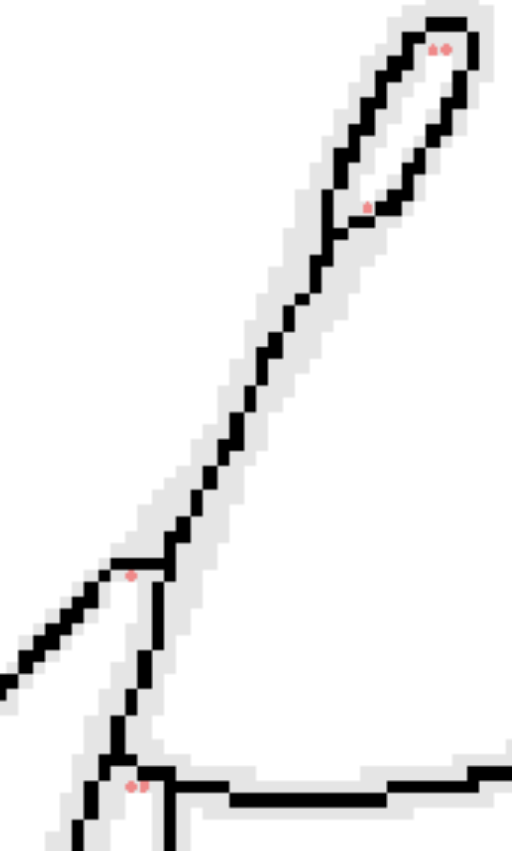


---
class: primary
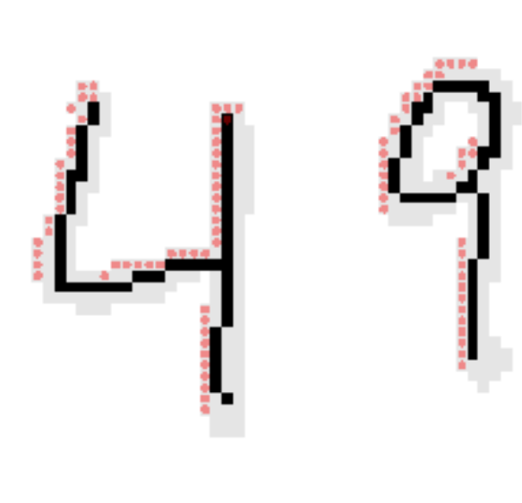

---
class: primary
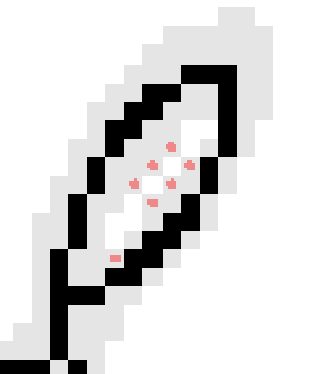

- Wrappers for testing created
- Improvements to structure and performance
---
class: inverse
# Nick

---
class: primary
# Actual Node Counts

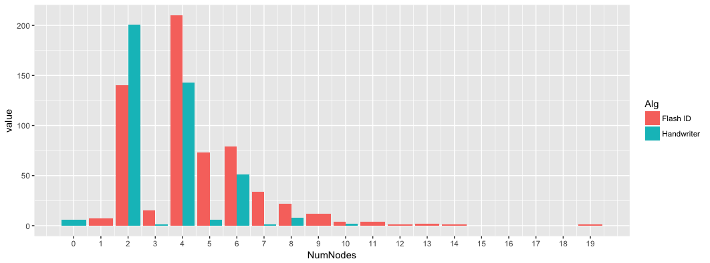

---
class: primary
# Flash ID 4 Node Grapheme

- This is a good 4 node grapheme. We would like to do this.

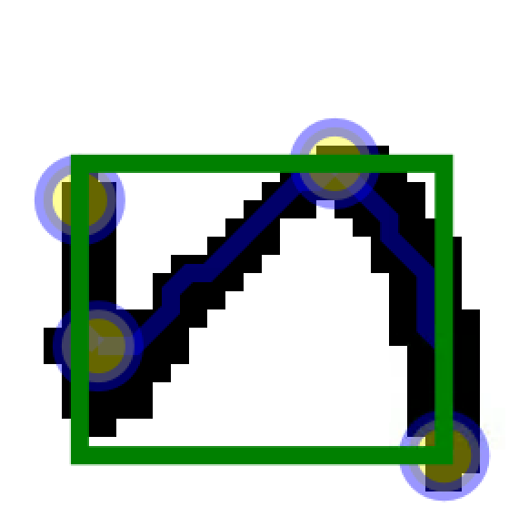

---
class: primary
# Flash ID 4 Node Grapheme

- This is a bad 4 node grapheme. We would NOT like to do this.

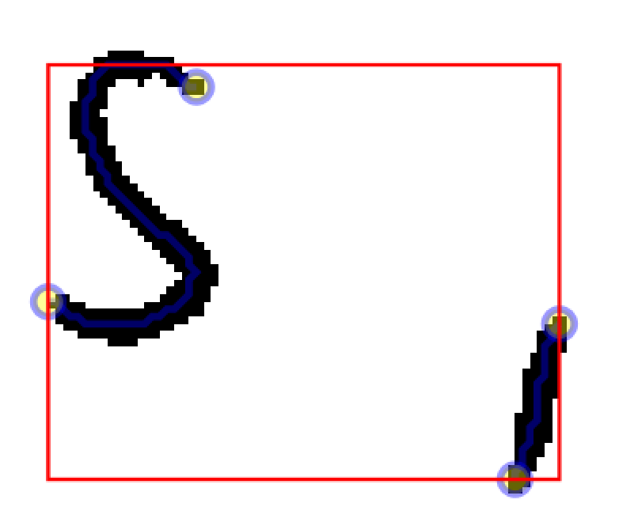

---
class: inverse
# Ganesh  

---
class: primary   
# Fall Semester Goals  

- Taking 2 or 3 classes (Time Series (Stat 551), Optimization in Machine Learning (Com Sc 578X), Cognitive Psychology for Human Computer Interaction (HCI 521))
- Continue with the development of the User Interface
- Explore possibilities of Optimizing the Random Forest wherever possible in the bullet project and implement it.
- Conceptualize the bullet-to-bullet comparison problem for the Chumbley score method.

---
class: inverse
# Sam

---
class: primary
# Fall semester plans: 

- submit papers from thesis for publication
- writing R packages with SP
    + glass 
    + shoes
    + "uncertainty pyramid" stuff with SL & HI
- working on book funded by ROpenSci Fellowship 
- narrowing down topics & formats for new CSAFE training materials 
- writing "Ten Simple Rules for..." articles with DO
    + statisticians doing forensic science
    + forensic scientists doing statistics
    + [legal professionals encountering statistics](https://github.com/CSAFE-ISU/slides/issues/2)

---
class: inverse
# Guillermo

---
class: secondary

- Write some functions to check filename (and bundle them in an R package)

- Do some minor changes to IRB (with James)

- Playing with aligned images from EverOS


---
class: inverse
# James

---
class: primary
# Baby Powder

* 3D Scans are finished 

* We are currently working out the issues with the flour impressions
   + Changing to Baby Powder
   + Getting a cart for the camera to help alignment
   
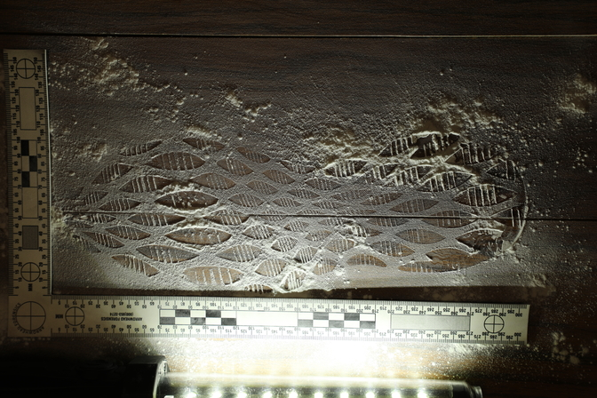


---
class: primary
# Baby Powder

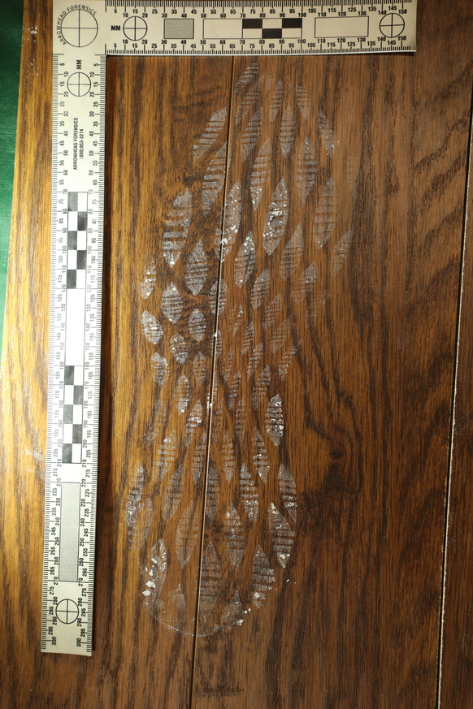


---
class: primary
# Mud

* Fine tuning mud impressions 
   + 3D Scanning 
   
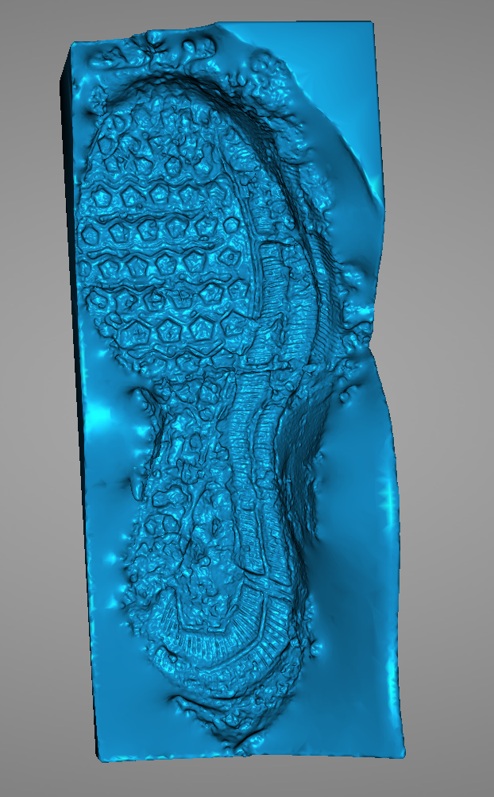
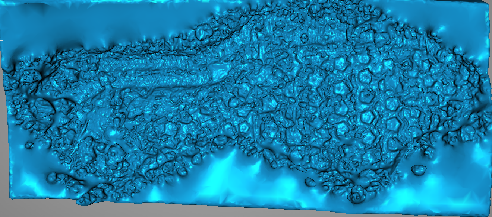  
---
class: inverse
# Kiegan  


---
class: primary   
# Fall Semester Goals  

- **Submit to AFTE journal**  
    - First round of edits complete
- Complete writing of Chapman & Hall book  
- **Write a joint paper with Nate on grooves project**  
    - Organizational work  
    - Finishing up functions so we can run downstream  
    - Starting to write up methodology  
    
---
class: inverse
# Danica  

---
class: primary   
# Fall Semester Update  

- Submit draft BF vs. LR paper to AOS 
    - nearly done ...
    - forgot all my usernames/passwords for the EJMS!  
- Write a follow-up paper to LPR  
    - first draft done, working on second draft
- Continue NIJ grant to validate FDE conclusions  
    - drafted surveys to send out to the examiners with the comparisons
    - starting to look at kinematic scores
    - can use these to recreate the static scans
- Write a paper on Fiducial Factors with UNC  
    - working on simulations during the hurricane in NC
    - to be submitted before winter break
- "Top 10 Things" 
    - fell by the wayside because I was creating & grading STAT 104 exams

---
class: inverse
# Miranda

---
class: primary
# Augmentation

- Recent models have had 92-95% accuracy*
    - *Images still improving in quality
    - *Unequal class representation makes "accuracy" not the best measure overall, but is consistent across all previous models so far
- Augmented images rotate, flip, and shear data to prevent over-fitting

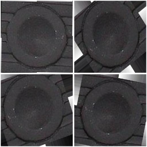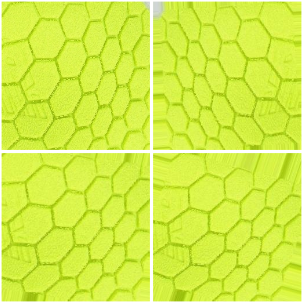

---
class:primary
# Automation...

- On Friday, Susan and I set up scripts to automatically run a new model each night on most recent images
- Something seemed wrong...
- Turns out, (4\*4\*4\*4)(11,318) = 2,897,408 >> 45,272 = (11,318)\*4
    - Now, the script will check whether data has been augmented already...

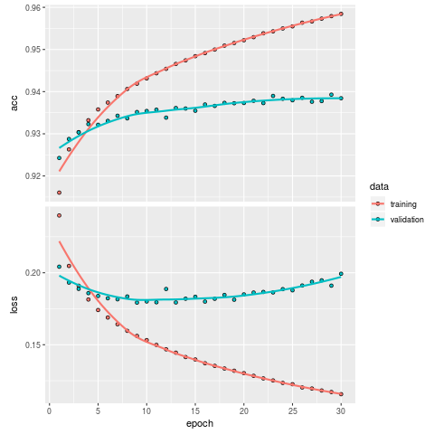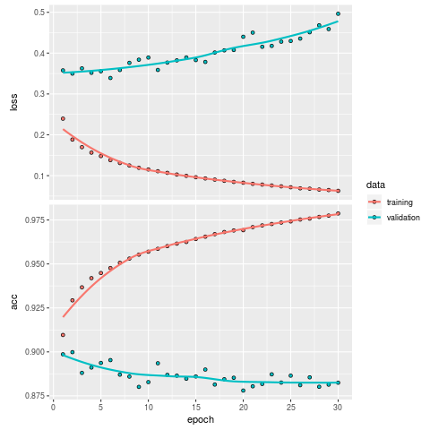

---
class: inverse
# Issues

---
class: secondary

- [Issues!!](https://github.com/CSAFE-ISU/slides/issues)
- One issue down, three to go.


