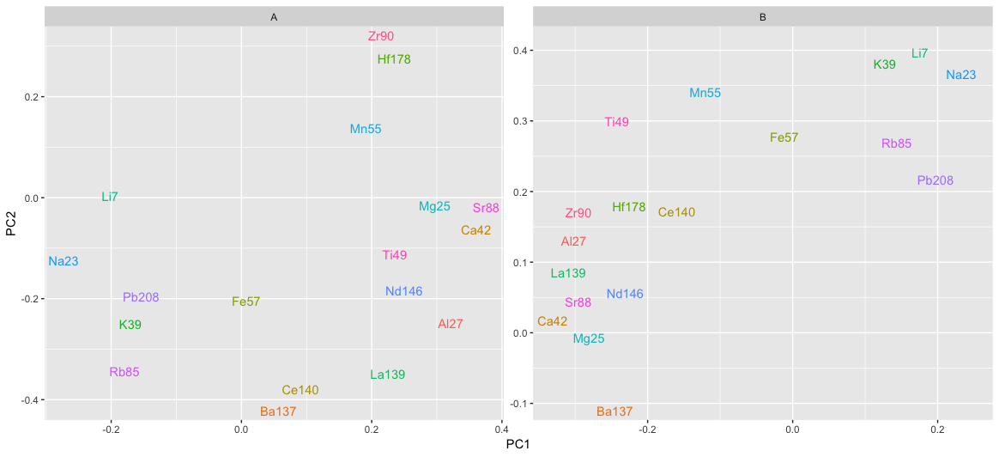
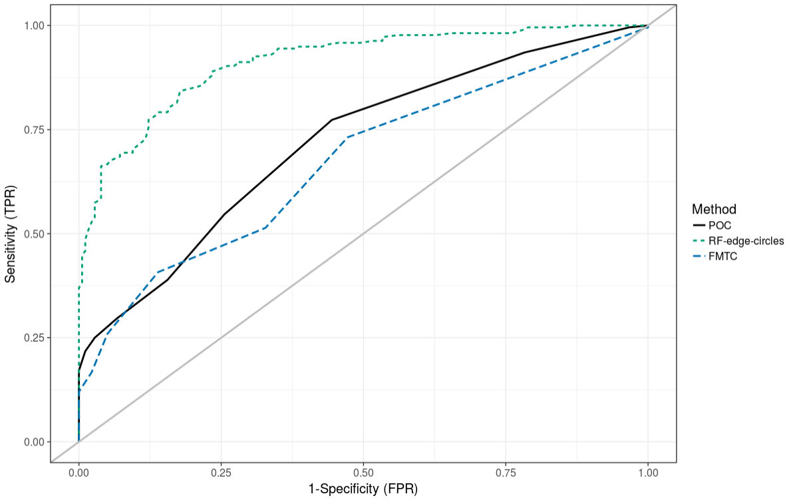

class: inverse
# About Slides

---
class: primary 
# New CSAFE slide template

We're now using [`xaringan`](https://github.com/yihui/xaringan)

What's changed: 

- New person slide: 

````
---
class: inverse
# Your Name
````

---
class: secondary

- New content slide with title: 

````
---
class: primary
# Title of slide 

Slide content
````

- New content slide without title: 

````
---
class: secondary

Slide content with no title on slide
````

---
class: inverse
# Sample User

---
class: primary
# Sample Slide

- Sample Table. Sam Tyner talked about the three must-haves of your summary:


| Must-have | It means |
| :------   | :------- |
| Context | Why are you doing what you're doing? "I'm working on X project in order to Y" |
| Content | What are you doing? "I wrote X function that does Y" or "I ran a simulation of Z" |
| Conclusion | What did you learn? "This will help me because it..." or "This important because it gets us to..." |


---
class: secondary

- If you are going to add an image, **create a directory** with your name within "images" folder. For example, "images/**guillermo**/sample_image.JPG"


 
 

---
class: inverse
# Sam

---
class: primary
# Update on plans: 

- submit papers from thesis for publication
    + **Chapter 1 ready to submit this week**
    + Chapter 2 up next
- writing R packages with SP
    + glass 
    + shoes
    + "uncertainty pyramid" stuff with SL & HI
- **Glass EDA paper** with SP. **Poster at Forensics@NIST**  
- working on book funded by ROpenSci Fellowship 
- ~~narrowing down topics & formats for new CSAFE training materials~~ **Preparing talk for Albany State University's Forensic Science week next week (!)**
- writing "Ten Simple Rules for..." articles with DO
    + statisticians doing forensic science
    + forensic scientists doing statistics
    + [legal professionals encountering statistics](https://github.com/CSAFE-ISU/slides/issues/2)
    
---
class: primary
# PCA on Glass data

Variable loadings: variables near each other are correlated 



---
class: primary
# Var. Imp. Mfr A

<iframe src="images/sam/mfr-a-three-most-imp-vars.html" height="550" width="800"></iframe>

---
class: inverse
# Guillermo

---
class: primary
# Plans for this Fall

- Complete adaptation of registration of 3D scans in R and perform analysis

- Complete shiny app for 2D outsole scans registration

- Write paper of the database which must include some data analysis

- Write paper on speaker recognition (w/Vianey Leos)

---
class: inverse
# James

---
class: primary
# Currently 

* Science Bound Saturday
   + 24 High School Students, many interested in Forensics
   + One very interested in forensics and statistics 
   + Lots of great questions
   
* Developed the 3D written procedure specifically for mud and dirt prints

* Ironed out what images will be taken

* Started 3D scanning shoes that do not have complete sets (50 pairs)
---
class: primary
# Cart 

* Data Collection on Hold
   + Consistency in Photographs - building a rolling camera cart
   
   

---
class: inverse
# Soyoung

---
class: primary
# Fall semester plans: 
 - Shoes
    + Wrap up shoe analysis using edges and SURF 
    + Compare the performance with other methods such as phase only correlations, Fourier-Mellin transformation correlation
    + Do analysis with CSAFE shoe data
    + Submit papers regarding shoe analysis soon!
   
- Research on "uncertainty pyramid" with Steve and Hari at NIST   
 - Glass analysis with Sam
    + Exploratory analysis 
    + Various covariance estimations
    + Submit papers!
   
- Working on book chapters of glass and shoes funded by ROpenSci Fellowship 

---
class: primary
# Analysis result with CSAFE shoe data 
- All nike shoes with size of 8.5 and 10.5 at time 4 (6 months)
- KM (210) : Between replicates within IDs
- KNM (180) : Between IDs
- Methods : Edge matching with three circles and RF for score, phase-only correlation (POC), Fourier-Mellin transform correlation (FMTC)
 


---
class: inverse
# Amy

---
class: primary
# Fall Semester Goals

- **Data Collection** </font> <font color="red">Things are happening.</font>
- Expand Bayesian hierarchical model
    - **Formal Model Selection** </font> <font color="red">Still focused here.</font>
    - Tests and Intervals
    - Validation
- Write and submit a paper on that modeling.
- Exploritory analysis of 'next level' features (AAFS)
    - **Work with Ben and Nick** 
        - </font> <font color="red">FlashID data - this week?</font>
        - </font> <font color="red">Re-extract data & re-run models</font>
    
---
class: inverse
# Ben

---
class: primary
# Semester Intentions

- Collaborate w/Nic & Amy to improve handwriting project
- Develop improvements / features part of algorithm
- Eventually port algorithm through an application portal
- Improve file structure of project
- Working on preprocessing binary image
  - Prototyping w/ Numba & Python
  - Testing performance relative to Cpp
  - Hope to expedite development

---
class: inverse
# Nick

---
class: secondary

 - Working on correcting node count. Difficult to detect sharp turns.

---
class: inverse
# Nate


---
class: primary
# Groove ID


---
class: secondary


   
---
class: secondary


---
class: secondary


---
class: secondary


---
class: inverse
# Kiegan  


---
class: primary   
# Fall Semester Goals  

- Submit to AFTE journal  
- Complete writing of Chapman & Hall book  
- **Write a joint paper with Nate on grooves project**  
    - Outline ready to go  
    - Starting "bake-off" and writing soon  
- Data structure issue  


---
class: primary  
# Data structure issue  
  


---
class: primary  
# Data structure issue  
  

---
class: inverse
# Danica  

---
class: primary   
# Fall Semester Goals  

- Submit draft BF vs. LR paper to AOS  
    - Write a follow-up paper to LPR  
- Continue NIJ grant to validate FDE conclusions  
- Work with Amy on the CSAFE Handwriting project  
- Work with Dan Spitzner from UVA on the CSAFE Statistical Foundations project
- Write a paper for LPR on approximations to BFs
- Write a paper on Fiducial Factors with UNC


---
class: inverse
# Susan

---
class: primary
# Sorry I can't be there today! 

Last week, I worked on:

- Debugging picture labeling for Neural Network, working through model issues
- Relabeling pictures (manual tagging)
- Bullet resampling - package works, needs to be faster
- Pestering IT about the Shoe Database frontend (sigh)
- (w/ Nick) Handwriting methods applied to fingerprints - not bad, but picture quality issues

This week:

 - More debugging of NN model
 - Refactor bullet resampling package
 - More fingerprint and shoe alignment


---
class: inverse
# Miranda

---
class: primary
# Fall Semester Goals

- Develop methods to train "one-hot" neural networks for multi-label classification
- Write paper on network training and results (ideally also a Creative Component)
- Continue to help with truthiness data collection

---
class: inverse
# Issues

---
class: secondary

- [Issues!!](https://github.com/CSAFE-ISU/slides/issues)
- One issue down, three to go.
