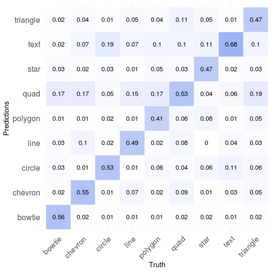
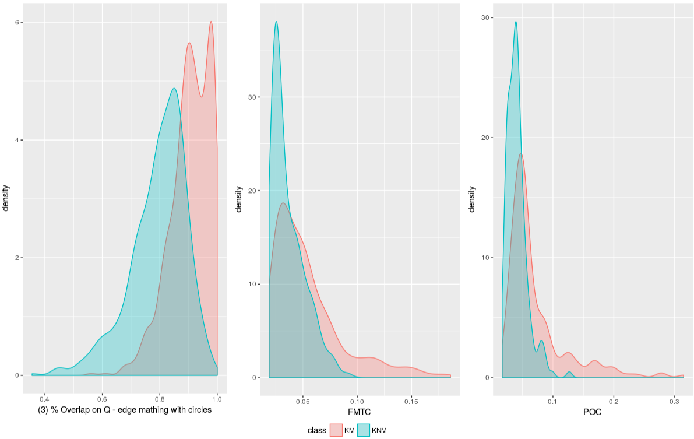
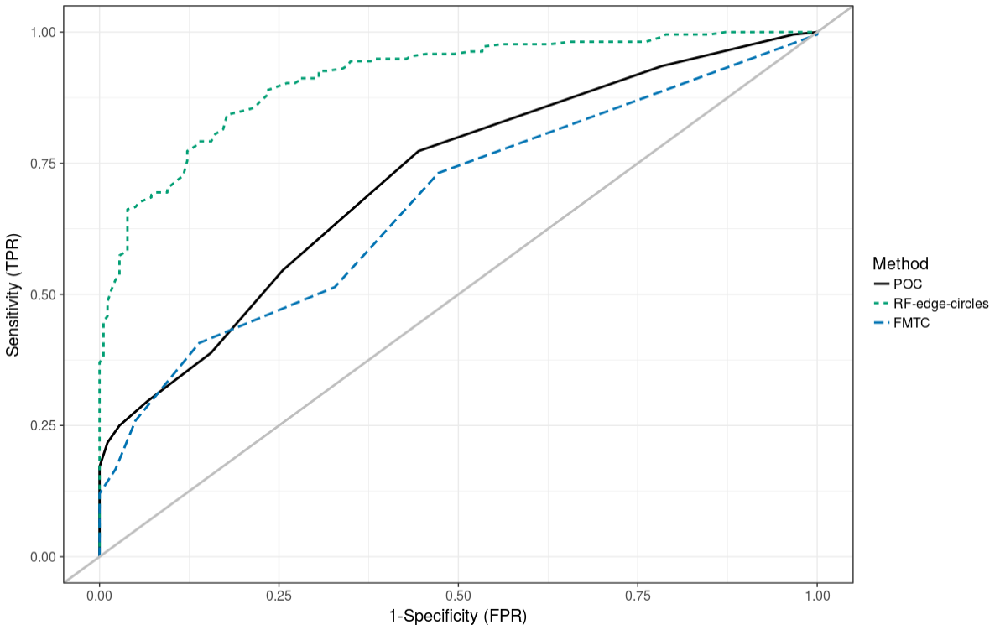
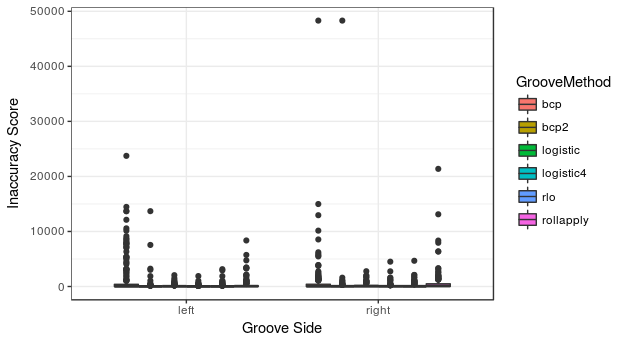
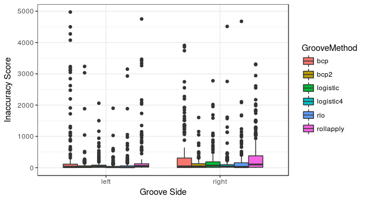
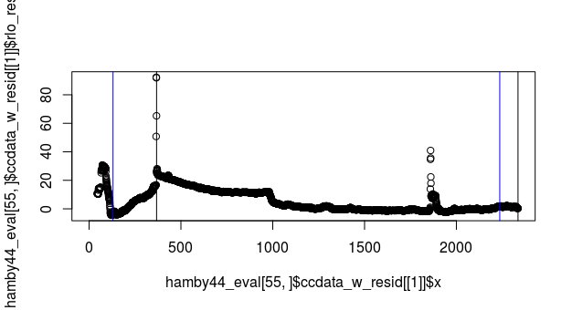
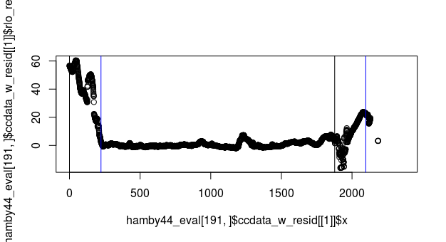
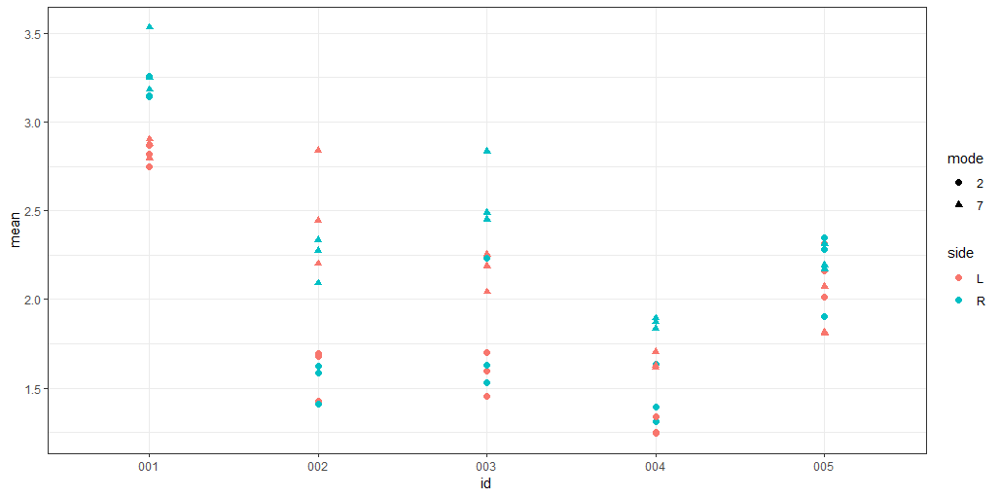

class: inverse
# About Slides

---
class: primary 
# New CSAFE slide template

We are now using [`xaringan`](https://github.com/yihui/xaringan)

What's changed: 

- New person slide: 

````
---
class: inverse
# Your Name
````

---
class: secondary

- New content slide with title: 

````
---
class: primary
# Title of slide 

Slide content
````

- New content slide without title: 

````
---
class: secondary

Slide content with no title on slide
````

---
class: inverse
# Sample User

---
class: primary
# Sample Slide

- Sample Table. Sam Tyner talked about the three must-haves of your summary:


| Must-have | It means |
| :------   | :------- |
| Context | Why are you doing what you're doing? "I'm working on X project in order to Y" |
| Content | What are you doing? "I wrote X function that does Y" or "I ran a simulation of Z" |
| Conclusion | What did you learn? "This will help me because it..." or "This important because it gets us to..." |


---
class: secondary

- If you are going to add an image, **create a directory** with your name within "images" folder. For example, "images/**guillermo**/sample_image.JPG"


 
 


---
class: inverse
# Kiegan  


---
class: primary   
# Fall Semester Goals  

- **Submit to AFTE journal**
- Complete writing of Chapman & Hall book  
- **Write a joint paper with Nate on grooves project**  
    - Integrating final `get_grooves` functions to `bulletxtrctr`
- **Submitting to DFSC funding opportunity**  


---
class: inverse
# Danica  

---
class: primary   
# Fall Semester Goals  

- Submit draft BF vs. LR paper to AOS  
    - Write a follow-up paper to LPR  
- Continue NIJ grant to validate FDE conclusions  
- Work with Amy on the CSAFE Handwriting project  
- Work with Dan Spitzner from UVA on the CSAFE Statistical Foundations project
- Write a paper for LPR on approximations to BFs
- Write a paper on Fiducial Factors with UNC


---
class: inverse
# Susan

---
class: primary
# Fall Semester Goals

- `x3ptools` and `bulletxtrctr`
    - \> 95% test coverage (if possible)
    - Results database - data provenance
    - Docker or packrat to ensure environment reproducibility
- Truthiness study data collection
- Paper with Miranda (Creative Component):    
one-hot Convolutional NN for shoeprint feature recognition
- Longitudinal Shoeprint Database
    - Functioning well enough to present at AAFS in Feb

---
class: inverse
# Miranda

---
class: primary
# Neural Networks

- Model fixed!
    - After implementing aumentation, one function argument didn't update as expected
- More quality control, optimize training parameters

 


---
class: inverse
# Soyoung

---
class: primary
# Fall semester plans: 
 - Shoes
    + Wrap up shoe analysis using edges and SURF 
    + Compare the performance with other methods such as phase only correlations, Fourier-Mellin transformation correlation
    + Do analysis with CSAFE shoe data
    + Submit papers regarding shoe analysis soon!
   
- Research on "uncertainty pyramid" with Steve and Hari at NIST   
 - Glass analysis with Sam
    + Exploratory analysis 
    + Various covariance estimations
    + Submit papers!
   
- Working on book chapters of glass and shoes funded by ROpenSci Fellowship 

---
class: primary
# Analysis result with CSAFE shoe data 
- All nike shoes with size of 8.5 and 10.5 at time 4 (6 months)
- KM (210) : Between replicates within IDs
- KNM (180) : Between IDs
- Methods : Edge matching with three circles and RF for score, phase-only correlation (POC), Fourier-Mellin transform correlation (FMTC)
 


---
class: primary
# Analysis result with CSAFE shoe data 
- All nike shoes with size of 8.5 and 10.5 at time 4 (6 months)
- KM (210) : Between replicates within IDs
- KNM (180) : Between IDs
- Methods : Edge matching with three circles and RF for score, phase-only correlation (POC), Fourier-Mellin transform correlation (FMTC)
 


---
class: inverse
# Amy

---
class: primary
# Fall Semester Goals

- Data Collection
- Expand Bayesian hierarchical model
    - Formal Model Selection
    - Tests and Intervals
    - Validation
- Write and submit a paper on that modeling.
- Exploritory analysis of 'next level' features (AAFS)
    - Work with Ben and Nick
    
---
class: inverse
# Ben

---
class: primary
# Semester Intentions

- Collaborate w/Nic & Amy to improve handwriting project
- Develop improvements / features part of algorithm
- Eventually port algorithm through an application portal
- Improve file structure of project
- Working on preprocessing binary image
  - Prototyping w/ Numba & Python
  - Testing performance relative to Cpp
  - Hope to expedite development

---
class: inverse
# Nick

---
class: secondary

- Working on preprocessing binary image
  - Prototyping w/ Numba & Python
  - Testing performance relative to Cpp
  - Hope to expedite development


---
class: inverse
# Ganesh  

---
class: primary   
# Update  

- Submitted latest Revision 
- Literature Review and App development (design changes) in process

    
---
class: inverse
# Nate


---
class: primary
# Groove ID



---
class: secondary



---
class: secondary



---
class: secondary



---
class: inverse
# Sam

---
class: primary
# Fall semester plans: 

- submit papers from thesis for publication
- writing R packages with SP
    + glass 
    + shoes
    + "uncertainty pyramid" stuff with SL & HI
- working on book funded by ROpenSci Fellowship 
- narrowing down topics & formats for new CSAFE training materials 
- writing "Ten Simple Rules for..." articles with DO
    + statisticians doing forensic science
    + forensic scientists doing statistics
    + [legal professionals encountering statistics](https://github.com/CSAFE-ISU/slides/issues/2)

---
class: inverse
# Guillermo

---
class: secondary

- Package to check shoeprints names on CSAFE Github

- Looking how to register matscan files (problem: very low resolution)

- Will read papers suggested by Susan



---
class: inverse
# James

---
class: primary
# This Fall

* Not a lot to update on
  + prep-work for data collection
  + all 3D scanning is done
  + working with Guillermo on further work
   
---
class: inverse
# Issues

---
class: secondary

- [Issues!!](https://github.com/CSAFE-ISU/slides/issues)
- 2 open, 2 closed.
