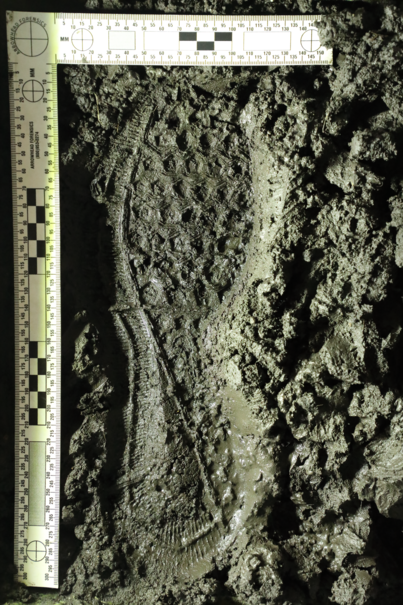

class: inverse
# About Slides

---
class: primary 
# New CSAFE slide template

We're now using [`xaringan`](https://github.com/yihui/xaringan)

What's changed: 

- New person slide: 

````
---
class: inverse
# Your Name
````

---
class: secondary

- New content slide with title: 

````
---
class: primary
# Title of slide 

Slide content
````

- New content slide without title: 

````
---
class: secondary

Slide content with no title on slide
````

---
class: inverse
# Sample User

---
class: primary
# Sample Slide

- Sample Table. Sam Tyner talked about the three must-haves of your summary:


| Must-have | It means |
| :------   | :------- |
| Context | Why are you doing what you're doing? "I'm working on X project in order to Y" |
| Content | What are you doing? "I wrote X function that does Y" or "I ran a simulation of Z" |
| Conclusion | What did you learn? "This will help me because it..." or "This important because it gets us to..." |


---
class: secondary

- If you are going to add an image, **create a directory** with your name within "images" folder. For example, "images/**guillermo**/handwritten_logo.png"


 
 

---
class: inverse
# Soyoung

---
class: primary
# Fall semester plans: 
 - Shoes
    + Wrap up shoe analysis using edges and SURF 
    + Compare the performance with other methods such as phase only correlations, Fourier-Mellin transformation correlation
    + Do analysis with CSAFE shoe data
    + Submit papers regarding shoe analysis soon!
   
- Research on "uncertainty pyramid" with Steve and Hari at NIST   
 - Glass analysis with Sam
    + Exploratory analysis 
    + Various covariance estimations
    + Submit papers!
   
- Working on book chapters of glass and shoes funded by ROpenSci Fellowship 

---
class: inverse
# Amy

---
class: primary
# Fall Semester Goals

- **Data Collection**
    - Moving (slowly).
- Expand Bayesian hierarchical model
    - **Formal Model Selection**
        - Cleaning up code.
        - Methods other than DIC.
    - Tests and Intervals
    - Validation
- Write and submit a paper on that modeling.
- Exploritory analysis of 'next level' features (AAFS)
    - Work with Ben and Nick
    
---
class: inverse
# Ben

---
class: primary
# Preprocessing Complete!
- Next steps: Character recognition? Other feature detection?


---
class: inverse:


---
class: inverse
# Nick

---
class: secondary

- Working on preprocessing binary image
  - Prototyping w/ Numba & Python
  - Testing performance relative to Cpp
  - Hope to expedite development


---
class: inverse
# Ganesh  

---
class: primary   
# Fall Semester Goals  

- Taking 2 or 3 classes (Time Series (Stat 551), Optimization in Machine Learning (Com Sc 578X), Cognitive Psychology for Human Computer Interaction (HCI 521))
- Continue with the development of the User Interface
- Explore possibilities of Optimizing the Random Forest wherever possible in the bullet project and implement it.
- Conceptualize the bullet-to-bullet comparison problem for the Chumbley score method.

    
---
class: inverse
# Nate

---
class: primary
# Groove ID

- Documented functions necessary to run changepoint analysis
- Working on a vignette for the R package

---
class: primary
# SLR

- Documenting what I've tried so far
- Small examples to compare SLRs and LRs
- Do well-calibrated SLRs have properties that imply they are close to true LRs with high probability?

---
class: inverse
# Sam

---
class: primary
# Fall semester plans: 

- submit papers from thesis for publication
- writing R packages with SP
    + glass 
    + shoes
    + "uncertainty pyramid" stuff with SL & HI
- working on book funded by ROpenSci Fellowship 
- narrowing down topics & formats for new CSAFE training materials 
- writing "Ten Simple Rules for..." articles with DO
    + statisticians doing forensic science
    + forensic scientists doing statistics
    + [legal professionals encountering statistics](https://github.com/CSAFE-ISU/slides/issues/2)

---
class: inverse
# Guillermo

---
class: primary
# Plans for this Fall

- Complete adaptation of registration of 3D scans in R and perform analysis

- Complete shiny app for 2D outsole scans registration

- Write paper of the database which must include some data analysis

- Write paper on speaker recognition (w/Vianey Leos)

---
class: inverse
# James

---
class: primary   
# Back at Data Collection!


---
class: inverse: 


---
class: inverse: 



   
---
class: inverse
# Kiegan  


---
class: primary   
# Chugging along!  

- **Submit to AFTE journal**  
    - Getting close!  
- Complete writing of Chapman & Hall book  
    - On pause so we can focus on getting 2 papers ready  
- **Write a joint paper with Nate on grooves project**  
    - Integrating in to `bulletxtrctr` this week
    - Getting test sets ready
- **Submit proposal to DFSC for funding**
    - Reworking NIJ Grad Fellowship proposal
    - Incorporating peer review comments  

    
---
class: primary   
# Update to plotting results  
 
  

---
class: primary  
# Update to plotting results  
 
   


---
class: inverse
# Danica  

---
class: primary   
# Fall Semester Update  

- Write a BF vs. LR paper for LPR  
    - working on making second draft less technical
    - this is taking longer than I expected :(
- Continue NIJ grant to validate FDE conclusions  
    - poster presentation for Forensics@NIST next month
    - oral presentation accepted for AAFS Feb 2019
- New NIJ grant awarded!
    - working on award acceptance and budgets
- 10 Things article
    - writing a draft complete with paragraphs and references


---
class: inverse
# Susan

---
class: primary
# Write all the things!

- `bulletsamplr` package 
    - Determined there's not a significant change in groove height along the signature
    - Started examining null feature distribution
    - Paper describing method for resampling bullet sequences
- Paper validating bullet algorithm on different case study sets (w/ Heike)
- Revising Statistical Atlas paper

---
class: inverse
# Miranda

---
class: primary
# Fall Semester Goals

- Develop methods to train "one-hot" neural networks for multi-label classification
- Write paper on network training and results (ideally also a Creative Component)
- Continue to help with truthiness data collection

---
class: inverse
# Issues

---
class: secondary

- [Issues!!](https://github.com/CSAFE-ISU/slides/issues)
- Two issue down, two to go.
