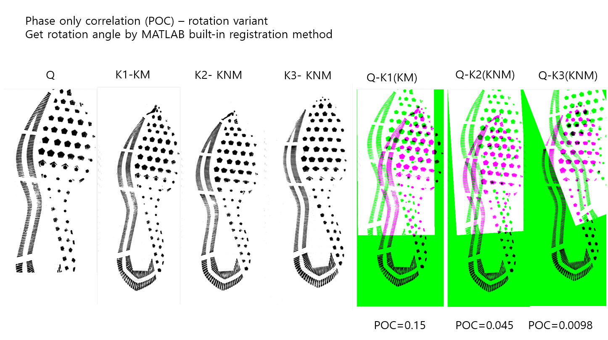
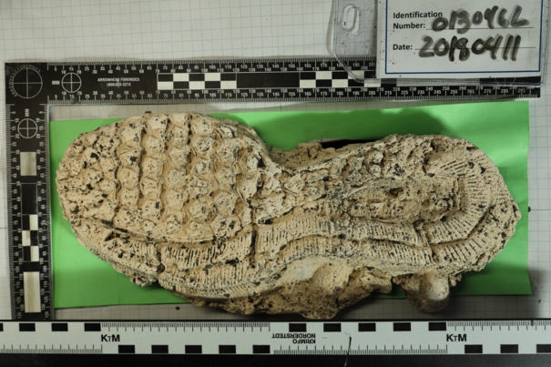

class: inverse
# About Slides

---
class: primary 
# New CSAFE slide template

We're now using [`xaringan`](https://github.com/yihui/xaringan)

What's changed: 

- New person slide: 

````
---
class: inverse
# Your Name
````

---
class: secondary

- New content slide with title: 

````
---
class: primary
# Title of slide 

Slide content
````

- New content slide without title: 

````
---
class: secondary

Slide content with no title on slide
````

---
class: inverse
# Sample User

---
class: primary
# Sample Slide

- Sample Table. Sam Tyner talked about the three must-haves of your summary:


| Must-have | It means |
| :------   | :------- |
| Context | Why are you doing what you're doing? "I'm working on X project in order to Y" |
| Content | What are you doing? "I wrote X function that does Y" or "I ran a simulation of Z" |
| Conclusion | What did you learn? "This will help me because it..." or "This important because it gets us to..." |


---
class: secondary

- If you are going to add an image, **create a directory** with your name within "images" folder. For example, "images/**guillermo**/sample_image.JPG"


 
 
---
class: inverse
# Susan

---
class: primary
# Last Week

- Set up participant recruitment for truthiness
- Writing `bulletsamplr` paper
    - Figured out how to bootstrap matching bullet signatures
- Submitted revised Statistical Atlas paper
- Added crosscut to `image_x3p` in x3ptools package

---
class: inverse
# Miranda

---
class: primary
# Neural Networks

- Working on poster for AAFS and Forensics@NIST
- Heatmaps to visualize important image features
    - Track predictions across sections of a whole shoe image
    - Restructuring model training method to connect pre-trained base to our classifier
- More visualizations...

---
class: primary
# ROC


---
class: inverse
# Soyoung

---
class: primary
# Fall semester plans: 
 - Shoes
    + Wrap up shoe analysis using edges and SURF 
    + Compare the performance with other methods such as phase only correlations, Fourier-Mellin transformation correlation
    + Do analysis with CSAFE shoe data
    + Submit papers regarding shoe analysis soon!
   
- Research on "uncertainty pyramid" with Steve and Hari at NIST   
 - Glass analysis with Sam
    + Exploratory analysis 
    + Various covariance estimations
    + Submit papers!
   
- Working on book chapters of glass and shoes funded by ROpenSci Fellowship 


---
class: primary
# Analysis with CSAFE shoe data 
- POC is rotation variant!
- Try to find ways to adjust rotation bewteen two images
 


---
class: primary
# Glass Analysis  
- Comparison between Standard method vs. Random forest 
- When two methods disgree,

|   | False neg.  | False pos.| True neg.  | True  pos.  |
|:-:|:-:|:-:|:-:|:-:|
|std| 92  |7635   |2299   |9   |
|RF | 9  |2299   |  7635 |92   |

- For false positives, std uses K (27.81\%), Li (18.62\%), Zr (14.43\%), Ba (8.98\%), Ti (6.72\%) 

---
class: inverse
# Amy

---
class: primary
# 

- Data
    -  </font> <font color="red">FlashID - Updates to data dump</font>
    -  </font> <font color="black">Hoping this will help with model performance.</font>
- Hierarchical model </font> <font color="red">evaluation</font>
    -  </font> <font color="red">Coding: ROC/AUC</font> </font> <font color="black">(multi-class extensions, one vs. all)</font>
    -  </font> <font color="red">Coding: ABC for model selection </font>
    -  </font> <font color="black">Fscore (micro and macro averaging)</font>
    -  </font> <font color="black">Log-loss for multi-class classification</font>
    
    
---
class: inverse
# Ben

---
class: primary
# Semester Intentions

- Collaborate w/Nic & Amy to improve handwriting project
- Develop improvements / features part of algorithm
- Eventually port algorithm through an application portal
- Improve file structure of project
- Working on preprocessing binary image
  - Prototyping w/ Numba & Python
  - Testing performance relative to Cpp
  - Hope to expedite development

---
class: inverse
# Nick

---
class: secondary

- Working on preprocessing binary image
  - Prototyping w/ Numba & Python
  - Testing performance relative to Cpp
  - Hope to expedite development

---
class: inverse
# Ganesh

---
class: secondary

- The Chumbley Land-to-land comparisons Paper got accepted!!
- Now setting Bullet-to-Bullet Comparisons and writing about the UI.

---
class: inverse
# Nate


---
class: primary
# Groove ID

- Writing vignette/drafting methodological description
- Work on integrating changepoint functions with bulletxtrctr(?) this week

---
class: primary
# SLR


---
class: secondary


---
class: secondary


---
class: inverse
# Sam

---
class: primary
# Fall semester plans: 

- submit papers from thesis for publication
- writing R packages with SP
    + glass 
    + shoes
    + "uncertainty pyramid" stuff with SL & HI
- working on book funded by ROpenSci Fellowship 
- narrowing down topics & formats for new CSAFE training materials 
- writing "Ten Simple Rules for..." articles with DO
    + statisticians doing forensic science
    + forensic scientists doing statistics
    + [legal professionals encountering statistics](https://github.com/CSAFE-ISU/slides/issues/2)

---
class: inverse
# Guillermo

---
class: primary
# Plans for this Fall

- Complete adaptation of registration of 3D scans in R and perform analysis

- Complete shiny app for 2D outsole scans registration

- Write paper of the database which must include some data analysis

- Write paper on speaker recognition (w/Vianey Leos)

---
class: inverse
# James

---
class: primary
# Data Collection 

* Estimate 10-13 hours per- 3 pairs
   + 2D Scanning
   + 3D Scanning (High Definition)
   + High Resolution Photos
   + 3D Mud Scans
   + Mud Photos
   + Casting 
   + Baby Powder Photos
   
* We are contacting an expert for input
* estimate >17 weeks to finish all shoes in their current condition 

---
class: primary
# Data Collection 



* Baby Powder Prints - 342
* Casting - 6 
   + 334 Casts total 
* Cast Photos - 4
* 3D Mud Scans - 15
* Mud Photos - 21

   
   


---
class: inverse
# Kiegan  


---
class: primary   
# Fall Semester Goals  

- Submit to AFTE journal  
- Complete writing of Chapman & Hall book  
    - Working on this from home T/Th  
- Write a joint paper with Nate on grooves project  
    - Probably aim for Journal of Forensic Sciences  
    - Compare/contrast of methodologies
    - Downstream impact on the algorithm!  
- Taking one class (Stat 643) and research credits  


---
class: inverse
# Danica  

---
class: primary   
# Fall Semester Goals  

- Submit draft BF vs. LR paper to AOS  
    - Write a follow-up paper to LPR  
- Continue NIJ grant to validate FDE conclusions  
- Work with Amy on the CSAFE Handwriting project  
- Work with Dan Spitzner from UVA on the CSAFE Statistical Foundations project
- Write a paper for LPR on approximations to BFs
- Write a paper on Fiducial Factors with UNC


---
class: inverse
# Heike  

---
class: primary   
# x3p images

Adding helper lines on x3p images


Might help with creating a mask for different areas of the file


---
class: inverse
# Issues

---
class: secondary

- [Issues!!](https://github.com/CSAFE-ISU/slides/issues)
- Two issue down, two to go.
