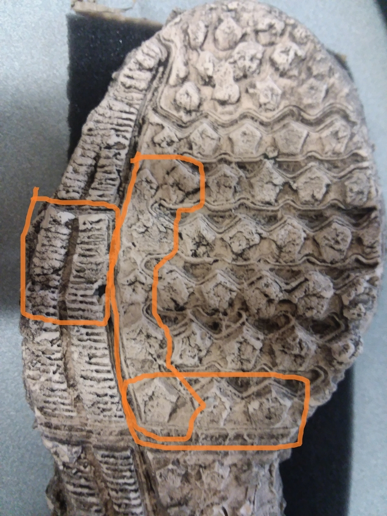

class: inverse
# About Slides

---
class: primary 
# New CSAFE slide template

We're now using [`xaringan`](https://github.com/yihui/xaringan)

What's changed: 

- New person slide: 

````
---
class: inverse
# Your Name
````

---
class: secondary

- New content slide with title: 

````
---
class: primary
# Title of slide 

Slide content
````

- New content slide without title: 

````
---
class: secondary

Slide content with no title on slide
````

---
class: inverse
# Sample User

---
class: primary
# Sample Slide

- Sample Table. Sam Tyner talked about the three must-haves of your summary:


| Must-have | It means |
| :------   | :------- |
| Context | Why are you doing what you're doing? "I'm working on X project in order to Y" |
| Content | What are you doing? "I wrote X function that does Y" or "I ran a simulation of Z" |
| Conclusion | What did you learn? "This will help me because it..." or "This important because it gets us to..." |


---
class: secondary

- If you are going to add an image, **create a directory** with your name within "images" folder. For example, "images/**guillermo**/sample_image.JPG"


 
 

---
class: inverse
# Danica  

---
class: primary   
# Fall Semester Goals  

- Submit draft BF vs. LR paper to AOS  
    - Write a follow-up paper to LPR  
- Continue NIJ grant to validate FDE conclusions  
- Work with Amy on the CSAFE Handwriting project  
- Work with Dan Spitzner from UVA on the CSAFE Statistical Foundations project
- Write a paper for LPR on approximations to BFs
- Write a paper on Fiducial Factors with UNC


---
class: inverse
# Soyoung

---
class: primary
# Fall semester plans: 
 - Shoes
    + Wrap up shoe analysis using edges and SURF 
    + Compare the performance with other methods such as phase only correlations, Fourier-Mellin transformation correlation
    + Do analysis with CSAFE shoe data
    + Submit papers regarding shoe analysis soon!
   
- Research on "uncertainty pyramid" with Steve and Hari at NIST   
 - Glass analysis with Sam
    + Exploratory analysis 
    + Various covariance estimations
    + Submit papers!
   
- Working on book chapters of glass and shoes funded by ROpenSci Fellowship 

---
class: inverse
# Sam

---
class: primary
# Fall semester plans: 

- submit papers from thesis for publication
    + one submission down, one rejection received. Some tweaks happening, resubmission to another journal soon. 
- glass data with SP
- working on book funded by ROpenSci Fellowship - meeting this week with the other fellows
- writing "Ten Simple Rules for..." articles with DO
    + meeting moved to this week 
    
---
class: primary
# Glass study 

Comparing the error rates from Soyoung's random forest to the standard method


---
class: primary
# EDA Shiny App

Ways to allow people coming to our poster to interact with the glass data. [Seeking input & ideas](https://github.com/CSAFE-ISU/slides/issues/7).


---
class: primary
# Self care ideas

Because the world can get us all down sometimes and we forget to care for ourselves:

- meditate
- go to yoga
- take a nap
- drink water 
- take a bath
- go on a walk 
- go to bed early
- drink herbal tea
- read your favorite book 
- call a friend you haven't talked to in a while
- watch cat fail videos on YouTube

---
class: inverse
# James

---
class: primary
# Still Collecting Data

* Time Estimate: 8-10 hours a week


---
class: primary
# Randomly Acquired Characteristics



  


---
class: inverse
# Nick

---
class: primary
## Fall semester plans

- Working on preprocessing binary image
  - Prototyping w/ Numba & Python
  - Testing performance relative to Cpp
  - Hope to expedite development

---
class: inverse
# Miranda

---
class: primary
# Fall Semester Goals

- Develop methods to train "one-hot" neural networks for multi-label classification
- Write paper on network training and results (ideally also a Creative Component)
- Continue to help with truthiness data collection

---
class: inverse
# Nate


---
class: primary
# Fall Semester Goals
- Verify theoretical basis for current SLR goals and begin experiments on simulated data 
- Finish groove changepoint detection algorithm version 2 and test on all available data
- Write paper with Kiegan on groove results

---
class: inverse
# Ben

---
class: primary
# Semester Intentions

- Collaborate w/Nic & Amy to improve handwriting project
- Develop improvements / features part of algorithm
- Eventually port algorithm through an application portal
- Improve file structure of project
- Working on preprocessing binary image
  - Prototyping w/ Numba & Python
  - Testing performance relative to Cpp
  - Hope to expedite development
  
---
class: inverse
# Amy

---
class: primary
# Fall Semester Goals

- Data Collection
- Expand Bayesian hierarchical model
    - Formal Model Selection
    - Tests and Intervals
    - Validation
- Write and submit a paper on that modeling.
- Exploritory analysis of 'next level' features (AAFS)
    - Work with Ben and Nick
    

---
class: inverse
# Ganesh  

---
class: primary   
# Fall Semester Goals  

- Taking 2 or 3 classes (Time Series (Stat 551), Optimization in Machine Learning (Com Sc 578X), Cognitive Psychology for Human Computer Interaction (HCI 521))
- Continue with the development of the User Interface
- Explore possibilities of Optimizing the Random Forest wherever possible in the bullet project and implement it.
- Conceptualize the bullet-to-bullet comparison problem for the Chumbley score method.

---
class: inverse
# Guillermo

---
class: primary
# Plans for this Fall

- Complete adaptation of registration of 3D scans in R and perform analysis

- Complete shiny app for 2D outsole scans registration

- Write paper of the database which must include some data analysis

- Write paper on speaker recognition (w/Vianey Leos)

---
class: inverse
# Kiegan  


---
class: primary   
# Fall Semester Goals  

- **Submit to AFTE journal**
    - soon!!! 
- Complete writing of Chapman & Hall book  
- **Write a joint paper with Nate on grooves project**  
    - **started writing up methodology**
    - **two more functions in `bulletxtrctr`**  
    - hopefully running test sets soon  
- **DFSC funding opportunity**
    - draft by next week  
- **Reading group paper data**    
    - anyone interested?  
- AAFS? when are talks?  


---
class: inverse
# Susan

---
class: primary
# Last Week

- Tests for `bulletxtrctr` - back to 98% coverage
- Working with multiple Hamby studies - aligning known bullets from Hamby 36, 44, 224
- `bulletsamplr`
    - multi-cycle sampling units
    - paper - notation, creating known non-match sequences
- Bullet Case Study Validation paper

---
class: secondary


---
class: inverse
# Issues

---
class: secondary

- [Issues!!](https://github.com/CSAFE-ISU/slides/issues)
- Three issue down, two to go.


```{r, eval=FALSE, echo=FALSE}
## Presenters
presenter <- 
  c("Soyoung", "Amy", "Ben", "Nick", 
    "Ganesh", "Nate", "Sam", "Guillermo", 
    "James", "Kiegan", "Danica", "Susan", 
    "Miranda")

## Set seed as the date (mmdd)
set.seed(1029)

## Shuffle presenters
sample(presenter)
```
