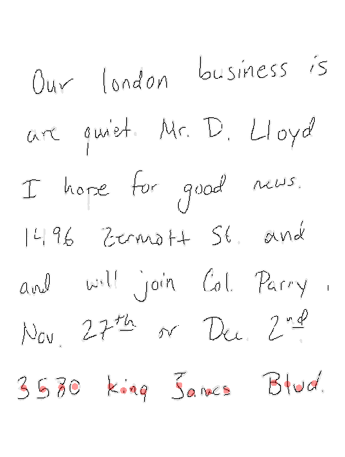

class: inverse
# About Slides

---
class: primary 
# New CSAFE slide template

We're now using [`xaringan`](https://github.com/yihui/xaringan)

What's changed: 

- New person slide: 

````
---
class: inverse
# Your Name
````

---
class: secondary

- New content slide with title: 

````
---
class: primary
# Title of slide 

Slide content
````

- New content slide without title: 

````
---
class: secondary

Slide content with no title on slide
````

---
class: inverse
# Sample User

---
class: primary
# Sample Slide

- Sample Table. Sam Tyner talked about the three must-haves of your summary:


| Must-have | It means |
| :------   | :------- |
| Context | Why are you doing what you're doing? "I'm working on X project in order to Y" |
| Content | What are you doing? "I wrote X function that does Y" or "I ran a simulation of Z" |
| Conclusion | What did you learn? "This will help me because it..." or "This important because it gets us to..." |

---
class: secondary

- If you are going to add an image, **create a directory** with your name within "images" folder. For example, "images/**guillermo**/sample_image.JPG"


 
 

---
class: inverse
# Danica  

---
class: primary   
# Fall Semester Update  

- Sorry I can't make it today ...
- Busy trying to catch up on STAT 104 grading after being gone to the NIST conference
- Still working on writing up papers from my dissertation research ...
- Still working on NIJ grant for handwriting
    - Please let me know if you are interested in the poster I presented and I will email it to you or sit down with you to discuss any time! (Net ID: dmommen)


---
class: inverse
# Sam

---
class: primary
# Fall semester plans: 

- submit papers from thesis for publication
- writing R packages with SP
    + glass 
    + shoes
    + "uncertainty pyramid" stuff with SL & HI
- working on book funded by ROpenSci Fellowship 
- narrowing down topics & formats for new CSAFE training materials 
- writing "Ten Simple Rules for..." articles with DO
    + statisticians doing forensic science
    + forensic scientists doing statistics
    + [legal professionals encountering statistics](https://github.com/CSAFE-ISU/slides/issues/2)

---
class: inverse
# Nick

---
class: primary
# Fall semester plans

- Working on preprocessing binary image
  - Prototyping w/ Numba & Python
  - Testing performance relative to Cpp
  - Hope to expedite development

---
class: inverse
# Nate


---
class: primary
# Fall Semester Goals
- Verify theoretical basis for current SLR goals and begin experiments on simulated data 
- Finish groove changepoint detection algorithm version 2 and test on all available data
- Write paper with Kiegan on groove results

---
class: inverse
# Ganesh  

---
class: primary   
# Fall Semester Goals  

- Taking 2 or 3 classes (Time Series (Stat 551), Optimization in Machine Learning (Com Sc 578X), Cognitive Psychology for Human Computer Interaction (HCI 521))
- Continue with the development of the User Interface
- Explore possibilities of Optimizing the Random Forest wherever possible in the bullet project and implement it.
- Conceptualize the bullet-to-bullet comparison problem for the Chumbley score method.

---
class: inverse
# James

---
class: primary
# General Update

* Last Week
 + Continued Data Collection
 + Some Odd Jobs
 
* Files - 432 New 
* Total - 1,344/3,852 Total

* This week
 + Continued Data Collection
 + Possible Odd Jobs
 + Assist Soyoung


---
class: inverse
# Kiegan  


---
class: primary   
# Fall Semester Goals  

- **Submit to AFTE journal**  
    - Getting pretty close
- Complete writing of Chapman & Hall book  
- **Write a joint paper with Nate on grooves project**  
    - Writing! 
    - Waiting for Nate's function to get integrated to bulletxtrctr for results

---
class: inverse
# Miranda

---
class: primary
# Fall Semester Goals

- Develop methods to train "one-hot" neural networks for multi-label classification
    - Fix model that we broke trying to do cool stuff
- Write paper on network training and results (ideally also a Creative Component)
- Continue to help with truthiness data collection
    
---
class: inverse
# Soyoung

---
class: primary
# Updates and plan: 
 - Shoes
    + Working on shoe-edge paper and will be submitted soon
    + Poster at Forensic@NIST 
    + Data collection with five pairs of NIKE Winflows brand new shoes 
    + Working on shoe paper with SURF 

- Research on "uncertainty pyramid" with Steve and Hari at NIST   
- Glass analysis with Sam
    + Working on visualization paper about glass analysis
    + Start covaraince estimation on glass data
    
- Working on book chapters of glass and shoes funded by ROpenSci Fellowship 


---
class: inverse
# Guillermo

---
class: primary
# Plans for this Fall

- Complete adaptation of registration of 3D scans in R and perform analysis

- Complete shiny app for 2D outsole scans registration

- Write paper of the database which must include some data analysis

- Write paper on speaker recognition (w/Vianey Leos)

---
class: inverse
# Ben

---
class: primary
# Lines / Features

---
class: primary
- Lines / Line numbers implemented  
- Working on more features
---
class: inverse
# Amy

---
class: primary
# Fall Semester Goals

- Data Collection
- Expand Bayesian hierarchical model
    - Formal Model Selection
    - Tests and Intervals
    - Validation
- Write and submit a paper on that modeling.
- Exploritory analysis of 'next level' features (AAFS)
    - Work with Ben and Nick

---
class: inverse
# Susan

---
class: primary
# Updates

## Last week

- Forensics@NIST
- Applying for all 3 ISU Statistics TT positions 
- Truthiness study setup
- Bullet case study validation paper

## This week

- Truthiness data collection
- Bullet case study validation paper
- Bullet signature bootstrap paper (if truthiness goes badly)

---
class: inverse
# Issues

---
class: secondary

- [Issues!!](https://github.com/CSAFE-ISU/slides/issues)
- One issue down, three to go.

```{r, eval=FALSE, echo=FALSE}
## Presenters
presenter <- 
  c("Soyoung", "Amy", "Ben", "Nick", 
    "Ganesh", "Nate", "Sam", "Guillermo", 
    "James", "Kiegan", "Danica", "Susan", 
    "Miranda")

## Set seed as the date (mmdd)
set.seed(1112)

## Shuffle presenters
sample(presenter)
```

