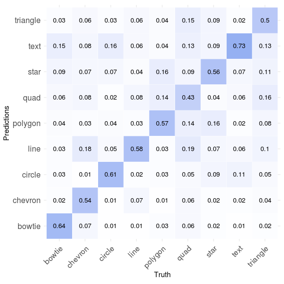
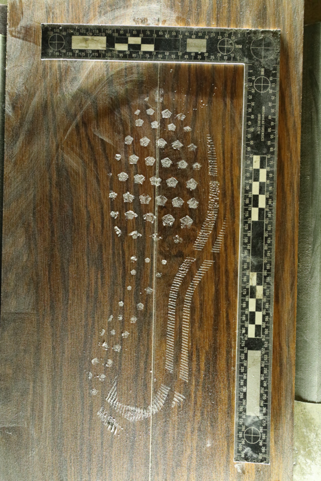
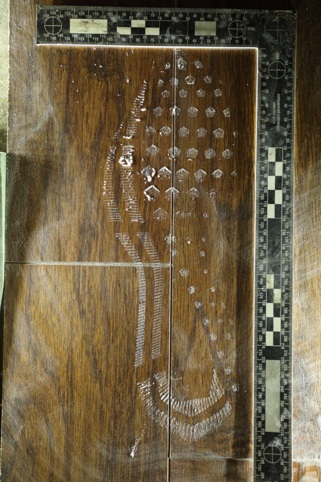
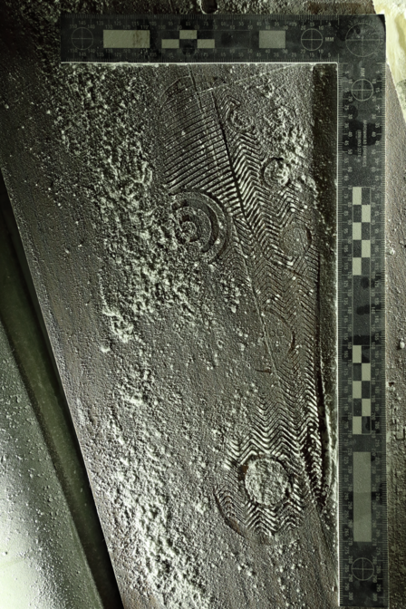
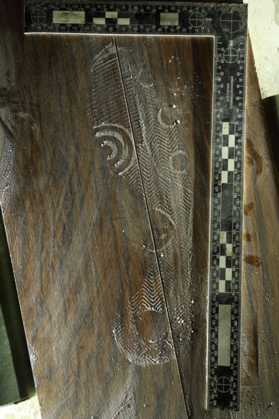

class: inverse
# About Slides

---
class: primary 
# New CSAFE slide template

We're now using [`xaringan`](https://github.com/yihui/xaringan)

What's changed: 

- New person slide: 

````
---
class: inverse
# Your Name
````

---
class: secondary

- New content slide with title: 

````
---
class: primary
# Title of slide 

Slide content
````

- New content slide without title: 

````
---
class: secondary

Slide content with no title on slide
````

---
class: inverse
# Sample User

---
class: primary
# Sample Slide

- Sample Table. Sam Tyner talked about the three must-haves of your summary:


| Must-have | It means |
| :------   | :------- |
| Context | Why are you doing what you're doing? "I'm working on X project in order to Y" |
| Content | What are you doing? "I wrote X function that does Y" or "I ran a simulation of Z" |
| Conclusion | What did you learn? "This will help me because it..." or "This important because it gets us to..." |

---
class: secondary

- If you are going to add an image, **create a directory** with your name within "images" folder. For example, "images/**guillermo**/sample_image.JPG"


 
 

---
class: inverse
# Miranda

---
class: primary
# Updates

- Working on slides for Graphics Group this Friday, writing paper/CC
- Fine-tuning model, exploring other options
- Developing/choosing a cool acronym...



---
class: primary
# Cool Acronym

- PRINNTS:  Pretty Rad Identification Neural Network Tool for Shoes

- FOReNNSICC: Footwear Outsole Recognition Neural Network for Statistical Information on Class Characteristics

- CoNNOR: Convolutional Neural Network for Outsole Recognition

- Other ideas?

---
class: inverse
# Amy

---
class: primary
# Fall Semester Goals

- Data Collection
- Expand Bayesian hierarchical model
    - Formal Model Selection
    - Tests and Intervals
    - Validation
- Write and submit a paper on that modeling.
- Exploritory analysis of 'next level' features (AAFS)
    - Work with Ben and Nick

---
class: inverse
# Ben

---
class: primary
# Semester Intentions

- Collaborate w/Nic & Amy to improve handwriting project
- Develop improvements / features part of algorithm
- Eventually port algorithm through an application portal
- Improve file structure of project
- Working on preprocessing binary image
  - Prototyping w/ Numba & Python
  - Testing performance relative to Cpp
  - Hope to expedite development

---
class: inverse
# Kiegan  


---
class: primary   
# Fall Semester Goals  

- Submit to AFTE journal  
- Complete writing of Chapman & Hall book  
    - Working on this from home T/Th  
- Write a joint paper with Nate on grooves project  
    - Probably aim for Journal of Forensic Sciences  
    - Compare/contrast of methodologies
    - Downstream impact on the algorithm!  
- Taking one class (Stat 643) and research credits  


---
class: inverse
# Susan

---
class: primary
# Fall Semester Goals

- `x3ptools` and `bulletxtrctr`
    - \> 95% test coverage     
    **(81%, 97% respectively)**
    - Results database - data provenance     
    **still in progress - Talen & Rishab**
    - Docker or packrat to ensure environment reproducibility
- Truthiness study data collection     
**Pilot study done - transcribing audio recordings**

---
class: primary
# Fall Semester Goals

- Paper with Miranda (Creative Component):    
one-hot Convolutional NN for shoeprint feature recognition    
**Model working relatively well, paper in beginning stages**
- Longitudinal Shoeprint Database
    - Functioning well enough to present at AAFS in Feb    
    **getting there**
- *Bullet papers*
    - *Case study validation* **(almost done)**
    - *Resampling* **(about 40% done)**
    
---
class:primary
# Last Couple of Weeks

- Truthiness: Pilot data done! 
    - Transcription of audio recordings: 5/41 as of 1pm
    - Initial findings: 
        1. People don't know basic geography
        2. Logical statements are hard - "Less than 85% have access to electricity" interpreted as:
            - less than 85% have access to electricity
            - less than 15% have access to electricity
            - more than 15% have access to electricity
            - more than 85% don't have access to electricity
            - and more...
- Case Study Validation paper
    - Designing a template that works with arcane JFS formatting requirements
- `bulletxtrctr` tests for groove-finding functions from Nate and Kiegan 

---
class: inverse
# James

---
class: primary
# Possible Issue (Baby Powder)






---
class: primary
# Possible Issue




---
class: primary
# Possible Issue


---
class: inverse
# Soyoung

---
class: primary
# Fall semester plans: 
- Shoes
    + Will submit shoe paper today!!!
    + Wrap up shoe analysis on SURF and maximum clique as a paper
    + NIKE Winflow brand new shoes data collection (Jimmy and Ganesh helped a lot!)
    + Do analysis with a new NIKE data
- Glass analysis with Sam
    + Writing paper on the exploratory analysis and visualizing on glass 
    + Various covariance estimations
- Research on "uncertainty pyramid" with Steve and Hari at NIST   
    + Sam and I are studying Dirichlet process..
- Working on book chapters of glass and shoes funded by ROpenSci Fellowship 
   
---
class: inverse
# Sam

---
class: primary
# Fall semester plans: 

- submit papers from thesis for publication
- writing R packages with SP
    + glass 
    + shoes
    + "uncertainty pyramid" stuff with SL & HI
- working on book funded by ROpenSci Fellowship 
- narrowing down topics & formats for new CSAFE training materials 
- writing "Ten Simple Rules for..." articles with DO
    + statisticians doing forensic science
    + forensic scientists doing statistics
    + [legal professionals encountering statistics](https://github.com/CSAFE-ISU/slides/issues/2)

---
class: inverse
# Nate


---
class: primary
# Fall Semester Goals
- Verify theoretical basis for current SLR goals and begin experiments on simulated data 
- Finish groove changepoint detection algorithm version 2 and test on all available data
- Write paper with Kiegan on groove results

---
class: inverse
# Nick

---
class: primary
# Fall semester plans

- Working on preprocessing binary image
  - Prototyping w/ Numba & Python
  - Testing performance relative to Cpp
  - Hope to expedite development


---
class: inverse
# Danica  

---
class: primary   
# Fall Semester Update  

- Submit revised BF vs. LR paper to Statistical Science
- Continue NIJ grant to validate FDE conclusions 
    - Working to figure out how to combine kinematic scores across the entire phrase
    - Getting a FlashID update that will help compare results to SIFT
    - Working on updating code to improve the SIFT scores
    - Finishing up year-end report so that I can get the next year's funds
- Working on paper with Larry concerning ROC curves and SLRs
- Invited to attend the Writing Winning Grant Proposals Phase 2 Workshop
    - Big thanks to Wolfgang!


---
class: inverse
# Guillermo

---
class: primary
# Plans for this Fall

- Complete adaptation of registration of 3D scans in R and perform analysis

- Complete shiny app for 2D outsole scans registration

- Write paper of the database which must include some data analysis

- Write paper on speaker recognition (w/Vianey Leos)


    
---
class: inverse
# Ganesh  

---
class: primary   
# Fall Semester Goals  

**Conceptualize the bullet-to-bullet comparison problem**
 - **for the Chumbley score method.**
    - Extract correlation information for same-shift and different shift pairs from existing runs for all land-to-land comparisons.
 - **for the RF method**  


---
class: inverse
# Issues

---
class: secondary

- [Issues!!](https://github.com/CSAFE-ISU/slides/issues)
- One issue down, three to go.

```{r, eval=FALSE, echo=FALSE}
## Presenters
presenter <- 
  c("Soyoung", "Amy", "Ben", "Nick", 
    "Ganesh", "Nate", "Sam", "Guillermo", 
    "James", "Kiegan", "Danica", "Susan", 
    "Miranda")

## Set seed as the date (mmdd)
set.seed(1126)

## Shuffle presenters
sample(presenter)
```

