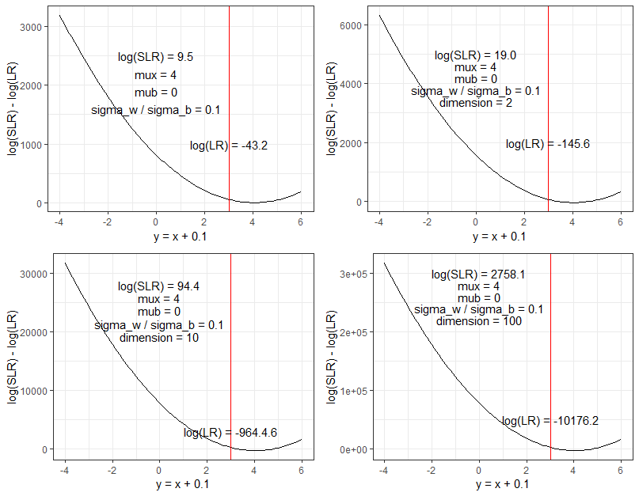
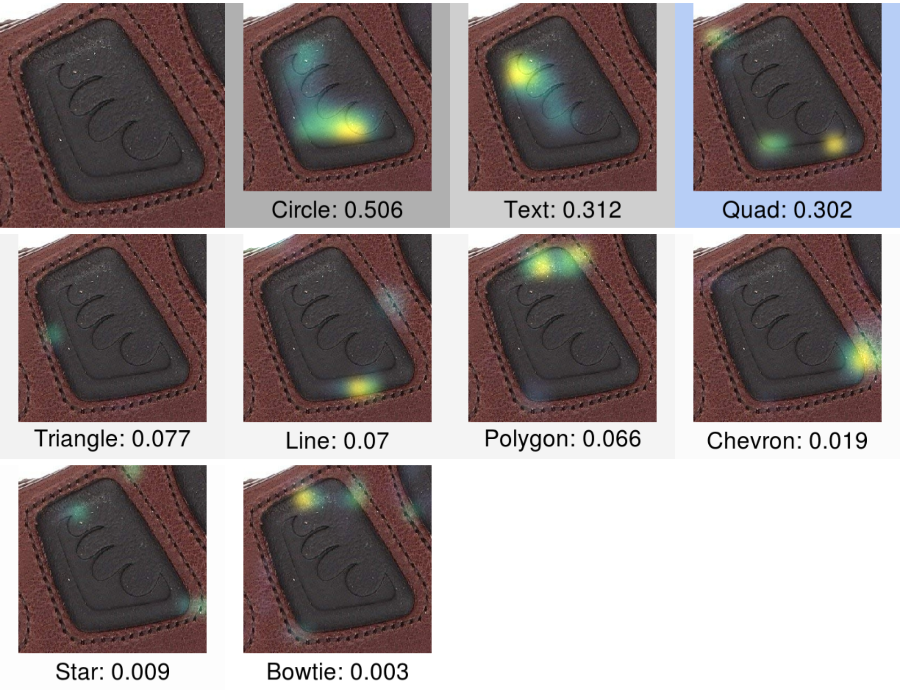
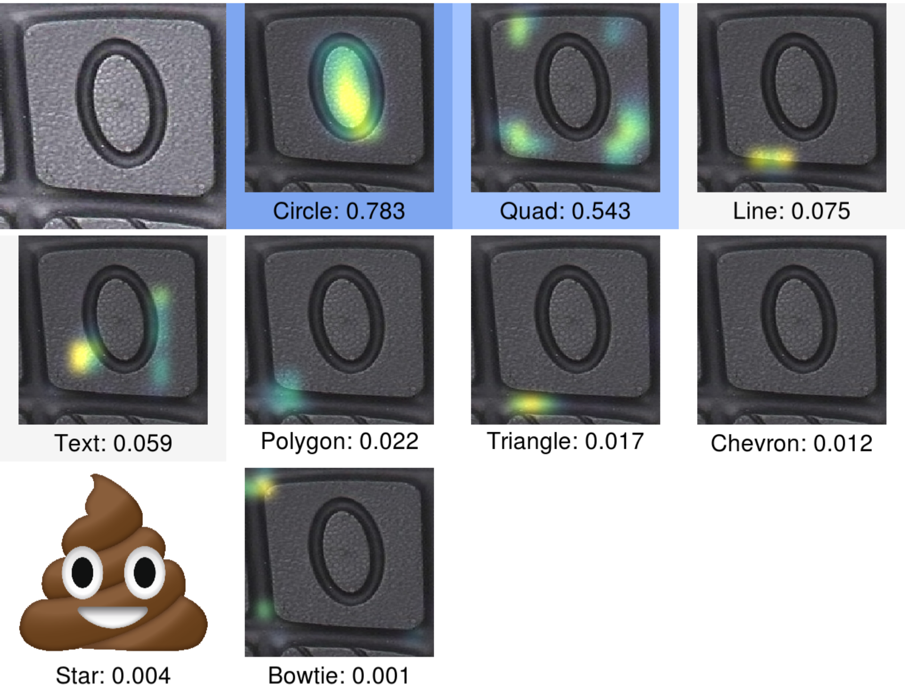
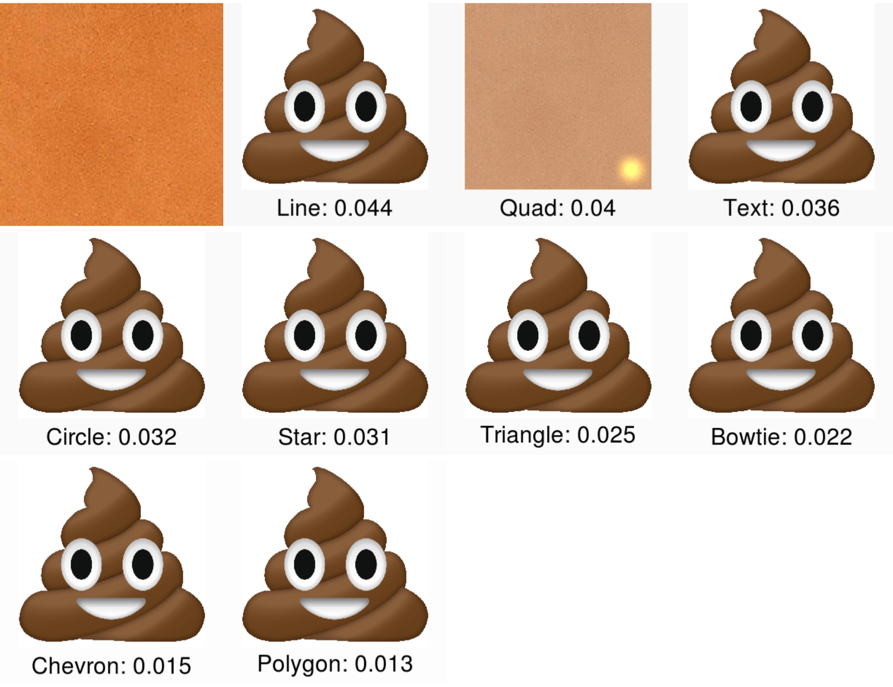
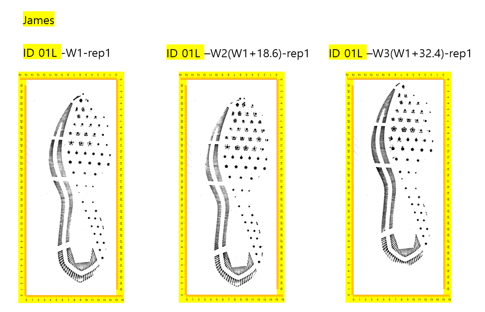
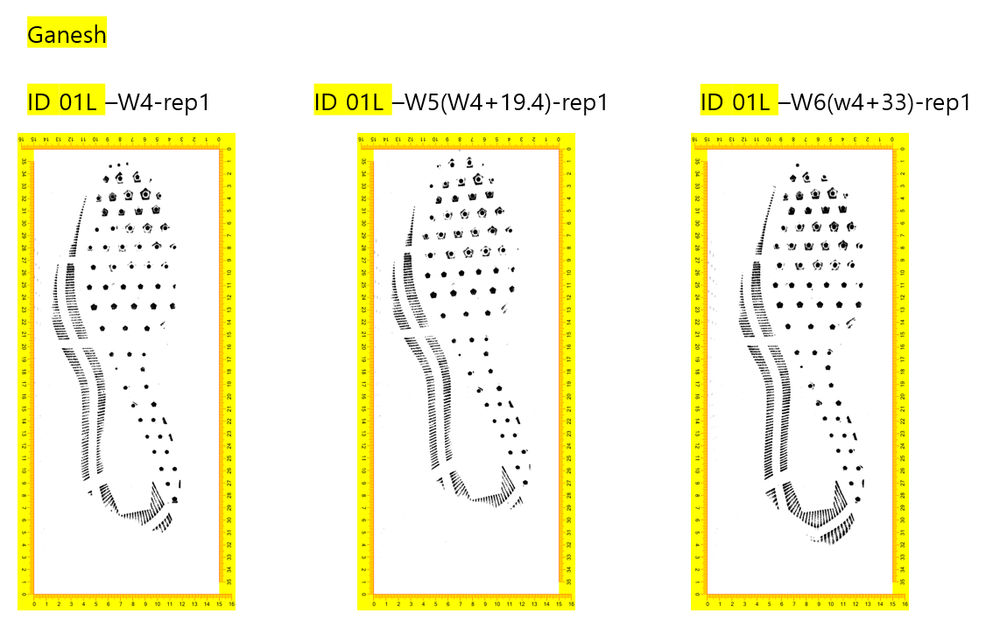

class: inverse
# About Slides

---
class: primary 
# New CSAFE slide template

We're now using [`xaringan`](https://github.com/yihui/xaringan)

What's changed: 

- New person slide: 

````
---
class: inverse
# Your Name
````

---
class: secondary

- New content slide with title: 

````
---
class: primary
# Title of slide 

Slide content
````

- New content slide without title: 

````
---
class: secondary

Slide content with no title on slide
````

---
class: inverse
# Sample User

---
class: primary
# Sample Slide

- Sample Table. Sam Tyner talked about the three must-haves of your summary:


| Must-have | It means |
| :------   | :------- |
| Context | Why are you doing what you're doing? "I'm working on X project in order to Y" |
| Content | What are you doing? "I wrote X function that does Y" or "I ran a simulation of Z" |
| Conclusion | What did you learn? "This will help me because it..." or "This important because it gets us to..." |

---
class: secondary

- If you are going to add an image, **create a directory** with your name within "images" folder. For example, "images/**guillermo**/sample_image.JPG"


 
 
---
class: inverse
# Kiegan  


---
class: primary   
# Fall Semester Goals  

- Submit to AFTE journal  
- Complete writing of Chapman & Hall book  
    - Working on this from home T/Th  
- Write a joint paper with Nate on grooves project  
    - Probably aim for Journal of Forensic Sciences  
    - Compare/contrast of methodologies
    - Downstream impact on the algorithm!  
- Taking one class (Stat 643) and research credits  

---
class: inverse
# Nate

---
class: primary
# SLR




---
class: inverse
# Amy

---
class: primary
# Fall Semester Goals

- <font color="red">Data Collection</font> Pilot in spring semester, then full collection.
- Expand Bayesian hierarchical model
    - <font color="red">Formal Model Selection</font>
    - Tests and Intervals
    - Validation
- <font color="red">Write and submit a paper on that modeling.</font> Draft by end of break.
- Exploritory analysis of 'next level' features (AAFS)
    - Work with Ben and Nick

---
class: primary
# Recently


---
class: inverse
# Ben

---
class: primary
# Semester Intentions

- Collaborate w/Nic & Amy to improve handwriting project
- Develop improvements / features part of algorithm
- Eventually port algorithm through an application portal
- Improve file structure of project
- Working on preprocessing binary image
  - Prototyping w/ Numba & Python
  - Testing performance relative to Cpp
  - Hope to expedite development

---
class: inverse
# Guillermo

---
class: primary
# Plans for this Fall

- Complete adaptation of registration of 3D scans in R and perform analysis

- Complete shiny app for 2D outsole scans registration

- Write paper of the database which must include some data analysis

- Write paper on speaker recognition (w/Vianey Leos)

---
class: inverse
# Sam

---
class: primary
# Fall semester plans: 

- submit papers from thesis for publication
- writing R packages with SP
    + glass 
    + shoes
    + "uncertainty pyramid" stuff with SL & HI
- working on book funded by ROpenSci Fellowship 
- narrowing down topics & formats for new CSAFE training materials 
- writing "Ten Simple Rules for..." articles with DO
    + statisticians doing forensic science
    + forensic scientists doing statistics
    + [legal professionals encountering statistics](https://github.com/CSAFE-ISU/slides/issues/2)


---
class: inverse
# Susan

---
class: primary
# Last week

- `bulletxtrctr` test coverage to 97%
- `x3ptools` test coverage to 98%
- Truthiness: 20/41 recordings transcribed
- Worked on shoe heatmaps with Miranda
- Bullet case validation paper fixes

---
class: inverse
# Miranda

---
class: primary
# Heatmaps


---
class: primary
# Heatmaps


---
class: primary
# Heatmaps



---
class: inverse
# James

---
class: primary
# Currently 

* Have compleated baby powder prints on the size 10-10.5 pairs of shoes (complete sets)
* Continueing on with the mud prints and casting
* Planning for the next phase of the study

---
class: primary
# Bugs of Some Sort


---
class: inverse
# Soyoung

---
class: primary
# Fall semester plans: 
- Shoes
    + Wrap up shoe analysis using SURF 
    + Compare the performance with other methods such as phase only correlations, Fourier-Mellin transformation correlation
    + Do analysis with CSAFE shoe scans with vests
    
- Research on "uncertainty pyramid" with Steve and Hari at NIST   
- Glass analysis with Sam
    + Writing EDA paper to submit within Jan.
    + Various covariance estimations
- Working on book chapters of glass and shoes funded by ROpenSci Fellowship 


---
class: primary
# Shoe scan example with vests 
 


---
class: primary
# Shoe scan example with vests 
 


---
class: inverse
# Danica  

---
class: primary   
# Fall Semester Goals  

- Submit draft BF vs. LR paper to AOS  
    - Write a follow-up paper to LPR  
- Continue NIJ grant to validate FDE conclusions  
- Work with Amy on the CSAFE Handwriting project  
- Work with Dan Spitzner from UVA on the CSAFE Statistical Foundations project
- Write a paper for LPR on approximations to BFs
- Write a paper on Fiducial Factors with UNC

---
class: inverse
# Nick

---
class: primary
# Fall semester plans

- Working on preprocessing binary image
  - Prototyping w/ Numba & Python
  - Testing performance relative to Cpp
  - Hope to expedite development


---
class: inverse
# Issues

---
class: secondary

- [Issues!!](https://github.com/CSAFE-ISU/slides/issues)
- One issue down, three to go.

```{r, eval=FALSE, echo=FALSE}
## Presenters
presenter <- 
  c("Soyoung", "Amy", "Ben", "Nick", 
     "Nate", "Sam", "Guillermo", 
    "James", "Kiegan", "Danica", "Susan", 
    "Miranda")

## Set seed as the date (mmdd)
set.seed(1203)

## Shuffle presenters
sample(presenter)
```

