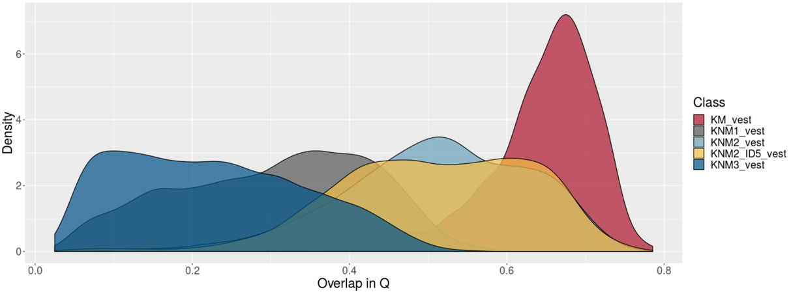
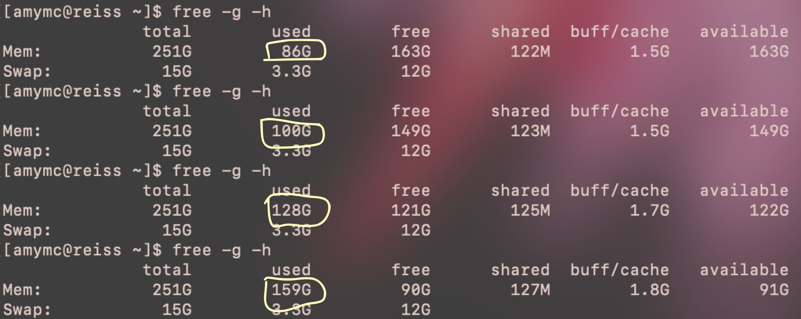

class: inverse
# About Slides

---
class: primary 
# New CSAFE slide template

We're now using [`xaringan`](https://github.com/yihui/xaringan)

What's changed: 

- New person slide: 

````
---
class: inverse
# Your Name
````

---
class: secondary

- New content slide with title: 

````
---
class: primary
# Title of slide 

Slide content
````

- New content slide without title: 

````
---
class: secondary

Slide content with no title on slide
````

---
class: inverse
# Sample User

---
class: primary
# Sample Slide

- Sample Table. Sam Tyner talked about the three must-haves of your summary:


| Must-have | It means |
| :------   | :------- |
| Context | Why are you doing what you're doing? "I'm working on X project in order to Y" |
| Content | What are you doing? "I wrote X function that does Y" or "I ran a simulation of Z" |
| Conclusion | What did you learn? "This will help me because it..." or "This important because it gets us to..." |

---
class: secondary

- If you are going to add an image, **create a directory** with your name within "images" folder. For example, "images/**guillermo**/sample_image.JPG"


 
 

---
class: inverse
# Miranda

---
class: primary
# Spring Semester Goals

- Write up neural network progress (to use as Creative Component)
- AAFS poster in February
- Help Susan with Truthiness study
- Determine next steps with CNN
- Written Prelim this summer


---
class: inverse
# Sam

---
class: primary
# Spring Semester Plans


- Submit, submit, submit! 
    * Another thesis chapter to JCGS. (No word yet on other paper submitted to ISR)
    * Glass EDA paper (w/Soyoung) to JFS 
    * Jury study paper (from a while ago...) to LPR
- Other research 
    * Covariance matrices for glass element concentrations (w/SP)
    * Keep researching uncertainty pyramid related things (w/SP, SL, HI)
    * ROpenSci fellowship book. Current plan: release in April
- Reading/working group 
    * Reading the [paper](https://www.jstatsoft.org/article/view/v028i05) introducing the `caret` package.  
    * Applying principles from applied machine learning [workshop](https://github.com/topepo/rstudio-conf-2019) at rstudio::conf (I wrote a blog post about my experience at rstudio::conf [here](https://sctyner.github.io/rstudio-conf.html).)
    

---
class: inverse
# Susan

---
class: primary
# Spring Semester Goals

---
class: inverse
# Kiegan  


---
class: primary   
# Spring Semester Goals  


- **Submit AFTE paper**  
    - edits are happening! getting close.  
- **Submit JFS paper**  
    - houston-test downstream (naming issues)  
    - results to share (if time)  
- AAFS in February  
- **Design/implement gauge R&R**  
    - working on study design  
- Working on the book  
- *Oral prelim on grooves material, plans for gauge R&R and beyond...*  
- *Write up Chapter 1*  

    
---
class: inverse
# Soyoung

---
class: primary
# Spring Semester Goals

- Submit glass EDA paper with Sam
- Working on two papers of shoe analysis on SURF matching 
- Waiting for response from JCGS 
- Workinig on the book chapters
- Working on Dirichlet process for uncentainty pyramid with Sam
- Working on covariance estimation on glass data with Sam 

---
# Vest prints
- Variations : 6 weights & 5 pairs of shoes (ID) & 2 sides of shoes (Left and Right) & 5 repeated impressions for each side 

  * KM : repeated measurements within a shoe ID 
  * KNM 1 : Fix weight - between shoe IDs
  * KNM 2 : Fix shoe 01 - between six weights
  * KNM 2-ID5 : Fix shoe ID 05 - between six weights
  * KNM 3 : shoe ID 1 vs shoe ID 2:5 on six weights




---
class: inverse
# James

---
class: primary
# Spring Semester Goals

---
class: inverse
# Ganesh  

---
class: primary   
# Spring Semester Goals


- *Taking Two Classes, Auditing One*
(Stat 544 Bayesian Statistics, Com Sc 575 Computational Perception, Stat 601)
- *Conclude the User Interface, finish write up.*
 - Getting the file system setup
- *Bullet-to-bullet scoring: Using the Chumbley Score method *
 - Cleaning up the data, and rewriting the tests.
- *Bullet-to-bullet scoring: Other methods/ tests.*

---
class: inverse
# Danica  

---
class: primary   
# Spring Semester Goals

- Submit follow-up BF vs. LR paper to LPR  
- Continue NIJ grant to validate FDE conclusions
    - Working to figure out how to combine kinematic scores across the entire phrase
- Work with Amy on the CSAFE Handwriting project  
- Write a paper for LPR on approximations to BFs
- Write a paper on Fiducial Factors with UNC
- Start NIJ grant on forensic error rate studies
    - Working on paper concerning ROC curves and SLRs
- Writing Winning Grant Proposals Phase 2 Workshop
    - Draft an NSF CAREER Proposal (for 2020 submission?)
- Work with Dan Spitzner from UVA on the CSAFE Statistical Foundations project

---
class: inverse
# Nick

---
class: primary
# Spring Semester Goals


---
class: inverse
# Amy

---
class: primary
# Spring Semester Goals  
- <strong>Collect data</strong>
    - Colin joins the team!
    - Automate parts of the process
<br><br>
- <strong>Research</strong> (Paper/Chapter 1)
    - Fun times with `read_csv` (next slide)
    - Working group Jan. 30 \& Feb. 6
    
<br>
- Oral prelim
- AAFS talk in February

---
class: primary
# Fun times.
- `read_csv` with `purrr::map`  
- 6G directory
<br><br>



---
class: inverse
# Nate


---
class: primary
# Spring Semester Goals

- Finish (or get close) to SLR paper
- Finish groove changepoint R package and my contribution to the joint paper with Kiegan
- Find an internship 
- Mostly finish dissertation chapter on sparse GPs (and work on corresponding R package?)
- Oral prelim
- Learn Python through stat 602
    
---
class: inverse
# Ben

---
class: primary
# Spring Semester Goals


---
class: inverse
# Issues

---
class: secondary

- [Issues!!](https://github.com/CSAFE-ISU/slides/issues)
- One issue down, three to go.

```{r, eval=FALSE, echo=FALSE}
## Presenters
presenter <- 
  c("Soyoung", "Amy", "Ben", "Nick", 
    "Ganesh", "Nate", "Sam", 
    "James", "Kiegan", "Danica", "Susan", 
    "Miranda")

## Set seed as the date (mmdd)
set.seed(1105)

## Shuffle presenters
sample(presenter)
```

