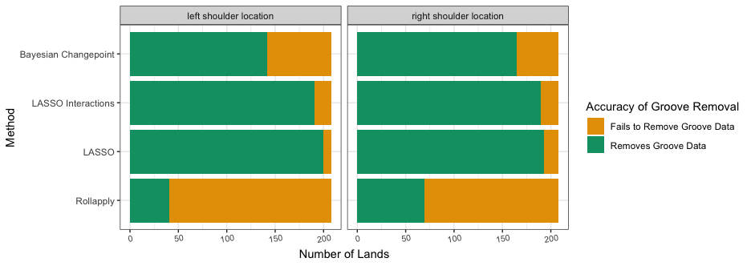
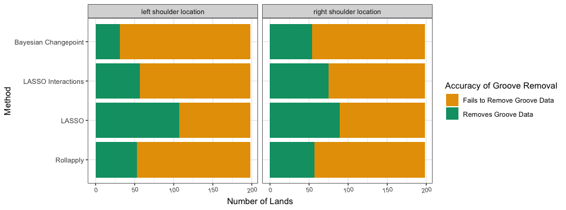
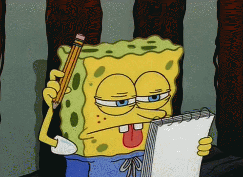
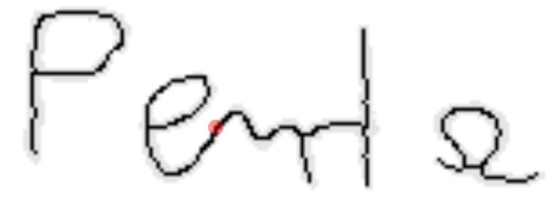

class: inverse
# About Slides

---
class: primary 
# New CSAFE slide template

We're now using [`xaringan`](https://github.com/yihui/xaringan)

What's changed: 

- New person slide: 

````
---
class: inverse
# Your Name
````

---
class: secondary

- New content slide with title: 

````
---
class: primary
# Title of slide 

Slide content
````

- New content slide without title: 

````
---
class: secondary

Slide content with no title on slide
````

---
class: inverse
# Sample User

---
class: primary
# Sample Slide

- Sample Table. Sam Tyner talked about the three must-haves of your summary:


| Must-have | It means |
| :------   | :------- |
| Context | Why are you doing what you're doing? "I'm working on X project in order to Y" |
| Content | What are you doing? "I wrote X function that does Y" or "I ran a simulation of Z" |
| Conclusion | What did you learn? "This will help me because it..." or "This important because it gets us to..." |

---
class: secondary

- If you are going to add an image, **create a directory** with your name within "images" folder. For example, "images/**guillermo**/sample_image.JPG"


 
 


---
class: inverse
# Kiegan  


---
class: primary   
# Spring Semester Goals  


- **Submit AFTE paper**  
    - Getting edits :) 
    - Formatting, then submitting!  
- **Submit JFS paper**  
    - Putting together results section  
    - Running last sets downstream through random forest  
- AAFS in February  
- **Design/implement gauge R&R**  
    - Working on study design  
- Working on the book  
- *Oral prelim on grooves material, plans for gauge R&R and beyond...*  
- *Write up Chapter 1*  


---
class: primary   
# Initial Results    


  
 


---
class: primary   
# Initial Results    


  
 
 
---
class: inverse
# Susan

---
class: primary
# Spring Semester Goals

- Survive interview

- Submit paper with Miranda

- Port `keras-vis` Python library to R (with Jason)

- bulletsamplr package/paper

- NIJ Grant for prototype scanner

---
class: inverse
# Sam

---
class: primary
# Spring Goals

- Submit, submit, submit! 
    * Another thesis chapter to JCGS.
    * Glass EDA paper (w/SP) to JFS (submit by end of Feb.)
    * Jury study paper to LPR
- Other research 
    * Covariance matrices for glass element concentrations
    * Keep researching uncertainty pyramid related things
    * ROpenSci fellowship book. To be released in April
- **Reading/working group sessions** 
    * **February 13th:** Presenting the process of fitting a random forest to the glass data, following the [`tidymodels`](https://github.com/tidymodels) workflow & principles. I'm open to using other data if you have it! 
    * **February 20th:** Working meeting applying the `tidymodels` principles to your own data. This could be CSAFE or other data for your research. Or, pick a dataset from the wild (try the [Tidy Tuesday](https://github.com/rfordatascience/tidytuesday) repo). Reference materials are the slides & code from the Applied ML [workshop](https://github.com/topepo/rstudio-conf-2019) at rstudio::conf and the [paper](https://www.jstatsoft.org/article/view/v028i05) from JSS on the `caret` package.
    


---
class: inverse
# James

---
class: primary
# Spring Semester Goals


---
class: inverse
# Miranda

---
class: primary
# Spring Semester Goals

- **Write up neural network progress (to use as Creative Component)**
- AAFS poster in February
- Help Susan with Truthiness study
- Determine next steps with CNN
- Written Prelim this summer




---
class: inverse
# Nate


---
class: primary
# Groove ID

- Almost done with AAFS poster (need discussion section)
- Get back to making my R package CRAN worthy (currently passing Travis checks)
    - change the names of functions
    
---
class: primary
# SLR

- To review
    - Uknown source data $Y$ and known source data $X$ are normal
    - score = $(x - y)^2$
    - $\log(SLR) - \log(LR)$ is unbounded
    - Probabilities that $SLR/LR$ under $H_d$ become large with signal-to-noise ratio
         - Under $H_p$ these probabilities are much more well-behaved
- The catch...
    - Overwhelming majority of large discrepancies exist when both the SLR and LR are very small (under $H_d$)
    
- How to interpret $\frac{P(Y|SLR, H_p)}{P(Y|SLR, H_d)}$ (or $\frac{P(Y|SLR, H_d)}{P(Y|SLR, H_p)}$)?
- I think...
    - $E_Y \left[ \frac{P(Y|SLR, H_p)}{P(Y|SLR, H_d)} | H_d \right] = E_Y\left[ \frac{P(SLR|H_d)P(SLR|Y,H_p)}{P(SLR|Y, H_d)P(SLR|H_p)} | H_p \right]$

    
---
class: inverse
# Ben

---
class: primary
# Spring Semester Goals
---
class: inverse
# Amy

---
class: primary
# Spring Semester Goals  
- <strong>Collect data</strong>
    - Colin working on QR codes
<br><br>
- <strong>Research</strong> (Paper/Chapter 1)
    - Working with Ben and Nick to process documents
    - Methods for making feature space smaller (2000 columns)
    - CSAFE-01 server issues at the end of last week
    - Working group Jan. 30 \& Feb. 6
    
<br>
- <strong>Sidenote. </strong>Detroit Lakes, MN tomorrow night: wind chills near -70&deg;F,  "realfeel" temperatures near -55&deg;F.

---
class: inverse
# Nick

---
class: primary
# Spring Semester Objectives
1. Provide support to Amy and Ben
  - Amy working on modellilng. I can aide by providing features and support for package as data extraction happens.
  - Ben is working on web application. I can help by providing over-arching ideas and assist with any R code that is needed for transition.
2. Continue to improve **handwriter**
  - Order letters coherently across lines
  - Add nodes at sharp turn
  - Detect loops that have multiple paths

---
class: primary
# This week


---
class: inverse
# Soyoung

---
class: primary
# Spring Semester Goals

- Submit glass EDA paper with Sam
- Working on two papers of shoe analysis on SURF matching 
- Workinig on the book chapters of glass and shoe
- Working with vest prints 
- Working on Dirichlet process for uncentainty pyramid with Sam
- Working on covariance estimation on glass data with Sam 
- Waiting for response from JCGS
---
class: inverse
# Ganesh  

---
class: primary   
# Spring Semester Goals


- *Taking Two Classes, Auditing One*
- *Conclude the User Interface, finish write up.*
- *Bullet-to-bullet scoring: Using the Chumbley Score method *
- *Bullet-to-bullet scoring: Other methods/ tests.*

---
class: inverse
# Danica  

---
class: primary   
# Spring Semester Goals

- Submit follow-up BF vs. LR paper to LPR  
- Continue NIJ grant to validate FDE conclusions
    - Working to figure out how to combine kinematic scores across the entire phrase
- Work with Amy on the CSAFE Handwriting project  
- Write a paper for LPR on approximations to BFs
- Write a paper on Fiducial Factors with UNC
- Start NIJ grant on forensic error rate studies
    - Working on paper concerning ROC curves and SLRs
- Writing Winning Grant Proposals Phase 2 Workshop
    - Draft an NSF CAREER Proposal (for 2020 submission?)
- Work with Dan Spitzner from UVA on the CSAFE Statistical Foundations project
---
class: inverse
# Issues

---
class: secondary

- [Issues!!](https://github.com/CSAFE-ISU/slides/issues)
- One issue down, three to go.

```{r, eval=FALSE, echo=FALSE}
## Presenters
presenter <- 
  c("Soyoung", "Amy", "Ben", "Nick", 
    "Ganesh", "Nate", "Sam", 
    "James", "Kiegan", "Danica", "Susan", 
    "Miranda")

## Set seed as the date (mmdd)
set.seed(0128)

## Shuffle presenters
sample(presenter)
```
