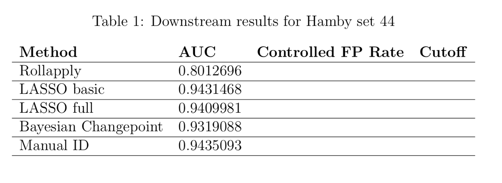
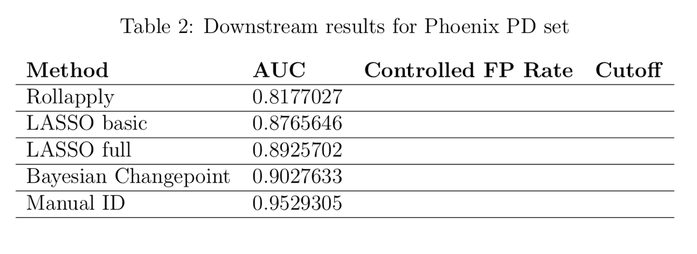
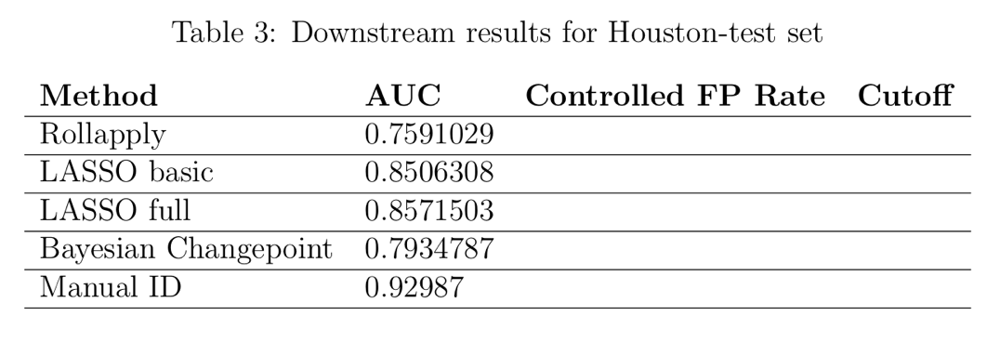
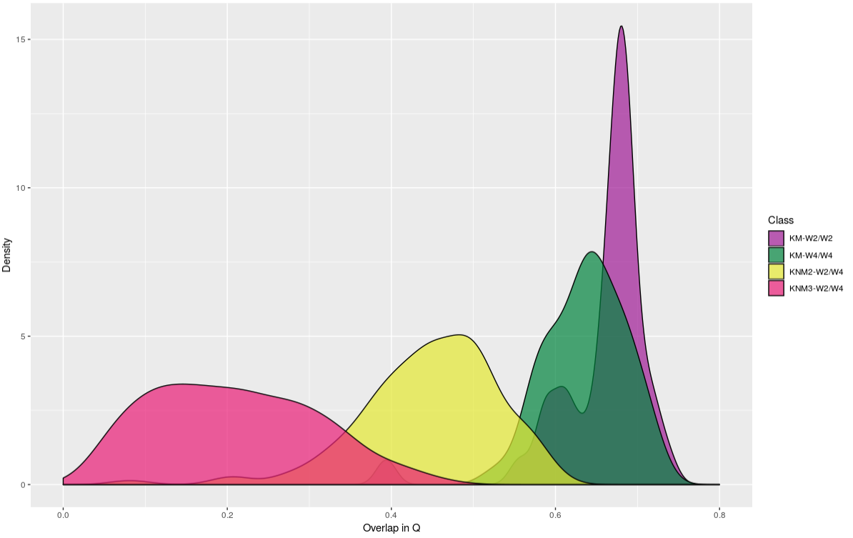

class: inverse
# About Slides

---
class: primary 
# New CSAFE slide template

We're now using [`xaringan`](https://github.com/yihui/xaringan)

What's changed: 

- New person slide: 

````
  ---
  class: inverse
  # Your Name
````

---
class: secondary

- New content slide with title: 

````
---
class: primary
# Title of slide 

Slide content
````

- New content slide without title: 

````
---
class: secondary

Slide content with no title on slide
````

---
class: inverse
# Sample User

---
class: primary
# Sample Slide

- Sample Table. Sam Tyner talked about the three must-haves of your summary:


| Must-have | It means |
| :------   | :------- |
| Context | Why are you doing what you're doing? "I'm working on X project in order to Y" |
| Content | What are you doing? "I wrote X function that does Y" or "I ran a simulation of Z" |
| Conclusion | What did you learn? "This will help me because it..." or "This important because it gets us to..." |

---
class: secondary

- If you are going to add an image, **create a directory** with your name within "images" folder. For example, "images/**guillermo**/sample_image.JPG"


 
 

---
class: inverse
# Danica

---
class: primary   
# Spring Semester Goals

- Submit follow-up BF vs. LR paper to LPR  
- Continue NIJ grant to validate FDE conclusions
    - Working to figure out how to combine kinematic scores across the entire phrase
- Work with Amy on the CSAFE Handwriting project  
- Write a paper for LPR on approximations to BFs
- Write a paper on Fiducial Factors with UNC
- Start NIJ grant on forensic error rate studies
    - Working on paper concerning ROC curves and SLRs
- Writing Winning Grant Proposals Phase 2 Workshop
    - Draft an NSF CAREER Proposal (for 2020 submission?)
- Work with Dan Spitzner from UVA on the CSAFE Statistical Foundations project

---
class: inverse
# Sam

---
class: primary
# Spring Goals

- Submit, submit, submit! 
    * Another thesis chapter to JCGS.
    * Glass EDA paper (w/SP) to JFS (submit by end of Feb. complete draft by end of this week.)
    * Jury study paper to LPR
- Other research 
    * Covariance matrices for glass element concentrations
    * Keep researching uncertainty pyramid related things
    * ROpenSci fellowship book. To be released in April
- Reading/working group sessions 
    * February 13th: Presenting the process of fitting a random forest to the glass data, following the [`tidymodels`](https://github.com/tidymodels) workflow & principles. 
    * February 20th: Working meeting applying the `tidymodels` principles to your own data. This could be CSAFE or other data for your research. Or, pick a dataset from the wild (try the [Tidy Tuesday](https://github.com/rfordatascience/tidytuesday) repo). Reference materials: code from the Applied ML [workshop](https://github.com/topepo/rstudio-conf-2019) at rstudio::conf 

---
class:primary
# Exciting news! 

- Have an interview for a [AAAS Science & Technology Policy Fellowship](https://www.aaas.org/programs/science-technology-policy-fellowships)
- Have to write a **briefing memo** on a topic of our choice (my choice: open data & public access to data) by this Thursday at 7am, so I'll be a bit distracted until Thursday. :) 


  
(Footage of me working on the memo this weekend)


---
class: inverse
# Kiegan

---
class: primary   
# Spring Semester Goals  


- **Submit AFTE paper**  
- **Submit JFS paper**    
- **AAFS next week**    
- **Design/implement gauge R&R**  
- Working on the book  
- *Oral prelim on grooves material, plans for gauge R&R and beyond...*  
- **Write up Chapter 1**  


---
class: primary   
# Hamby set 44 results  


  


---
class: primary   
# Phoenix PD set results  


  


---
class: primary   
# Houston-test set results  


   


    
---
class: inverse
# Nick

---
class: primary
# Spring Semester Goals


---
class: inverse
# Susan

---
class: primary
# Last Week

- Set up framework for bullet quality screening project with Joe

- CoNNOR: Got distance calculations working reliably
    - it turns out, file order matters? Who knew?

- Survived Friday

- Uncoast Unconf participant evaluations

## This Week
- AAFS Poster - Longitudinal Shoe DB
    - Testing the database ([issue filed](https://github.com/CSAFE-ISU/slides/issues/9))


---
class: inverse
# Amy

---
class: primary
# Working From Home
Working from MN this week! On email and Zoom if you need me.   
  
  
- Thanks to everyone who sent resources and engaged in discussion at working group last week.


---
class: inverse
# Ganesh

---
class: primary   
# Spring Semester Goals


- *Taking Two Classes, Auditing One*
(Stat 544 Bayesian Statistics, Com Sc 575 Computational Perception, Stat 601)
- *Conclude the User Interface, finish write up.*
- *Bullet-to-bullet scoring: Using the Chumbley Score method *
- *Bullet-to-bullet scoring: Other methods/ tests.*

---
class: inverse
# Nate


---
class: primary
# Spring Semester Goals

- Finish (or get close) to SLR paper
- Finish groove changepoint R package and my contribution to the joint paper with Kiegan
- Find an internship 
- Mostly finish dissertation chapter on sparse GPs (and work on corresponding R package?)
- Oral prelim
- Learn Python through stat 602
    
---
class: inverse
# Miranda

---
class: primary
# Spring Semester Goals

- Write up neural network progress (to use as Creative Component)
- AAFS poster in February
- Help Susan with Truthiness study
- Determine next steps with CNN
- Written Prelim this summer


---
class: inverse
# Soyoung

---
class: primary
# Spring Semester Goals

- Submit glass EDA paper with Sam
- Working on two papers of shoe analysis on SURF matching 
- Waiting for response from JCGS 
- Workinig on the book chapters
- Working on Dirichlet process for uncentainty pyramid with Sam
- Working on covariance estimation on glass data with Sam 

---
# Vest prints
- Brand new shoes with two people on weight vests

  * KM-W2/W2 (purple):  Between repeated I from James (W2)
  * KM-W4/W4 (green): Between repeated I from Ganseh W4)
  * KNM2-W2/W4 (yellow): Between I(J-W2) and I(G-W4) from shoe 1
  * KNM3-W2/W4 (red): Between I(J-W2) from shoe 1 and I(G-W4) from shoes 2-5
  



---
class: inverse
# Issues

---
class: secondary

- [Issues!!](https://github.com/CSAFE-ISU/slides/issues)
- One issue down, three to go.

```{r, eval=FALSE, echo=FALSE}
## Presenters
presenter <- 
  c("Soyoung", "Amy", "Ben", "Nick", 
    "Ganesh", "Nate", "Sam", 
    "James", "Kiegan", "Danica", "Susan", 
    "Miranda")

## Set seed as the date (mmdd)
set.seed(1105)

## Shuffle presenters
sample(presenter)
```

