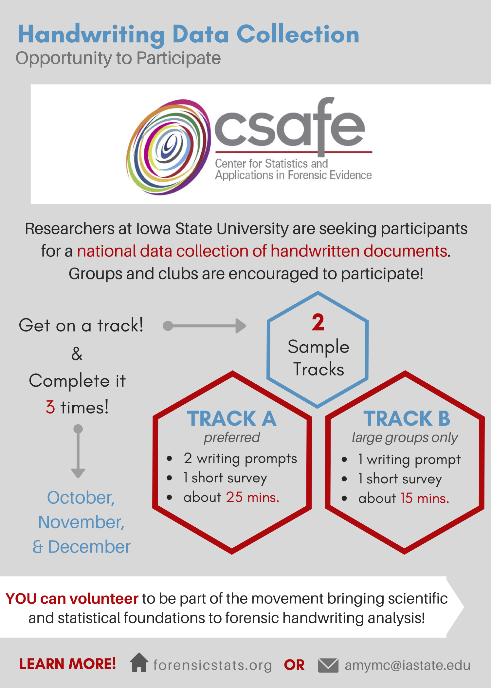
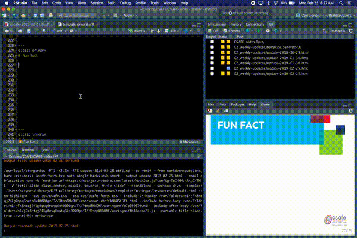

class: inverse
# About Slides

---
class: primary 
# New CSAFE slide template

We're now using [`xaringan`](https://github.com/yihui/xaringan)

What's changed: 

- New person slide: 

````
  ---
  class: inverse
  # Your Name
````

---
class: secondary

- New content slide with title: 

````
---
class: primary
# Title of slide 

Slide content
````

- New content slide without title: 

````
---
class: secondary

Slide content with no title on slide
````

---
class: inverse
# Sample User

---
class: primary
# Sample Slide

- Sample Table. Sam Tyner talked about the three must-haves of your summary:


| Must-have | It means |
| :------   | :------- |
| Context | Why are you doing what you're doing? "I'm working on X project in order to Y" |
| Content | What are you doing? "I wrote X function that does Y" or "I ran a simulation of Z" |
| Conclusion | What did you learn? "This will help me because it..." or "This important because it gets us to..." |

---
class: secondary

- If you are going to add an image, **create a directory** with your name within "images" folder. For example, "images/**guillermo**/sample_image.JPG"


 
 

---
class: inverse
# Danica

---
class: primary   
# Spring Semester Goals

- Submit follow-up BF vs. LR paper to LPR  
- Continue NIJ grant to validate FDE conclusions
    - Working to figure out how to combine kinematic scores across the entire phrase
- Work with Amy on the CSAFE Handwriting project  
- Write a paper for LPR on approximations to BFs
- Write a paper on Fiducial Factors with UNC
- Start NIJ grant on forensic error rate studies
    - Working on paper concerning ROC curves and SLRs
- Writing Winning Grant Proposals Phase 2 Workshop
    - Draft an NSF CAREER Proposal (for 2020 submission?)
- Work with Dan Spitzner from UVA on the CSAFE Statistical Foundations project

---
class: inverse
# Susan

---
class: primary
# Spring Semester Goals

---
class: inverse
# Amy

---
class: primary
# Spring Semester Goals  
- <strong>Collect data</strong>
- <strong>Submit paper</strong> (Chapter 1)
<br> <br>
- Oral prelim
- AAFS talk in February
- Learning about other areas of statistics: FDA, adaptive designs, "statistical learning" (602), ...
- STATers
- <i>No classes!</i> :)

---
class: primary
# Coming up
<p>  <br> <br> <br> <br> - Undergraduate &nbsp; research &nbsp;&nbsp;assistant <br> <br> - Pilot data &nbsp;&nbsp;collection </p>


---
class: inverse
# Soyoung

---
class: primary
# Spring Semester Goals

- Submit glass EDA paper with Sam
- Working on two papers of shoe analysis on SURF matching 
- Waiting for response from JCGS 
- Workinig on the book chapters
- Working on Dirichlet process for uncentainty pyramid with Sam
- Working on covariance estimation on glass data with Sam 

---
class: inverse
# Nick

---
class: primary
# Spring Semester Goals


---
class: inverse
# Nate


---
class: primary
# Spring Semester Goals

- Finish (or get close) to SLR paper
- Finish groove changepoint R package and my contribution to the joint paper with Kiegan
- Find an internship 
- Mostly finish dissertation chapter on sparse GPs (and work on corresponding R package?)
- Oral prelim
- Learn Python through stat 602
    
---
class: inverse
# Miranda

---
class: primary
# Spring Semester Goals

- Write up neural network progress (to use as Creative Component)
- AAFS poster in February
- Help Susan with Truthiness study
- Determine next steps with CNN
- Written Prelim this summer

---
class: inverse
# Kiegan

---
class: primary   
# Spring Semester Goals  


- Submit AFTE paper 
- Submit JFS paper   
- **AAFS in February**  
    - done! 
- **Design/implement gauge R&R**  
    - Working group next week!  
- Working on the book  
- **Oral prelim on grooves material, plans for gauge R&R and beyond...**  
- **Write up Chapter 1**  


    
---
class: inverse
# Sam

---
class: primary
# This Week

- Completed draft of glass paper
- **Wednesday @ 3:10pm**: `tidymodels` BYOD DIY. It will be exactly what it sounds like! 
- If you need data: try [TidyTuesdays](https://github.com/rfordatascience/tidytuesday), the [`mlbench`](https://cran.r-project.org/web/packages/mlbench/mlbench.pdf) package, or the [`AmesHousing`](https://cran.r-project.org/web/packages/AmesHousing/AmesHousing.pdf) package. 
- Repo from rstudio::conf [here](https://github.com/topepo/rstudio-conf-2019); my slides from last time [here](https://github.com/CSAFE-ISU/slides/tree/master/04_working-group-talks/tidymodels)


---
class: primary
# Fun fact

With the new update of `xaringan`, you can see your updated slides live in RStudio!

```{r out.width="75%", echo = FALSE, fig.align = "center"}

```

[How:](https://yihui.name/en/2019/02/ultimate-inf-mr/) `remotes::install_github('yihui/xaringan', upgrade = TRUE)`, Then, `xaringan:::inf_mr()` or Tools `r emo::ji("right arrow")`  Addins `r emo::ji("right arrow")` Search "xaringan" `r emo::ji("right arrow")` Execute.


---
class: inverse
# Ganesh

---
class: primary   
# Spring Semester Goals


- *Taking Two Classes, Auditing One*
(Stat 544 Bayesian Statistics, Com Sc 575 Computational Perception, Stat 601)
- *Conclude the User Interface, finish write up.*
- *Bullet-to-bullet scoring: Using the Chumbley Score method *
- *Bullet-to-bullet scoring: Other methods/ tests.*

---
class: inverse
# Issues

---
class: secondary

- [Issues!!](https://github.com/CSAFE-ISU/slides/issues)
- One issue down, three to go.


