class: inverse
# About Slides

---
class: primary 
# New CSAFE slide template

We're now using [`xaringan`](https://github.com/yihui/xaringan)

What's changed: 

- New person slide: 

````
  ---
  class: inverse
  # Your Name
````

---
class: secondary

- New content slide with title: 

````
---
class: primary
# Title of slide 

Slide content
````

- New content slide without title: 

````
---
class: secondary

Slide content with no title on slide
````

---
class: inverse
# Sample User

---
class: primary
# Sample Slide

- Sample Table. Sam Tyner talked about the three must-haves of your summary:


| Must-have | It means |
| :------   | :------- |
| Context | Why are you doing what you're doing? "I'm working on X project in order to Y" |
| Content | What are you doing? "I wrote X function that does Y" or "I ran a simulation of Z" |
| Conclusion | What did you learn? "This will help me because it..." or "This important because it gets us to..." |

---
class: secondary

- If you are going to add an image, **create a directory** with your name within "images" folder. For example, "images/**guillermo**/sample_image.JPG"


 
 

---
class: inverse
# Amy

---
class: primary
# Spring Semester Goals  
- <strong>Collect data</strong>
- <strong>Submit paper</strong> (Chapter 1)
<br> <br>
- Oral prelim
- AAFS talk in February
- Learning about other areas of statistics: FDA, adaptive designs, "statistical learning" (602), ...
- STATers
- <i>No classes!</i> :)

---
class: primary
# Coming up
<p>  <br> <br> <br> <br> - Undergraduate &nbsp; research &nbsp;&nbsp;assistant <br> <br> - Pilot data &nbsp;&nbsp;collection </p>


---
class: inverse
# Sam

---
class: primary
# Spring Semester Goals

- Submit, submit, submit! 
    * Another thesis chapter to JCGS. **Hopefully this week or next.** (No word yet on other paper submitted to ISR.)
    * Glass EDA paper (w/Soyoung) to ~~JFS~~ FSI. **Draft complete. Waiting on feedback from A.**
- Other research 
    * ROpenSci fellowship book. Current plan: release in April. **My primary focus in March.**
    
---
class: primary
# Tonight

### Crime Solving with Genetic Genealogy
#### CeCe Moore
##### 8:00 pm – Sun Room, Memorial Union

Abstract: *The 2018 arrest of the Golden State serial killer in California made international headlines in part because police teamed up with genealogists to use familial DNA to track him down. This new method of sleuthing raises questions about how it’s done, ethics and privacy, and the reliability of genetic and DNA tests. CeCe Moore is an investigative genetic genealogist and media consultant. She has worked as the genetic genealogist for the PBS Television documentary series Finding Your Roots with Henry Louis Gates, Jr. since 2013. She is the founder of The DNA Detectives and recently joined forces with Parabon Nanolabs to lead their new Genetic Genealogy Services for law enforcement unit. National Affairs Series: Building a Better Democracy.*

---
class: primary
# Tomorrow (& every Tues.)

### Tidy Tuesdays w/R-Ladies Ames

Practice your `tidyverse` skills with us! New [data](https://github.com/rladies-ames/tidytuesday/tree/master/data/2019/2019-03-05) every week. 


---
class: inverse
# Soyoung

---
class: primary
# Spring Semester Goals

- Submit glass EDA paper with Sam
- Working on two papers of shoe analysis on SURF matching 
- Waiting for response from JCGS 
- Workinig on the book chapters
- Working on Dirichlet process for uncentainty pyramid with Sam
- Working on covariance estimation on glass data with Sam 

---
class: inverse
# Danica

---
class: primary   
# Spring Semester Goals

- Submit follow-up BF vs. LR paper to LPR  
- Continue NIJ grant to validate FDE conclusions
    - Working to figure out how to combine kinematic scores across the entire phrase
- Work with Amy on the CSAFE Handwriting project  
- Write a paper for LPR on approximations to BFs
- Write a paper on Fiducial Factors with UNC
- Start NIJ grant on forensic error rate studies
    - Working on paper concerning ROC curves and SLRs
- Writing Winning Grant Proposals Phase 2 Workshop
    - Draft an NSF CAREER Proposal (for 2020 submission?)
- Work with Dan Spitzner from UVA on the CSAFE Statistical Foundations project

---
class: inverse
# Nick

---
class: primary
# Spring Semester Goals


---
class: inverse
# Ganesh

---
class: primary   
# Spring Semester Goals

- *Finished the User Interface*
  - Start writing! 
- *Reading on Markov Random Fields*
- *Testing some existing methods to identify irregularities*

---
class: inverse
# Nate


---
class: primary
# Spring Semester Goals

- Finish (or get close) to SLR paper
- Finish groove changepoint R package and my contribution to the joint paper with Kiegan
- Find an internship 
- Mostly finish dissertation chapter on sparse GPs (and work on corresponding R package?)
- Oral prelim
- Learn Python through stat 602
    
---
class: inverse
# Susan

---
class: primary
# Last Week

- NIJ grant: Class Characteristics
    - Call with Lesley Hammer - ways to frame the data collection to solve problems examiners currently face
    - Email to DCI Investigator - will follow up this week

- Bullet software
    - updated tests for `x3ptools`
    - tried to fix Travis for `x3ptools` (fixed!) and `bulletxtrctr` (not fixed)

```{r i-made-a-thing, eval = F, include = F}
library(hexSticker)
library(ggplot2)
library(showtext)

# https://fonts.google.com/featured/Superfamilies
font_add_google("Montserrat", "Montserrat", regular.wt = 300, db_cache = F)
# font_paths("/home/susan/.local/share/fonts/Unknown Vendor/TrueType")
# font_files()
fp_url <- "https://github.com/CSAFE-ISU/Templates/raw/master/logos/fingerprint.png"
text_url <- "https://github.com/CSAFE-ISU/Templates/raw/master/logos/csafe_sticker_text.png"
url_url <- "https://github.com/CSAFE-ISU/Templates/raw/master/logos/url_text.png"
ggplot() + 
  coord_fixed() +
  geom_hexagon(size = 1.2, fill = "#FFFFFF", color = "#22a8e0") +
  geom_segment(aes(x = 0.18, xend = .98, y = 1.25, yend = 1.25), color = "#cf0a2c", size = 1) + 
  ggimage::geom_image(aes(image = text_url, y = 1.1, x = .175, size = I(.45)), hjust = 0) +
  ggimage::geom_image(aes(image = fp_url, y = .9, x = 1.325, size = I(.5))) +
  geom_text(aes(x = 1, y = 0, label = "forensicstats.org"), 
            family = "Montserrat", angle = -30, color = "#8a8a8d", hjust = 1.125, 
            vjust = -0.5, size = 2) + 
  theme_void() 
ggsave("02_weekly-updates/images/susan/csafe-sticker.png", width = 2, height = 2, dpi = 600)
```
- I made a thing: 
.center[]

---
class: inverse
# Miranda

---
class: primary
# Convolution

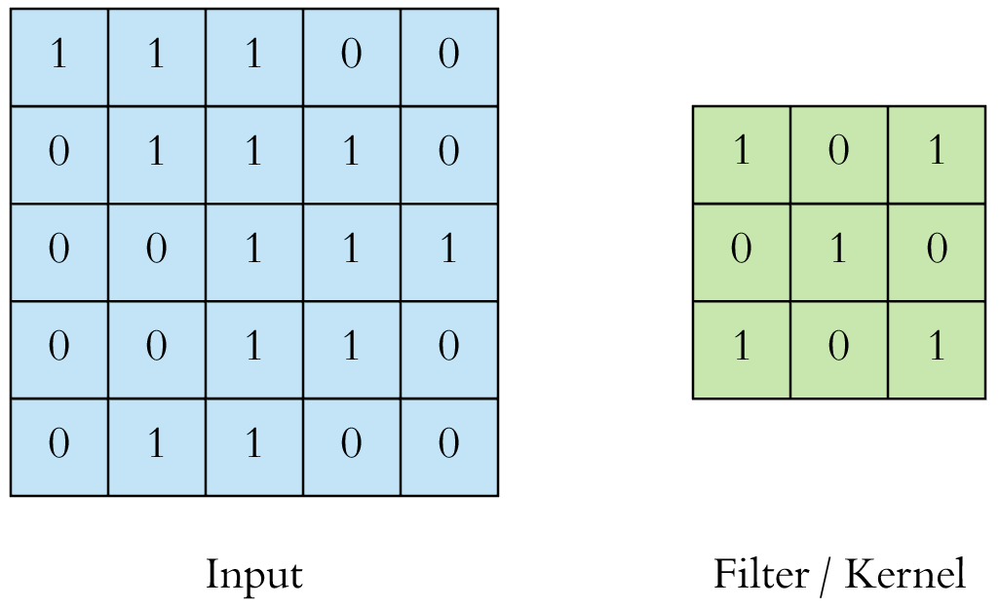

---
class: primary
# Convolution

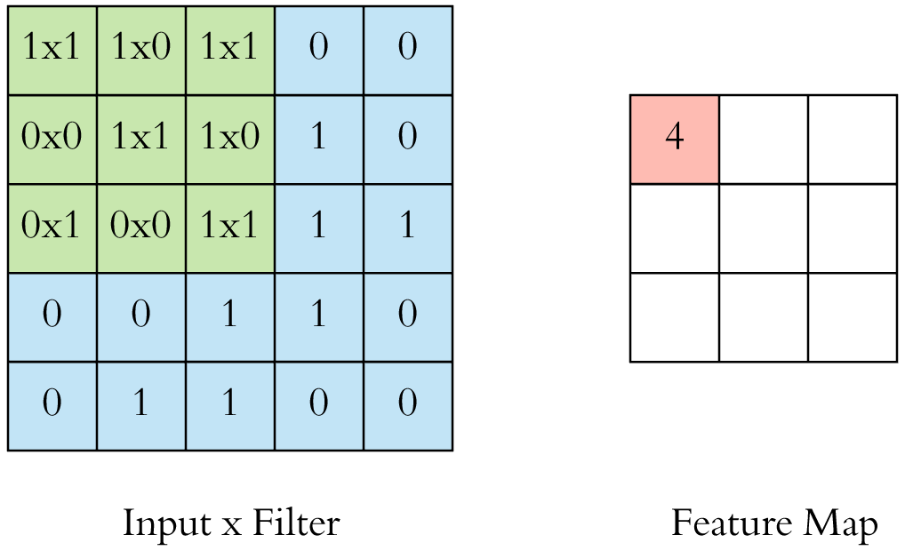

---
class: primary
# Convolution

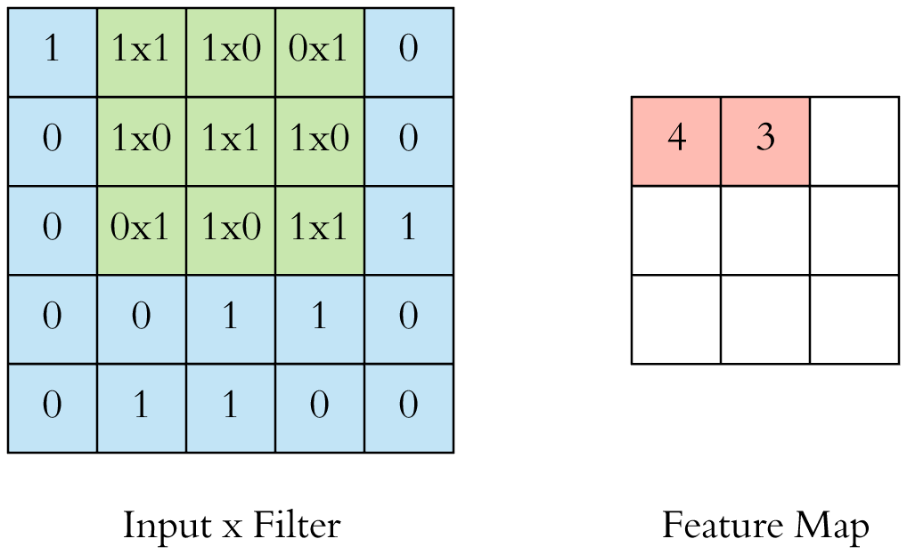

---
class: primary
# Keras-Vis

- Jason's R package: https://github.com/jkhseo/Keras-Vis
- Gradient ascent to visualize image that maximally activates each filter


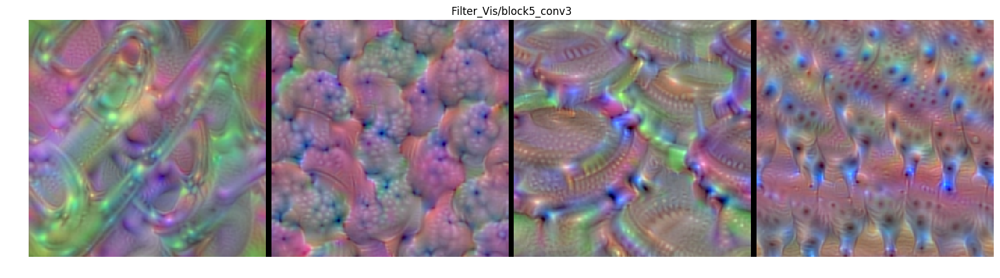
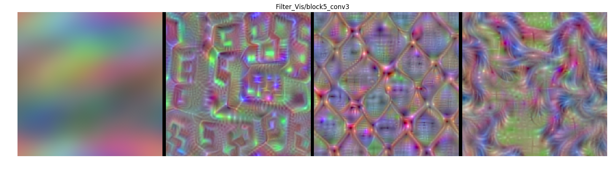

---
class: primary
# Useful Filters

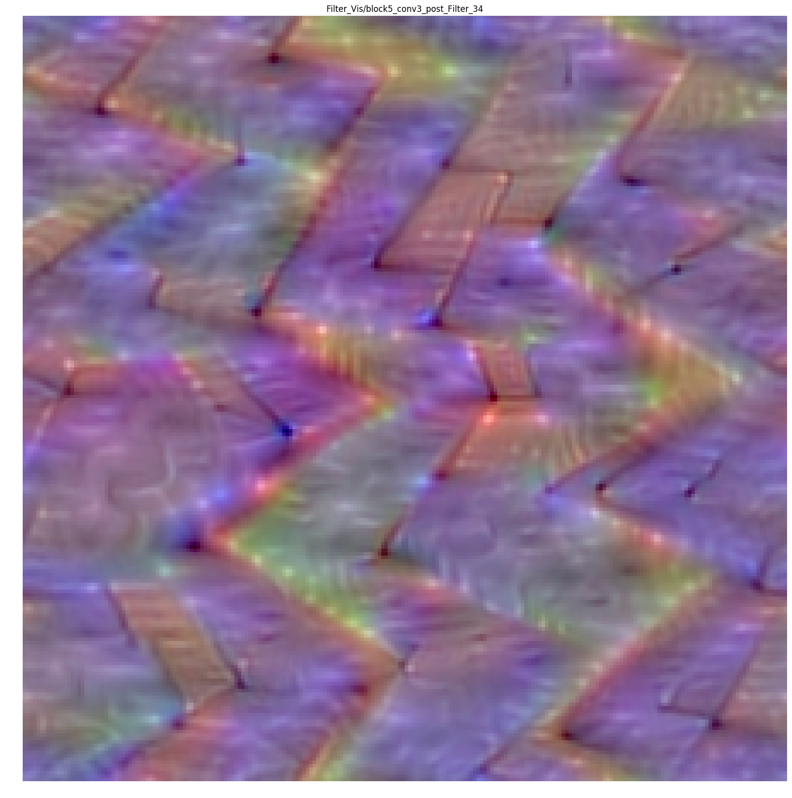
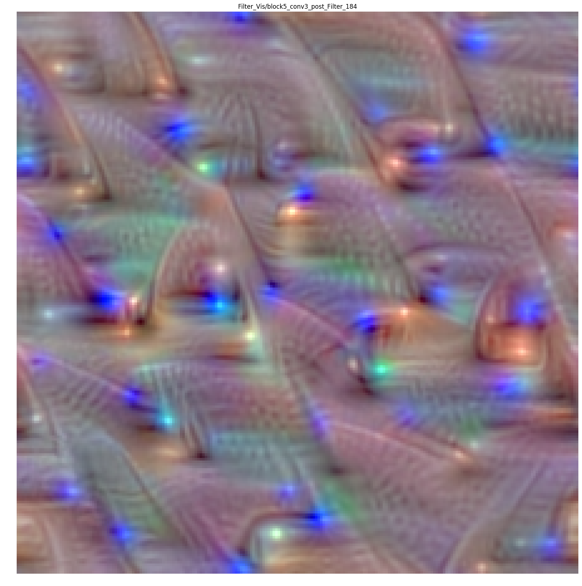

---
class: primary
# Too specific?

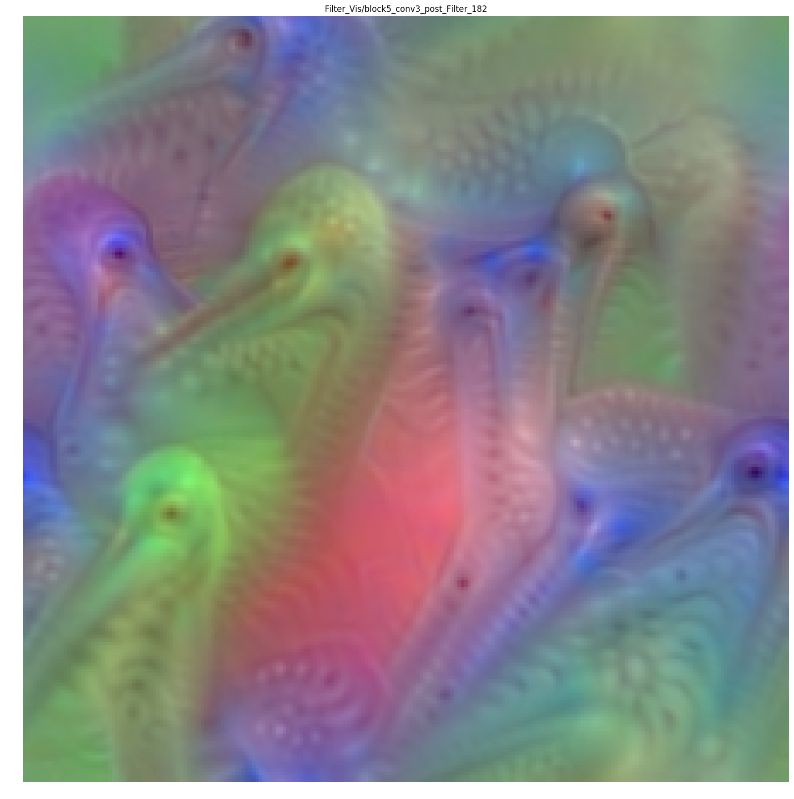
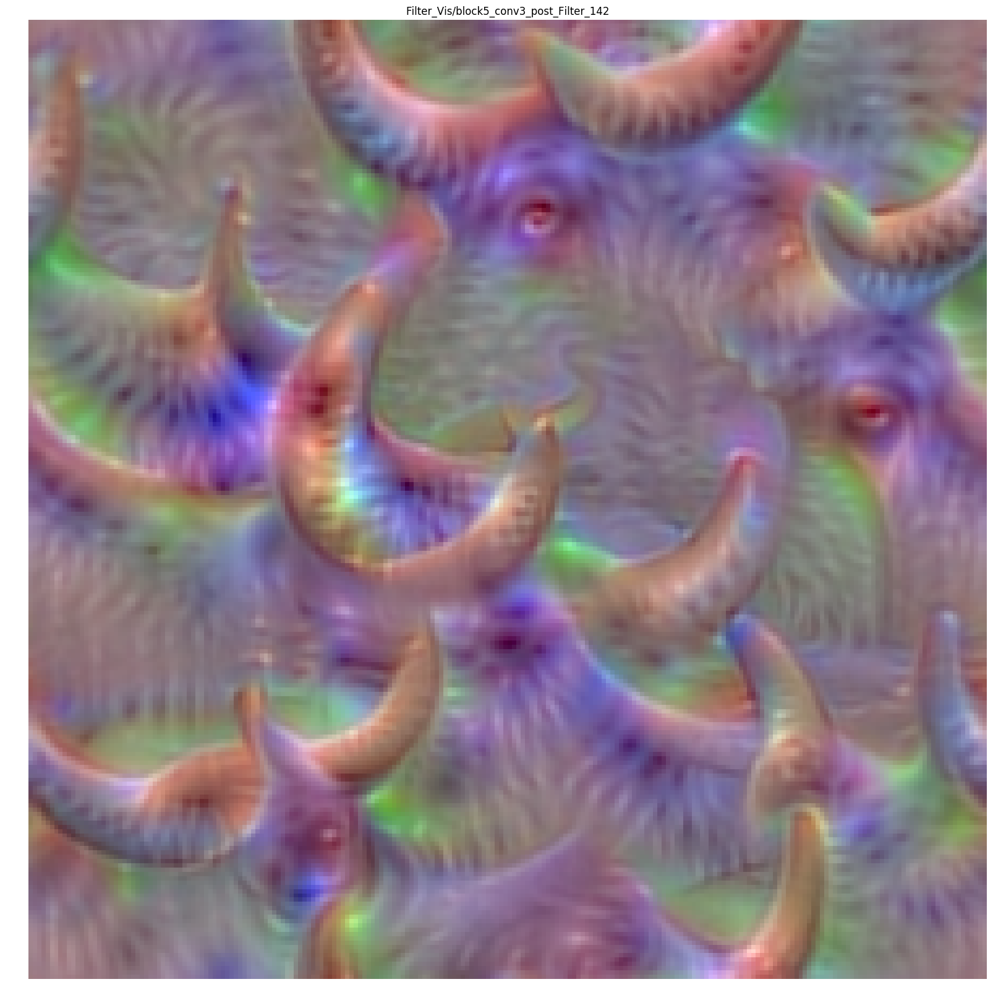

---
class: inverse
# Kiegan

---
class: primary   
# Spring Semester Goals  


- Submit AFTE paper 
- Submit JFS paper   
- **AAFS in February**  
    - done! 
- **Design/implement gauge R&R**  
    - Working group next week!  
    - Updates in images!  
- Working on the book  
- **Oral prelim on grooves material, plans for gauge R&R and beyond...**  
- **Write up Chapter 1**  

---
class: primary   
# Pilot Study Data  

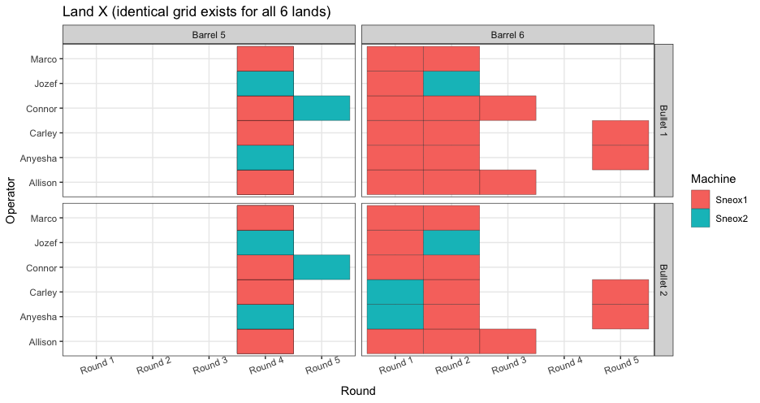
 
---
class: primary   
# Pilot Study Data  

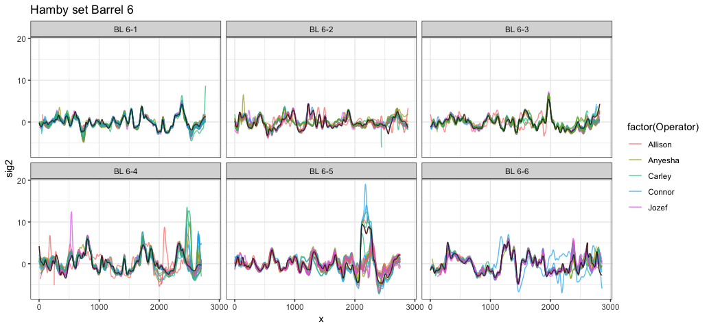  

---
class: primary   
# Pilot Study Data  

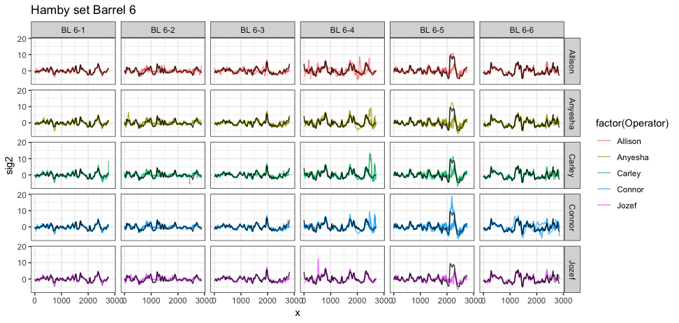  


    
---
class: inverse
# Issues

---
class: secondary

- [Issues!!](https://github.com/CSAFE-ISU/slides/issues)
- One issue down, three to go.

```{r, eval=FALSE, echo=FALSE}
## Presenters
presenter <- 
  c("Soyoung", "Amy", "Ben", "Nick", 
    "Ganesh", "Nate", "Sam", 
    "James", "Kiegan", "Danica", "Susan", 
    "Miranda")

## Set seed as the date (mmdd)
set.seed(1105)

## Shuffle presenters
sample(presenter)
```

