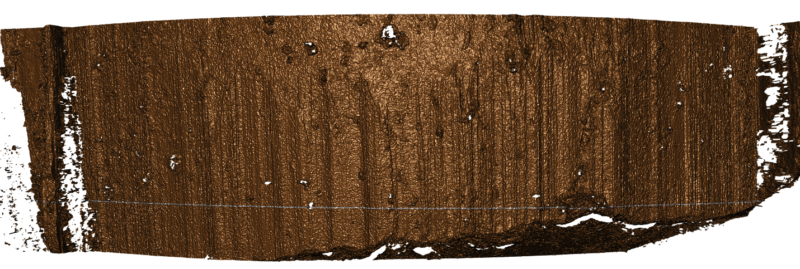
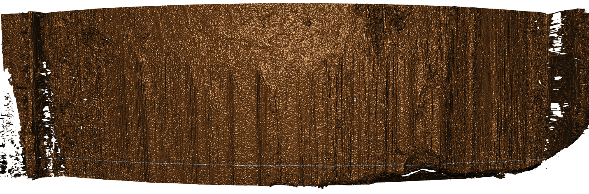
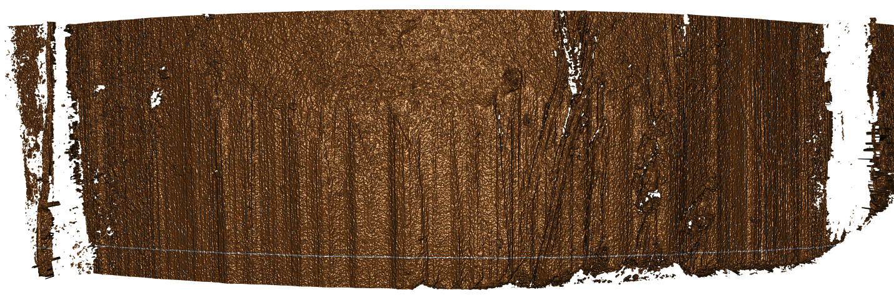
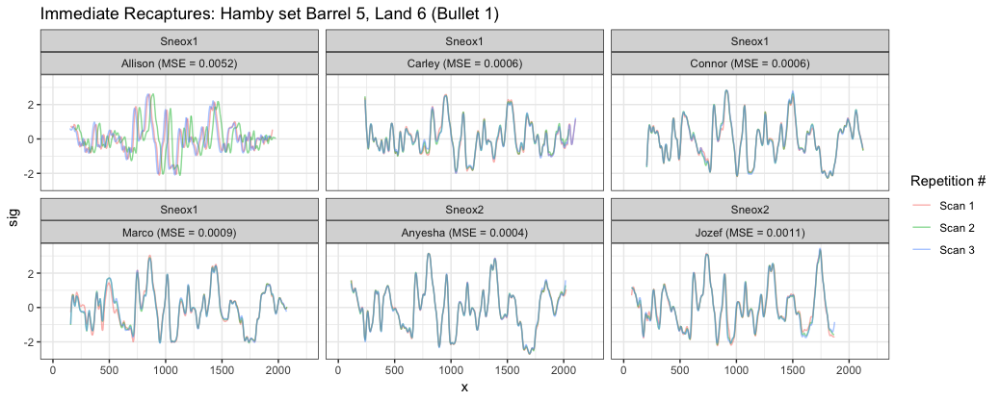
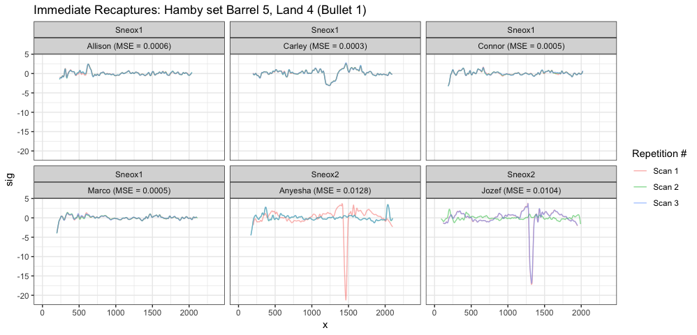
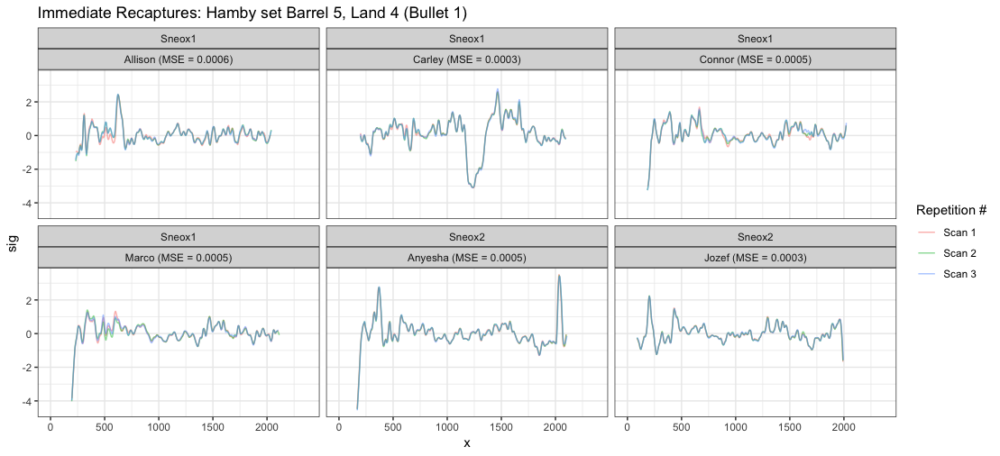
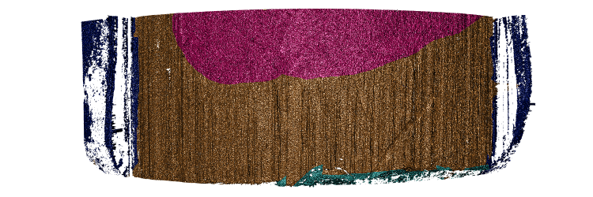

class: inverse
# About Slides

---
class: primary 
# New CSAFE slide template

We're now using [`xaringan`](https://github.com/yihui/xaringan)

What's changed: 

- New person slide: 

````
  ---
  class: inverse
  # Your Name
````

---
class: secondary

- New content slide with title: 

````
---
class: primary
# Title of slide 

Slide content
````

- New content slide without title: 

````
---
class: secondary

Slide content with no title on slide
````

---
class: inverse
# Sample User

---
class: primary
# Sample Slide

- Sample Table. Sam Tyner talked about the three must-haves of your summary:


| Must-have | It means |
| :------   | :------- |
| Context | Why are you doing what you're doing? "I'm working on X project in order to Y" |
| Content | What are you doing? "I wrote X function that does Y" or "I ran a simulation of Z" |
| Conclusion | What did you learn? "This will help me because it..." or "This important because it gets us to..." |

---
class: secondary

- If you are going to add an image, **create a directory** with your name within "images" folder. For example, "images/**guillermo**/sample_image.JPG"


 
 

---
class: inverse
# Sam

---
class: primary
# ~~Spring Semester~~ March Goals

Working almost exclusively on the *Open Forensic Science in R* book. 

**If I emailed you about it, please get back to me ASAP. Heike and I want to make sure all of CSAFE's R packages are included.** 

I was at the [Chicago R Unconference](https://chirunconf.github.io/) this weekend and I'm off today. It was really fun! We wrote an [Unconf Toolbox](https://github.com/unconf-toolbox) for other people interested in hosting their own R unconf, and we are now going to apply for [an ISC grant](https://www.r-consortium.org/projects/call-for-proposals) from the R Consortium to expand the project. (That bit was [H. Wick's idea](https://twitter.com/hadleywickham/status/1105048536066990081))

See you tomorrow! 

---
class: inverse
# Danica

---
class: primary   
# Spring Semester Goals

- Submit follow-up BF vs. LR paper to LPR  
- Continue NIJ grant to validate FDE conclusions
    - Working to figure out how to combine kinematic scores across the entire phrase
- Work with Amy on the CSAFE Handwriting project  
- Write a paper for LPR on approximations to BFs
- Write a paper on Fiducial Factors with UNC
- Start NIJ grant on forensic error rate studies
    - Working on paper concerning ROC curves and SLRs
- Writing Winning Grant Proposals Phase 2 Workshop
    - Draft an NSF CAREER Proposal (for 2020 submission?)
- Work with Dan Spitzner from UVA on the CSAFE Statistical Foundations project

---
class: inverse
# Nick

---
class: primary
# Spring Semester Goals


---
class: inverse
# Miranda

---
class: primary
# Spring Semester Goals

- Write up neural network progress (to use as Creative Component)
- AAFS poster in February
- Help Susan with Truthiness study
- Determine next steps with CNN
- Written Prelim this summer

---
class: inverse
# Soyoung

---
class: primary
# Spring Semester Goals

- Submit glass EDA paper with Sam
- Working on two papers of shoe analysis on SURF matching 
- Waiting for response from JCGS 
- Workinig on the book chapters
- Working on Dirichlet process for uncentainty pyramid with Sam
- Working on covariance estimation on glass data with Sam 

---
class: inverse
# Kiegan

---
class: primary   
# Spring Semester Goals  


- Submit AFTE paper  
- Submit JFS paper (draft almost complete!)   
- ~~AAFS in February~~  
- **Design/implement gauge R&R**  
    - More working group this week!  
    - Some interesting recapture findings to share...  
- Working on the book  
- **Oral prelim on grooves material, plans for gauge R&R and beyond...**  
- **Write up Chapter 1**  


---
class: primary   
# Rounds 1, 3, 5   

  

  

  


---
class: primary   
# Immediate Recapture: Shift  

  


---
class: primary   
# Immediate Recap: Crosscut  

  


---
class: primary   
# Immediate Recap: Crosscut   

  


---
class: inverse
# Nate


---
class: primary
# Updates

- Submitted bulletcp to CRAN
    - Returned to me with some requested changes 
- Look at SLR results with simulated data and random forest scores 
    
---
class: inverse
# Amy

---
class: primary
# Spring Semester Goals  
- <strong>Collect data</strong>
- <strong>Submit paper</strong> (Chapter 1)
<br> <br>
- Oral prelim
- AAFS talk in February
- Learning about other areas of statistics: FDA, adaptive designs, "statistical learning" (602), ...
- STATers
- <i>No classes!</i> :)

---
class: primary
# Coming up
<p>  <br> <br> <br> <br> - Undergraduate &nbsp; research &nbsp;&nbsp;assistant <br> <br> - Pilot data &nbsp;&nbsp;collection </p>


---
class: inverse
# Susan

---
class: primary
# Last Week

- NIJ Grant Proposal
    - Prototype machine will be ready after Spring Break  - "land mine actuated camera"
    
    - Series of emails with SoleMate about possibility of creating an API, but they don't have the resources right now.
    
    - Reframing proposal in terms of immediate utility to practitioners    
    <div class="small">Iowa DCI doesn't use SoleMate - if they examine a shoe, it's because they've already recovered a suspect's physical shoe. They aren't looking to see what shoes could have made any given print.</div>
    
- `x3ptools` - update testing for add_grid_x3p. Test coverage is back at 98% (or was when I wrote this)


---
class: inverse
# Heike

---
class: primary   
# Updates to x3ptools

- getting ready for releasing version 0.0.2 to CRAN

- adding some functionality and making Susan sweat with the test coverage (97% right now)

- biggest change: adding color masks


---
class: primary



https://heike.github.io/x3ptools/

---
class: inverse
# Ganesh

---
class: primary   
# Spring Semester Goals


- *Done with the UI, start write up.*
- *Start Writing the Toolmark chapter*


---
class: inverse
# Issues

---
class: secondary

- [Issues!!](https://github.com/CSAFE-ISU/slides/issues)
- One issue down, three to go.

```{r, eval=FALSE, echo=FALSE}
## Presenters
presenter <- 
  c("Soyoung", "Amy", "Ben", "Nick", 
    "Ganesh", "Nate", "Sam", 
    "James", "Kiegan", "Danica", "Susan", 
    "Miranda")

## Set seed as the date (mmdd)
set.seed(1105)

## Shuffle presenters
sample(presenter)
```

