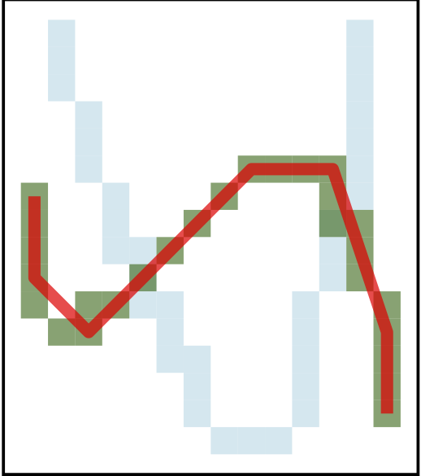
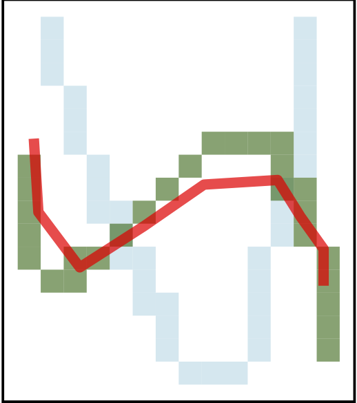
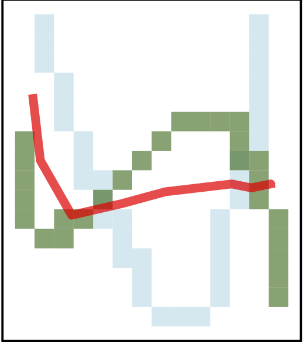
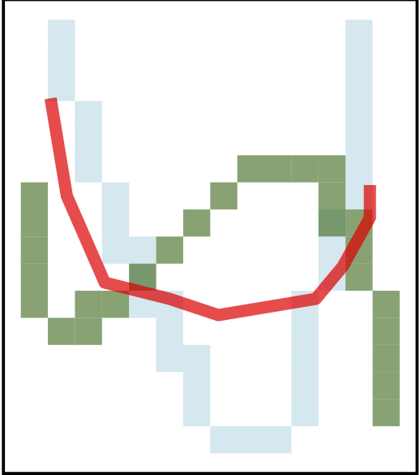
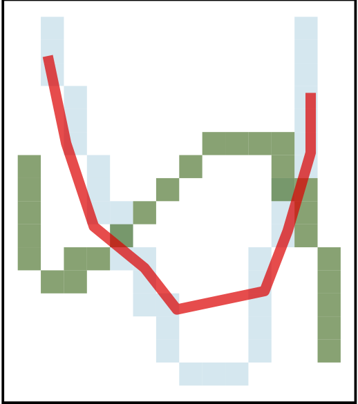
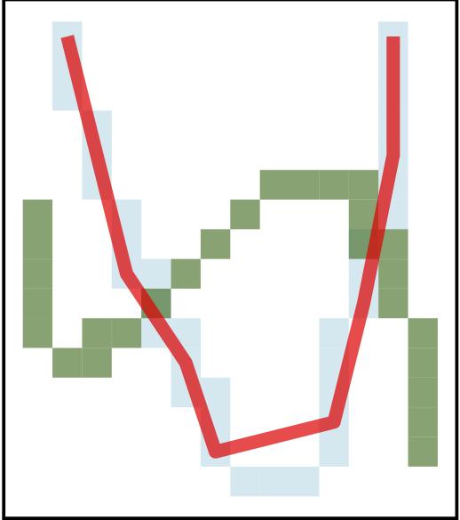
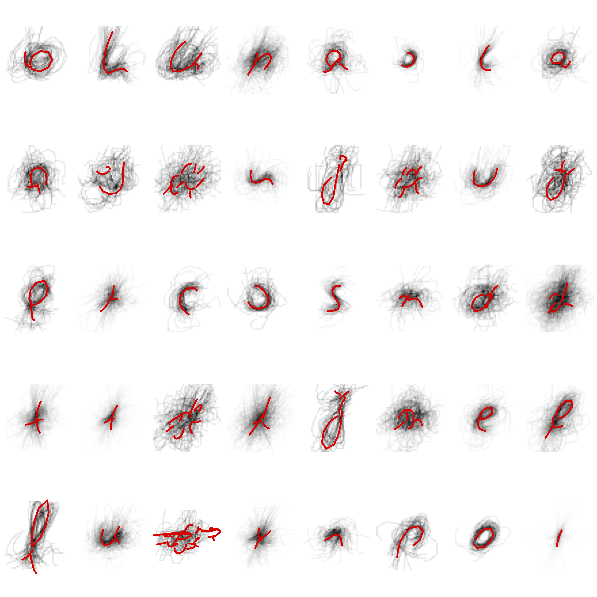
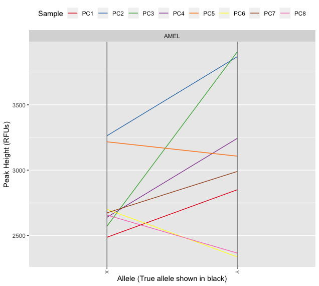
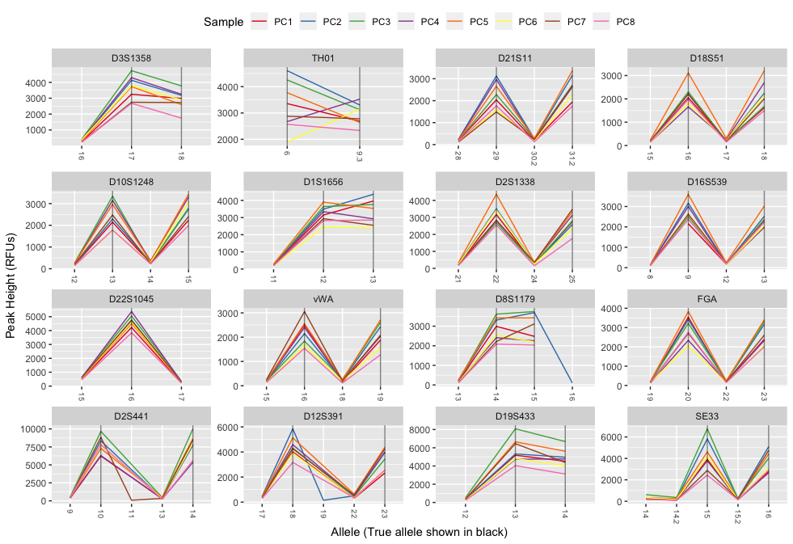

class: inverse
# About Slides

---
class: primary 
# New CSAFE slide template

We're now using [`xaringan`](https://github.com/yihui/xaringan)

What's changed: 

- New person slide: 

````
  ---
  class: inverse
  # Your Name
````

---
class: secondary

- New content slide with title: 

````
---
class: primary
# Title of slide 

Slide content
````

- New content slide without title: 

````
---
class: secondary

Slide content with no title on slide
````

---
class: inverse
# Sample User

---
class: primary
# Sample Slide

- Sample Table. Sam Tyner talked about the three must-haves of your summary:


| Must-have | It means |
| :------   | :------- |
| Context | Why are you doing what you're doing? "I'm working on X project in order to Y" |
| Content | What are you doing? "I wrote X function that does Y" or "I ran a simulation of Z" |
| Conclusion | What did you learn? "This will help me because it..." or "This important because it gets us to..." |

---
class: secondary

- If you are going to add an image, **create a directory** with your name within "images" folder. For example, "images/**guillermo**/sample_image.JPG"


 
 

---
class: inverse
# Nick

---
class: primary
# Weighted Mean of 2 Letters

<br><br><br>








---
class: primary
# HW Clusters


---
class: inverse
# Sam

---
class: primary
# Working on...

- Revising glass paper
- *Open Forensic Science in R* 
- This week: presenting glass poster at ISU research day with Soyoung. 

Next slide: pictures! 

---
class: primary
# Some DNA things 

```{r, fig.align='center', out.width="85%", echo=FALSE}

```

---
class: secondary

```{r, fig.align='center', out.width="85%", echo=FALSE}

```


---
class: inverse
# Danica

---
class: primary   
# Spring Semester Goals

- Submit follow-up BF vs. LR paper to LPR  
- Continue NIJ grant to validate FDE conclusions
    - Working to figure out how to combine kinematic scores across the entire phrase
- Work with Amy on the CSAFE Handwriting project  
- Write a paper for LPR on approximations to BFs
- Write a paper on Fiducial Factors with UNC
- Start NIJ grant on forensic error rate studies
    - Working on paper concerning ROC curves and SLRs
- Writing Winning Grant Proposals Phase 2 Workshop
    - Draft an NSF CAREER Proposal (for 2020 submission?)
- Work with Dan Spitzner from UVA on the CSAFE Statistical Foundations project

---
class: inverse
# Nate


---
class: primary
# Spring Semester Goals

- Finish (or get close) to SLR paper
- Finish groove changepoint R package and my contribution to the joint paper with Kiegan
- Find an internship 
- Mostly finish dissertation chapter on sparse GPs (and work on corresponding R package?)
- Oral prelim
- Learn Python through stat 602
    
---
class: inverse
# Kiegan

---
class: primary   
# Spring Semester Goals  


- Submit AFTE paper   
- Submit JFS paper    
- ~~AAFS in February~~  
- **Design/implement gauge R&R**    
    - Data collection starting next week!  
- Working on the book  
- **Oral prelim on grooves material, plans for gauge R&R and beyond...**   
    - Friday!  
- **Write up Chapter 1**  

    
---
class: inverse
# Susan

---
class: primary
# Over the Last 2 Weeks:

NIJ Grant 

- restructure into distinct phases
- complete rewrite of narrative - focus on current practitioner practice and potential to incrementally improve (instead of just enabling likelihood ratios out of the box...)
- prototype machine should be testable on Thursday!
- IRB application mostly complete - hope to submit by April 2 for review on the 16th

__still to do__: 
- finish Phase 2 narrative
- write the impact section and additional boilerplate
- finish IRB application

---
class: primary
# Over the Last 2 Weeks:

Annual Review of Statistics Paper on Testing Statistical Graphics

- requested ~1000 things from interlibrary loan, including a book which describes statistics as a discipline somewhere between "accounting and the science of higher mathematics" 
- Overview of historical graphical testing, testing methods sections

__still to do__: 9 pages down, another 14 to go on lineups, best practices, and future research areas


---
class: inverse
# Amy

---
class: primary
# Spring Semester Goals  
- <strong>Data Collection</strong>
      - Document scanner
      - IRB amendment submitted (signatures, short phrase, personnel)
- <strong>Research</strong>
      - R package! (awesome for Rstan)
      - Overdispersion (<strike>Stratified sampling</strike>, Negative multinomial)
<br> <br>

---
class: inverse
# Miranda

---
class: primary
# Spring Semester Goals

- Write up neural network progress (to use as Creative Component)
- AAFS poster in February
- Help Susan with Truthiness study
- Determine next steps with CNN
- Written Prelim this summer

---
class: inverse
# Soyoung

---
class: primary
# Spring Semester Goals

- Submit glass EDA paper with Sam
- Working on two papers of shoe analysis on SURF matching 
- Waiting for response from JCGS 
- Workinig on the book chapters
- Working on Dirichlet process for uncentainty pyramid with Sam
- Working on covariance estimation on glass data with Sam 

---
class: inverse
# Ganesh

---
class: primary   
# Weekly Goals


- *Writing Book chapter on Toolmarks*
- Outlining the Markov Random Field approach for detecting a break-off
- Written Prelim Prep

---
class: inverse
# Issues

---
class: secondary

- [Issues!!](https://github.com/CSAFE-ISU/slides/issues)
- One issue down, three to go.

```{r, eval=FALSE, echo=FALSE}
## Presenters
presenter <- 
  c("Soyoung", "Amy", "Ben", "Nick", 
    "Ganesh", "Nate", "Sam", 
    "James", "Kiegan", "Danica", "Susan", 
    "Miranda")

## Set seed as the date (mmdd)
set.seed(1105)

## Shuffle presenters
sample(presenter)
```

