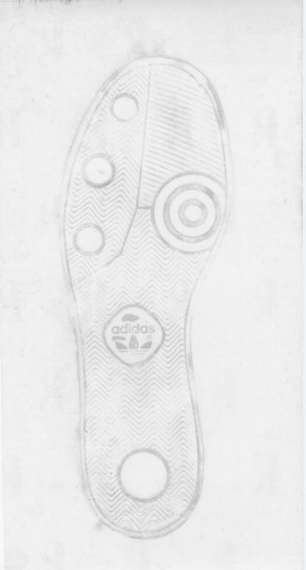
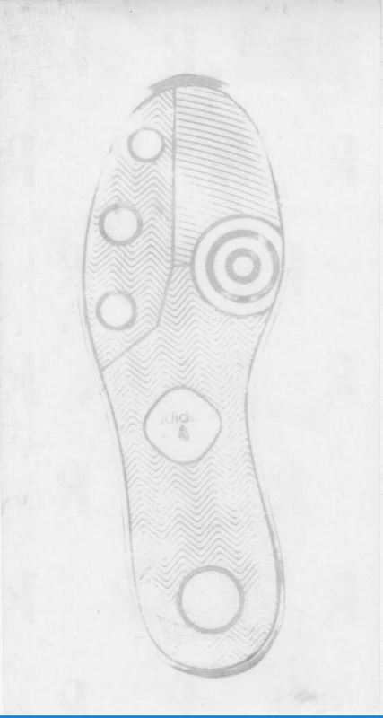

# Shoeprints Database

## Why we need a shoeprints database?

- What are reliable and accurate methods to quantify the similarity between two outsole prints?
- How robust are those methods to degradation of the crime scene print?
- What is the best instrument to “measure” outsole images? (We are using at least five different instruments).
- What is the persistence of outsole patterns over time? Or, can we identify the source of a print even after the shoe has been used for period of weeks or months?

## Details

- Provide a pair of shoes to 160 persons (ISU students, staff, faculty and external)
- Roughly half men and half women
- Half one shoe pattern and half the other
- Take measurements every six weeks (baseline + four times)

## Shoe models

- Contrained to: 
    - current and future availability
    - One athletic and one more casual
- Nike Winflow 4 ([left](https://store.nike.com/us/en_us/pd/zoom-wio-4-mens-running-shoe/pid-11597324/pgid-11839265))
- Adidas Seeley ([right](http://www.zappos.com/p/adidas-skateboarding-seeley-collegiate-navy-core-black-footwear-white/product/8123308/color/678550))

## Restrictions for impressions

- Time it takes to take each impression
- Adapt to schoolyear dates
- Tidiness of the space

# Impressions

## Pressure Heatmat

- Obtain pressure map with Matscan pressure sensing mat by [Tekscan](https://www.tekscan.com/products-solutions/systems/matscan)
- Only at the beginning of the study
- 4 files per foot: JPEG, AVI, CSV (single frame), CSV (300 frames)

## 3D Scans

- Taken with [EinScan Pro+ 3D scanner](https://www.einscan.com/einscan-pro-plus?gclid=Cj0KCQjwxdPNBRDmARIsAAw-TUnNdmaEc6Lk2M6xjYmkg006DyZJesvKD0_2vuy2f4DWCqJsAKDctUEaAkDTEALw_wcB))
- Format: STL
- 2 scans per shoe

## 2D Scans

- Taken with [EverOS footwear scanner](http://www.footprintmatcher.com/products/products_03.htm)
- Format: TIFF
- Modes: Detailed and quick
- 2 per shoe per mode

## High Resolution Picture

- Modes: 2 (different lighting)
- Format: TIFF

## Film Prints

- Procedure from Israeli Police
- Modes: two per shoe
- 1 film per shoe per mode

## Paper Prints

- Stepping on paper after applying fingerprints powder
- Modes: Detailed, walking, stomping, twisting
- 1 impression per mode

## Vinyl Impression

- Done right after paper prints

## Other Considerations

## Other Considerations

- No way to measure within subject variability (only one pair of shoes was asssigned to each subject)
- Two different patterns are being considered
- Two shoe sizes are being considered for every gender
- Weather might affect the experiment
- The person who takes the impression could be another factor
